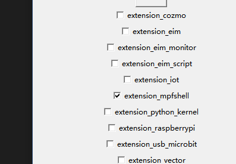
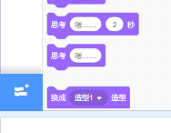
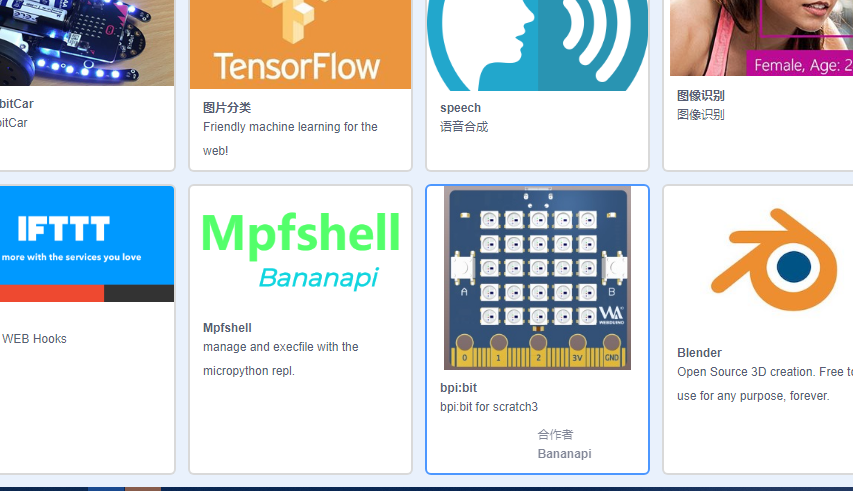
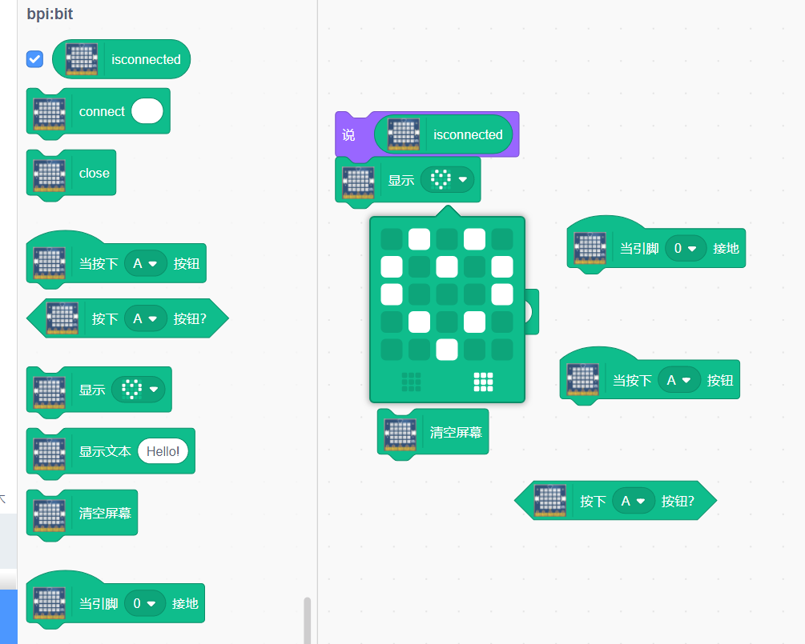
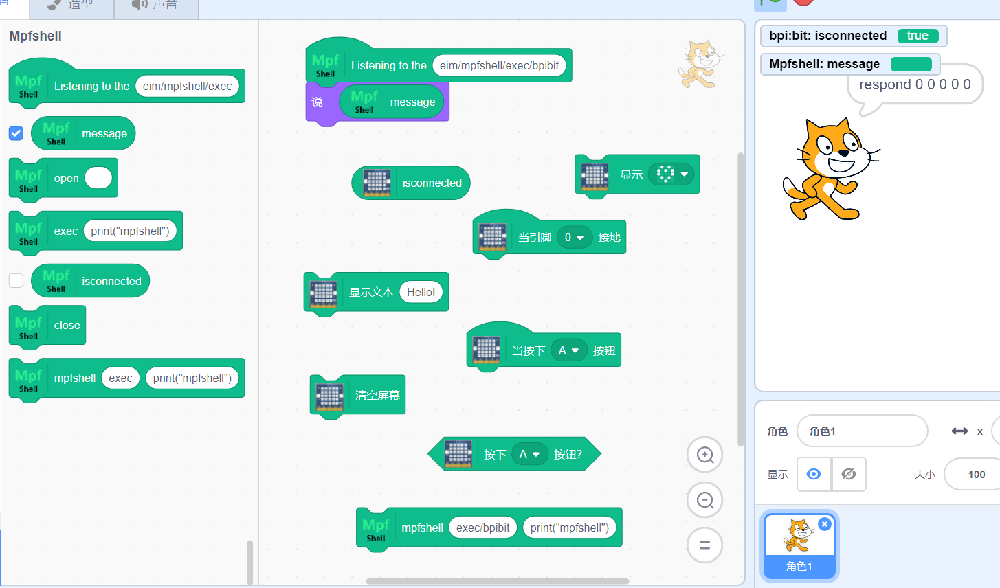
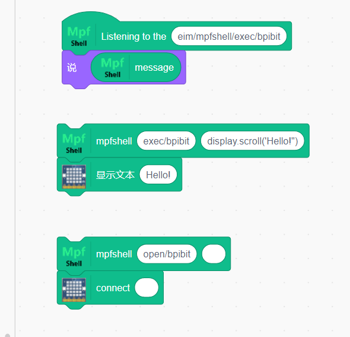

如何使用 scratch3 for bpi:bit
=====================================================

在线 `Scratch3 Codelab`_ 网站，更详细的看这里\ `codelab`_ 和 `scratch 开源文档`_\ 。

首先选择适合你的系统版本，获取 `adapter`_ ，无需安装，打开即可。

接着参考一下 `usb_microbit 使用手册`_\ ，同理，如下图，勾选 mpfshell 选项。

如何使用它们？
------------------------------------------------------

确定 adapter 软件 和 scratch3 网站都打开了。 在 scratch3 网站中，接着点开它（左下角的拓展按钮）

并滚动到最底，找到 bpi:bit 插件选择它，点击确认后回到主界面。

勾选 isconnected 表示进行连接

.. figure:: codelab/isconnected.png

此时插入硬件，点击连接，可以看到很快就连上了。（如果不能确定，就用通常的 mpfshell 的方式来核对一下吧）

.. figure:: codelab/result.png

此时它可以用的标准积木有如下图

自此你就可以自由的使用自带的积木了，但是，如果你对自带的积木不满意，可以直接使用
mpfshell，直接控制硬件，直接完成接口的调用和测试，如果你希望某些组合调试的接口，变成一个单独的积木，可以提交给我，直接合并，但是因为 scratch3 还没有动态积木载入，所以没办法完全开放对接。

如何使用 Scratch3 for Mpfshell ？
------------------------------------------------------

如何使用 mpfshell ，其实只需要看几个实例就知道它们的由来和对照关系了。

如果你知道 mpfshell 怎么用，那么这个也是同样的道理，所谓的控制硬件实际上就相当于每次调用 mpfshell exec 而已。

但要注意的地方就是 eim/mpfshell/exec/bpibit 是一个典型的主题，意思是指，这个是一个实例的访问接口了，如果你有多个硬件的话，它就会呈现出不同的接口，比如默认的
mpfshell 插件主题的是 eim/mpfshell/exec/default ，而 bpibit 的拓展是 eim/mpfshell/exec/bpibit，所以可以根据这种区分多个实例的控制，等到你需要的时候，就会发现它的必要性了。

说说它是如何设计出来的
------------------------------------------------------

这次我们提供了可二次编辑的接口，但如果真的想知道如何做到的可以了解这两个项目。

-  `scratch3-eim-mpfshell`_

-  `webduino-module-eim`_

并且 scratch3 插件最后会期望同步到 Webduino blockly 当中，因为在我们 blockly 的平台上，允许不建立服务器也可以定义属于自己的积木，意味着可以更加专注的实现自己的积木了，而不是每修改一次就要合并到服务器里重建。这样开发出的积木和拓展插件是完全属于自己的，还可以通吃绝大部分积木前端平台了，更加的自由不受限制，完美！

.. _Scratch3 Codelab: https://scratch3.codelab.club/
.. _codelab: https://www.codelab.club
.. _scratch 开源文档: https://blog.just4fun.site/tag/scratch.html
.. _adapter: https://adapter.codelab.club/user_guide/install/
.. _usb_microbit 使用手册: https://adapter.codelab.club/user_guide/usage/#3-microbit
.. _scratch3-eim-mpfshell: https://github.com/junhuanchen/scratch3-eim-mpfshell
.. _webduino-module-eim: https://github.com/junhuanchen/webduino-module-eim
