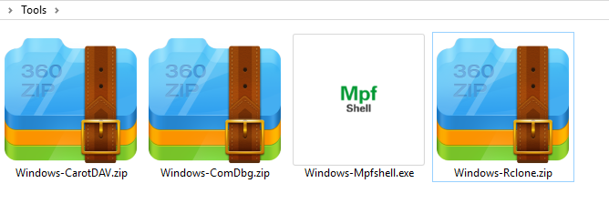
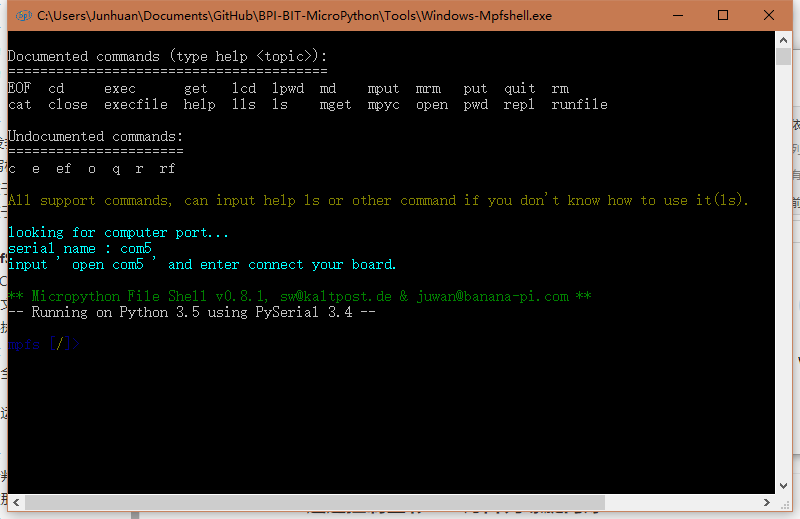
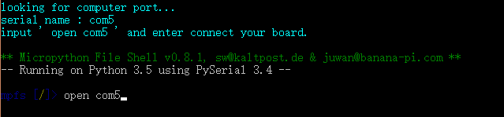
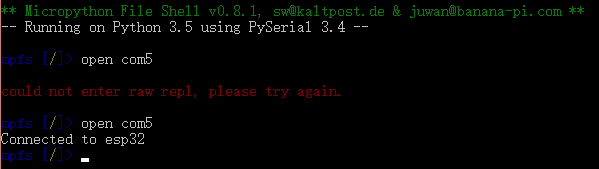
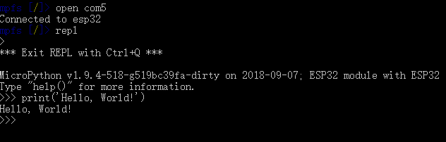
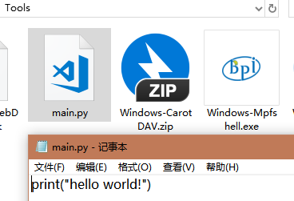
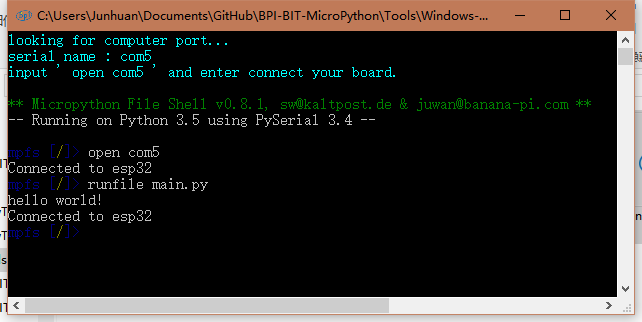

# Document


## Hello, World!

**Hello World** 是一个最著名的程序。对每一位程序员来说，这个程序几乎是每一门编程语言中的第一个示例程序。实际上，这个程序的功能只是告知计算机显示 Hello World 这句话。传统意义上，程序员一般用这个程序测试一种新的系统或编程语言。对程序员来说，看到这两个单词显示在电脑屏幕上，往往表示他们的代码已经能够编译、装载以及正常运行了，这个输出结果就是为了证明这一点，因此以下说明以此为例。 

### 1. 使用 MpfShell 编程

- 温馨提示，往下使用之前，请先烧写 MicroPython 固件，[查看如何烧写固件](https://github.com/BPI-STEAM/BPI-BIT-MicroPython/wiki/how_to_esp_pyflasher)。

- 所需材料，Windows 请到此处 [Tools](https://github.com/BPI-STEAM/BPI-BIT-MicroPython/releases/tag/Tools) 下载 **Windows-Mpfshell.exe** ， 由于软件版本可能会升级变动，所以需要手动选取所需版本下载。

- 如果你的电脑已经有 Python 环境，直接输入 `pip install mpfshell-lite` 获取调试开发工具，使用文档在此 [mpfshell](https://github.com/BPI-STEAM/BPI-BIT-MicroPython/wiki/mpfshell)。

#### 1. 通过 repl 运行程序

- 

- （以 Windows 为例）双击运行 **Windows-Mpfshell.exe**。

- 

- | 依次出现的颜色 | 解释其说明                                                   |
  | -------------- | ------------------------------------------------------------ |
  | 白色           | 显示所有支持的命令操作，上排命令表示有帮助说明，下排命令反之。 |
  | 黄色           | 以上为全部支持的命令，如果想知道` ls `的用法，输入` help ls `即可得知。 |
  | 蓝色           | 显示当前插入的板子的串口名，如图所示为 `com5`，可以输入`open com5`连接设备。 |

- 尝试连接设备，输入 `open com5`（可以简写为 `o com5`），如果没有反应，使用`CTRL + C`或右上角点红叉。

- 

- 现在的提示：首次启动板子，若是使用了联网功能，如果灯还在滚动的时候连接了板子，可能会停止联网操作，所以当发现联网功能被停止了，需要手动在repl执行wifi.start()，或使用 exec 执行该语句即可。

- 过去的提示：首次启动板子，第一次会连接失败，根据提示 `try again` 重试即可，因此要注意红色的提示信息。

- 

- 当显示 `Connected to esp32` 时，就可以确认板子已成功连接。

- 此时再次输入 `repl`，进入基础编程环境，并写下你的第一段程序，例如：`print('Hello, World!')`。

- 提示：最新的固件在开机时的 REPL 可能会出现 `no found AP`，想要停止它可以输入`wifi.close()`，这不影响板子的外部操作，只是会影响 REPL 的输出位置，固件设定板子上电就会自动执行联网，其联网配置文件在内部的`wifi_cfg.py`，由于每个人的环境不一样，所以默认的是连接`webduino.io/webduino`，它输出的讯息只会影响显示，不影响功能。

- 

- 回显 `Hello, World!`，即说明你成功的运行了你的第一段程序，你也可以继续输入代码来测试。

- 更多的编程用法将在之后的章节中逐步涉及。


#### 2. 通过 main.py 运行程序

- 新建一个 main.py 文件，并写入以下内容。

  ```python 
  print('Hello, World!')
  ```

- 若是想使用 MpfShell 执行该文件，请将文件放到与 MpfShell 同一目录下。

- 

- 接着再切换到 `MpfShell` 的程序区域，输入`runfile main.py`，或输入`rf main.py`，`runfile` 简写成 `rf`。

- 

- 可以看到回显了`hello world`，说明你成功运行了程序。

- 可能有用的提示：最新的 mpfshell 指令多了 lexecfile，如果需要进行python 的 input 输入交互的时候，请使用该指令， 因为 runfile 只能接收板子输出而不能输入。

### 至此你已经学会了基本操作，进入下一章[点亮各种LED](https://github.com/BPI-STEAM/BPI-BIT-MicroPython/wiki/light_many_leds)吧。

## 以下为进一步深入的内容，可以回头再了解。

### 4. 详解开发环境和工具

#### 1. 什么是 repl？

REPL(Read-eval-print-loop)：交互式解析器

在 repl 环境下，可以定义和运行变量、函数、对象。

repl 的常用命令：

- 启动 `MicroPython`，即进入了 REPL 环境。
- 退出：按 `Ctrl + C `中断 或 按`CTRL + D` 软复位。
- 点击 tab 可以打印出 Python 中的所有模块，或补全不完整的命令（输入过的历史命令）。
- 使用键盘方向键的 向上 或 向下 可以查看 **历史命令**，向左 或 向右 配合 backspace 可以修改还没确认输入（Enter）的内容。

常见使用场景：

- 在 repl 中想要输入 import 命令，只需要 输入 i + 按下 tab 键即可补全成 import，其他同理，使用的前提是此前输入过，因此不是所有命令都可以被补全。

- 在运行 python 代码时，希望能让它停下来，按下 `CTRL + C` 即可向解释器发送一个 KeyboardInterrupt 异常，此时解释器运行过程中如果未使用异常捕获处理该异常，则程序将会停止。


#### 2. 如何选择开发工具？

|   名称    | 描述                 | 优势                 | 劣势                                                         |
| :-------: | :------------------- | -------------------- | :----------------------------------------------------------- |
|  notepad  | 系统自带记事本       | 足够简单             | 远古高手才能用得起 XD                                        |
| notepad++ | 记事本升级版 | 支持代码识别和高亮   | 现代高手看代码用的 XD                                        |
| uPyCraft  | 跨平台简易开发环境   | 使用简单，适合新手   | 问题多，且缺少许多必要的编程功能，例如各种操作快捷键。       |
| MpfShell  | 跨平台简易交互工具   | 功能完整，拓展性强   | 缺乏编辑器支持，代码靠外部编辑器编写，例如： VSCODE 或 PyCharm。 |
| ESPBlocks | 跨平台代码编辑器     | 新手专属的简易开发工具 | 支持板子的快速有线连接和运行代码，还有 Blockly 的支持，其他功能略有缺失，但不影响新手上手。 |
|  VSCODE   | 跨平台代码编辑器     | 专业代码标准编程环境 | 缺乏板子的支持，需要配合工具运行代码，例如 ：MpfShell、RShell、PyLoader。 |
|  PyCharm  | 跨平台代码编辑器     | 专业代码标准编程环境 | 支持板子的直接操作，但配置稍微多了一些，要使用起来没有那么一键快速，编程体验相当于 Visual Studio IDE。 |

个人推荐 `MpfShell` + PyCharm ，理由是编写简单的代码用 `MpfShell` ，编写复杂的代码用 PyCharm ，无需额外配置任何东西，运行流畅，简单快捷。

### 3. 使用 PyCharm 编程

使用方法在这里[Pycharm IDE 中 使用 Mpfshell 插件](https://github.com/BPI-STEAM/BPI-BIT-MicroPython/wiki/pycharm)


