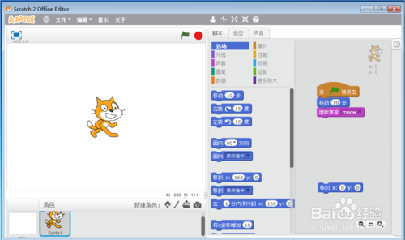
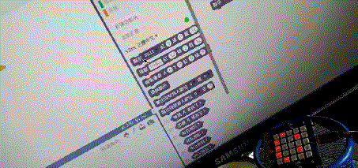
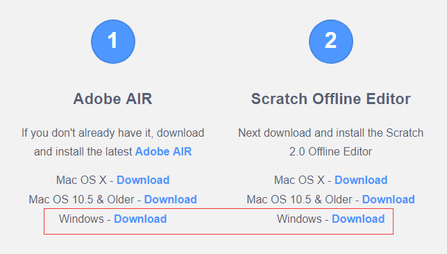
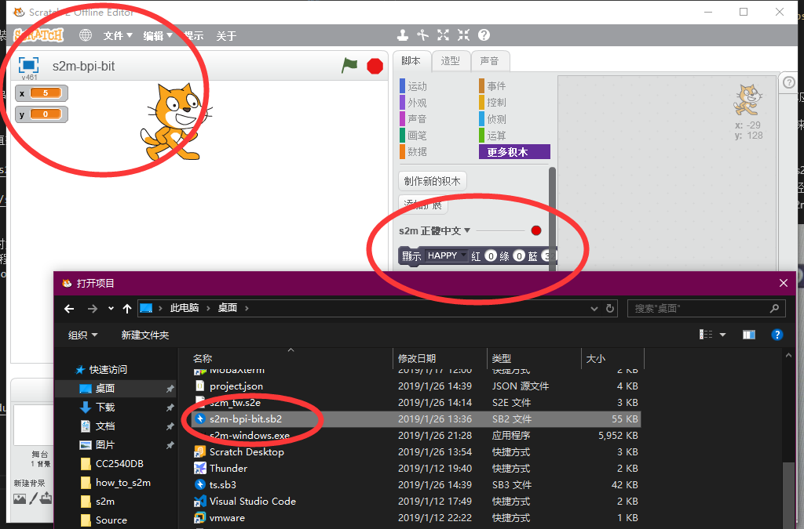
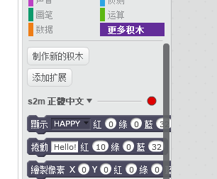
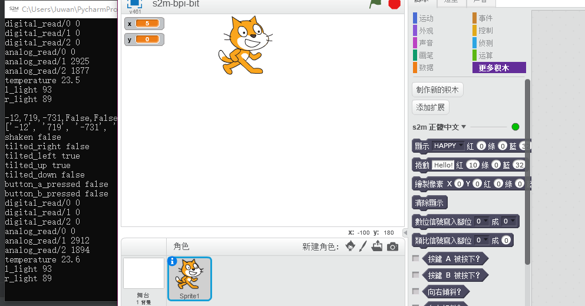
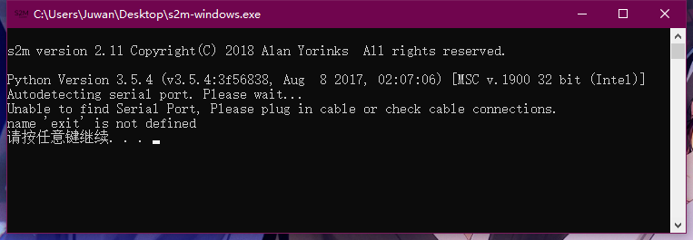
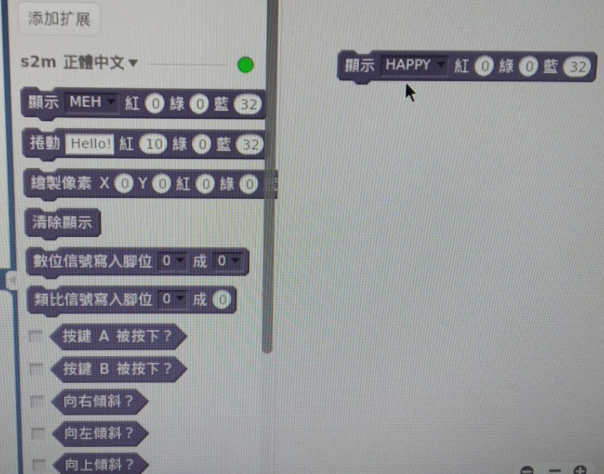

# Document

## Scratch2 的支持

### 什么是 Scratch2 ？

为了让大家更快的理解计算机语言，让小朋友们也能做出自己的作品，麻省理工学院多媒体实验室的专家们为小朋友们开发出了一种计算机语言--Scratch。

在Scratch中不需要记忆复杂的语法和语句，使用Scratch类似于搭建积木，通过拖拽的方式就能够实现了程序的编写，所以Scratch看起来更加形象、直观，而且更加容易操作。同学们很容易就能做出自己的作品！

## 演示效果

以下是在 Bananapi M64 的 Linux ARM 硬件上运行的 Scratch2 的效果。

而这些东西，你只需要简单看下方的教程即可实现。

## 硬件准备前提

先学会如何烧写程序，[到此一看](https://github.com/BPI-STEAM/BPI-BIT-MicroPython/wiki/how_to_flash)，然后烧写这个固件 [s2mb_firmware.bin](https://github.com/BPI-STEAM/BPI-BIT-MicroPython/releases/download/s2mb/s2mb_firmware.bin)，注意改名成 firmware.bin ，否则会识别不到硬件。

烧写后不需要拔掉硬件，硬件至此已经准备完成。

## 在 Windows 上安装

### 先安装 Scratch2 

访问 [Scratch 2.0 editor](https://scratch.mit.edu/download/scratch2)，先安装 Adobe AIR，再安装 Scratch Offline Editor 即可。

### 再使用 Scratch2 打开 [s2m-bpi-bit.sb2](https://raw.githubusercontent.com/junhuanchen/s2m/master/s2m/scratch_files/projects/s2m-bpi-bit.sb2) 文件

### 此时可以看到更多积木了

红色的点表示设备没有连接上，此时需要下载 [s2mb release](https://github.com/BPI-STEAM/BPI-BIT-MicroPython/releases/tag/s2mb) 页面的[s2m-windows.exe](https://github.com/BPI-STEAM/BPI-BIT-MicroPython/releases/download/s2mb/s2m-windows.exe) 软件，此时确定固件已经烧写了提供的[s2mb_firmware.bin](https://github.com/BPI-STEAM/BPI-BIT-MicroPython/releases/download/s2mb/s2mb_firmware.bin)固件，具体烧写教程可以看前面所提及 硬件准备前提 的内容。

### 确认它已经工作

现在打开 [s2m-windows.exe](https://github.com/BPI-STEAM/BPI-BIT-MicroPython/releases/download/s2mb/s2m-windows.exe) 将会看到绿灯已经亮起，开始使用它吧。

如果你没有插入硬件，它会产生对应的提示。

## 在 Linux 上安装

### 软件准备前提

确认 python3 和 pip3 已安装，然后 shell 框输入命令 `pip3 install git+https://github.com/junhuanchen/s2m`，确认等待安装完成即可。

### 开始使用软件

安装完成后，在 shell 中输入 s2m 即可，它会自动查找串口并打开服务，所以你应该确保硬件已经连入后启动服务即可。

由于每个人的 Scratch2 的安装可能不一样，所以我建议直接拿 Scratch2 项目回来直接打开即可，下载的 [s2m-bpi-bit.sb2](https://raw.githubusercontent.com/junhuanchen/s2m/master/s2m/scratch_files/projects/s2m-bpi-bit.sb2) 工程项目[在此](https://github.com/junhuanchen/s2m/tree/master/s2m/scratch_files/projects)（也就是在 s2m 的目录下）。

接着使用 Scratch2 加载该项目文件即可，当看到顶栏此时为绿色的点即可得知 s2m 已经正常工作，并且也连上了硬件得到数据，此时你就可以在 Scratch2 使用 bpibit 来编程学习啦，如果你有其他想要的功能，也可以很轻松的添加进去，只需要右键用压缩包打开项目文件，编辑 project.json 中的内容即可添加更多积木，对应的功能则需要对应修改 s2m 和 s2mb 的源码。

