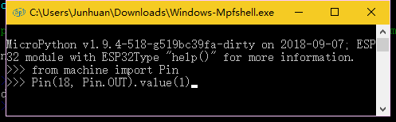
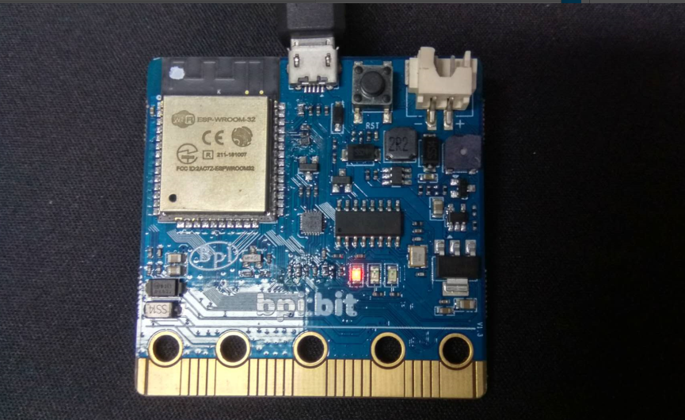
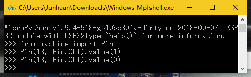

## 点亮各种LED

如果说 Hello World 对软件程序员来说是一种宗教般的编程开始，那么对在硬件程序员的人来说，Blink Led，亦如此，所有的硬件编程都是从点亮一盏灯开始的。因此我们讲究循序渐进，先是一盏灯，再是一排灯。


### 1. 点亮 LED 灯

1. 使用 repl

   - 进入 repl 模式

   - 

   - 输入（选取文本复制后，在黑框里右键粘贴）

     ```python
     from machine import Pin
     ```

   - 再次输入

     ```python
     Pin(18, Pin.OUT).value(1)
     ```

   - 

   - 确定即可看到面板上的灯有一盏亮起

   - 

   - 为了进一步确认它是我们控制的灯

   - 输入

     ```python
     Pin(18, Pin.OUT).value(0)
     ```

   - 

   - 这时就可以看到它灭了

   - 

2. 使用 mian.py

   - 准备以下代码到 main.py 文件中，与上一个不同的是，这个效果是连续的，它将让灯亮起来后，等待一秒钟后灭了，由于展现的效果是连续的，没有办法通过图示来说明情况，所以自己动手试一试吧。

   - ```python
     from machine import Pin
     import time
     led = Pin(18, Pin.OUT) # get a led on gpio 18.
     print('turn on')
     led.value(1) # turn on
     print('sleep 1s')
     time.sleep(1) # sleep 1s
     print('turn off')
     led.value(0) # turn off
     ```

     

   - 若是觉得效果不明显，可以写成死循环来查看效果，注意使用` Ctrl + C `停下来，否则无法继续操作。

     ```python
     from machine import Pin
     import time
     led = Pin(18, Pin.OUT) # get a led on gpio 18.
     while True:
         print('turn on')
         led.value(1) # turn on
         print('sleep 1s')
         time.sleep(1) # sleep 1s
         print('turn off')
         led.value(0) # turn off
         print('sleep 1s')
         time.sleep(1) # sleep 1s
     ```

   - 

1. 学习点亮面板上的LED灯阵列（NeoPixel）

   - 准备以下代码到 main.py 中（\HowToCode\01.LEDs\rgb_lattice.py）

     ```python
     from pixel import Pixel
     View = Pixel()
     RGB = (10, 10, 10)
     View.LoadXY(2, 2, RGB)
     View.Show()
     ```

   - 使用 `runfile main.py` 执行即可。

   - 
