## 使用 pycharm 编程

### 1. 安装 Python 3.7 

- 获取 [Python ](https://www.python.org/downloads/) 最新版本（3.7, 11/08/2018)
- 使用 windows 系统 [点此下载](https://www.python.org/ftp/python/3.7.0/python-3.7.0.exe ) 
- 安装界面设置如下
- 此时系统已经拥有了Python。

### 2. 安装 pycharm 社区版

- 获取 [pycharm ](https://www.jetbrains.com/pycharm/) 
- 使用 windows 系统 [点此下载 2019.1 版本](https://download-cf.jetbrains.com/python/pycharm-community-2019.1.exe) (community版免费使用)
- Linux 系统如果出现串口连接不上，须核对串口是否对一般用户有权限，如果不确定，请核对这条指令`usermod -a -G dialout Username && sudo reboot`，Username 是指你的用户名，不是 Username 。
- 安装完成打开即可，按默认的设置一路进入到以下界面即可。
- 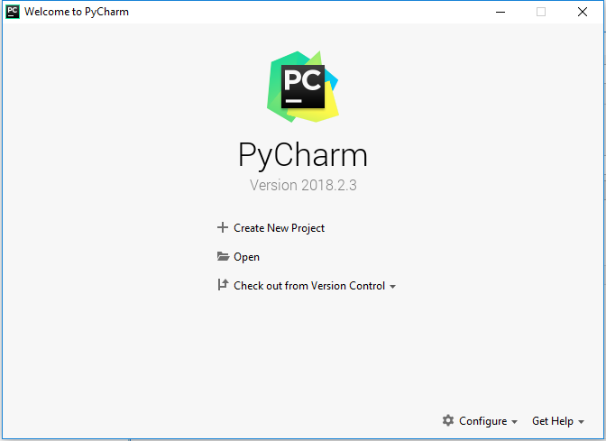

### 3. 新建一个项目

- 点击 Create New Project 弹出以下界面。
- 
- 如果没有安装Python则是以下界面
- 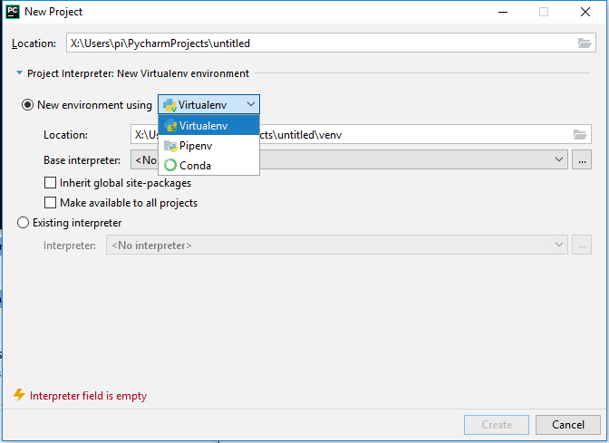
- 最后可以看到项目已经建立完成。
- 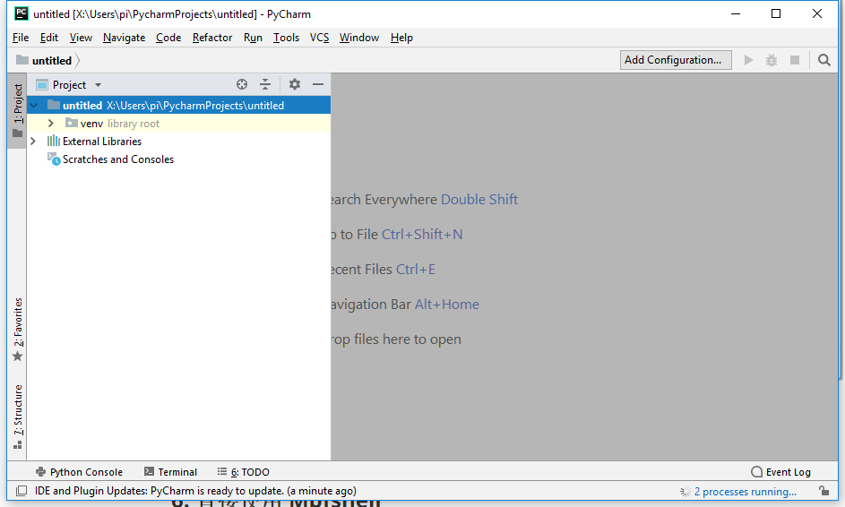
- 更多方法可以参考 [pycharm]( http://www.jetbrains.com/help/pycharm/meet-pycharm.html) 的官方文档

### 4. 安装 intellij-MicroPython 插件

- 关于该插件的资料在 [官方介绍](http://plugins.jetbrains.com/plugin/9777-micropython)  和 [官方GIT](https://github.com/vlasovskikh/intellij-micropython) 
- 下载好 [intellij-mpfshell-1.1.1.zip](https://github.com/BPI-STEAM/BPI-BIT-MicroPython/releases/tag/intellij-mpfshell)  插件，放在你知道的地方，进入 JetBrains pycharm Community Edition 的 File -> Settings -> plugins -> Install plugins from disk
- 
- 
- 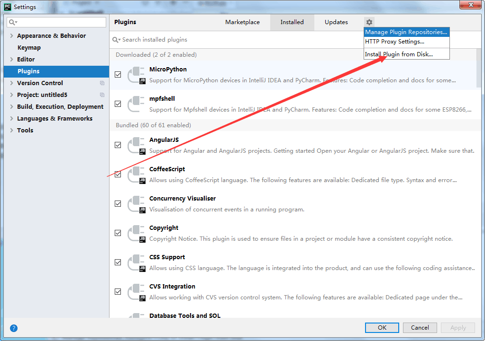
- 提示：我提供的这个插件是修改过底层的接口版本，并且还未接入到官方商店，所以仍和原版的插件同名，因此 IDE 提示插件需要升级或是其他修复的时候，会被替换回原版，遇到这种情况的时候，忽视了就好。
- 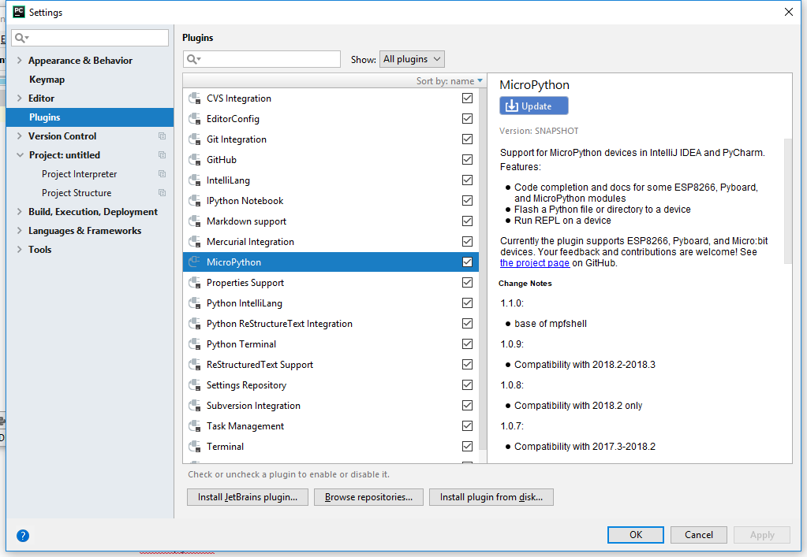

### 5. 运行一个文件

- 安装好插件后，在项目中启动它。
- 
- 你可以在设置里搜索 `MicroPython`得到以上页面。
- 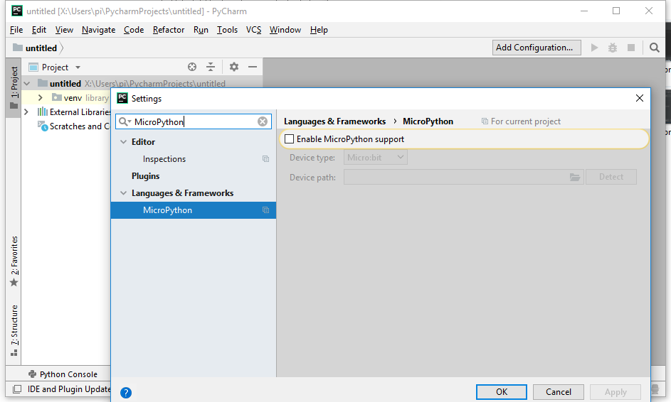
- 现在启动它，依次点开如图设置，Enable MicroPython support。 
- 
- 选择 ESP8266 （ESP32）配置设备类型，再点击 Detect 可以自动判断你连接的板子的路径（或名称），此时的 Detect 一定会失败，因为关键的依赖还没安装。
- 
- 当出现自动识别串口失败，则需要你自己填入自己板子的串口名称（包括路径），或是其他连接参数，比如 ：ws:192.168.1.1,1234，这和 `mpfshell` 的 open 是一样的。
- 
- 此时已经设定好板子的连接参数了，现在可以在 untitled 处右键新建一个 python 文件，第一次使用的时候，务必创建一个文件来触发安装依赖，安装完成后才能使用 自动识别串口 和 其他工具（菜单项中的 Tools）。
- 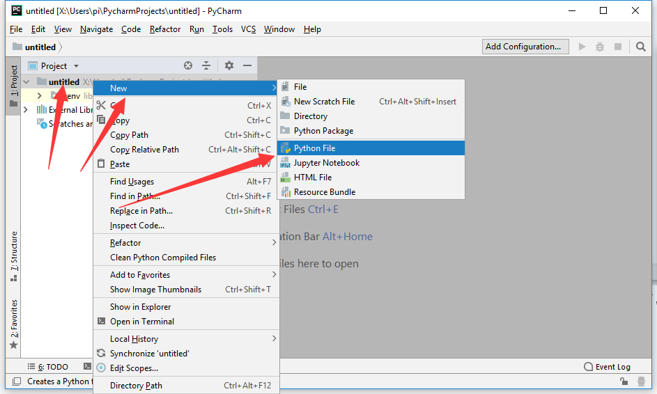
- 在右侧代码编辑框中写入一句`print(helloworld!)`。
- 
- 第一次使用的时候，会提示你需要安装依赖项，因此点击消息的 Install requirements 即可在后台自动下载安装。
- 
- 耐心等待一会就可以了。
- 
- 安装完成会提示。
- 
- 现在我们可以运行 main.py 文件了，在编辑框的任意地方右键显示菜单选取 Run 'Flash main.py'，即可自动生成运行文件配置并在板子中运行。
- 
- 可以看到运行结果如下
- 

### 6. 直接使用 Mpfshell 

 - 在 Tools -> Run Mpfshell Tools 中可以使用 REPL 和 Mpfshell 的快捷功能。
 - 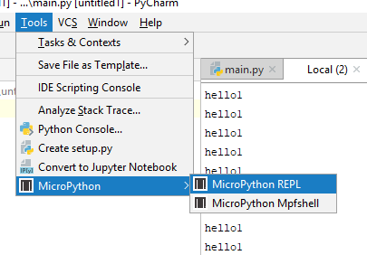

### 7. 功能详细说明

#### 1. 认识 intellij-micropython 插件

- 这个插件 intellij-micropython 版本和官方的底层不同，是基于我的 mpfshell-lite 得到，也就是说，你只要知道原来的 mpfshell-lite 有什么功能就可以了，它只是把输入命令的操作简化到图形按钮了。
- 未来将会独立出来或合并回官方，因此现阶段请不用使用商店里的版本。

#### 2. 手动 配置 想要 运行的 文件

- 现在的提示：现在底层已经会自动重连设备了，如果运行过程中出错了的话，它会自动修复重新执行，所以在绝大多数情况下运行代码不会失败。
- **以下信息可能已经过时，仅供参考。**
- 过去的提示：目前的运行操作出现失败重试即可，偶尔会发生，尤其是在 main.py 函数中，因为 main.py 上电会自动执行，影响了连接判断，所以可以用其他文件来执行，彼此间没有什么区别。
- 准备一个项目，并添加一个文件，如图。
- 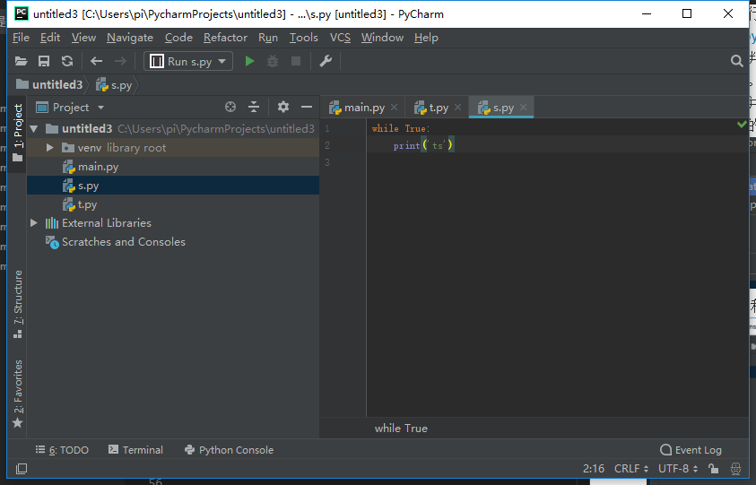
- 先配置一下当前的文件，如图操作即可。
- 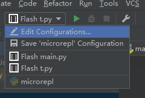
- 设置一下 Name 和 Path 就可以了。
- 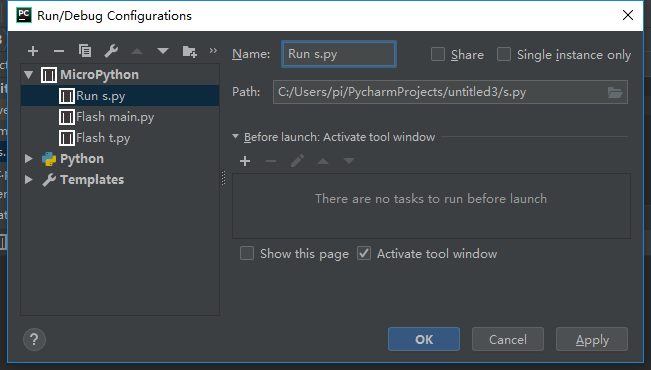
- 选择配置的设备，然后点击一下绿三角形就运行了，红色方块表示停止运行，失败了重试即可。
- 
- 运行效果如下
- 
- 常见失败如下图，和 mpfshell 是一样的，因为底层一样。
- 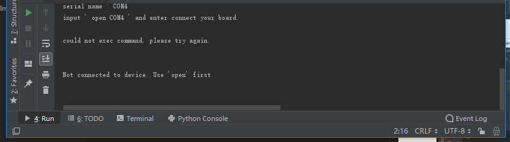
