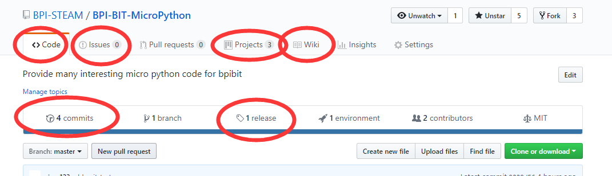
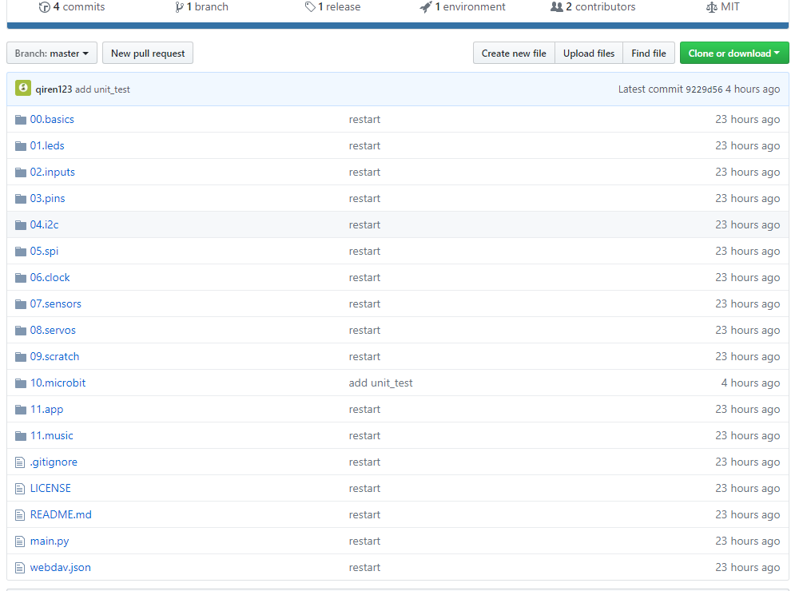
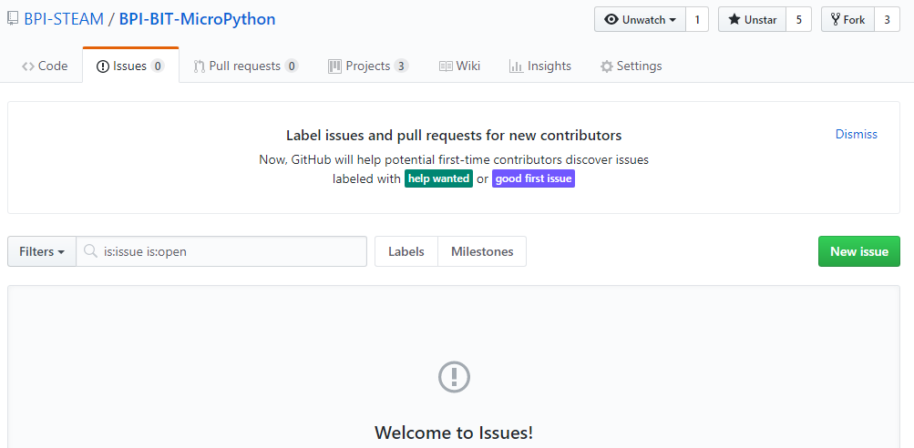
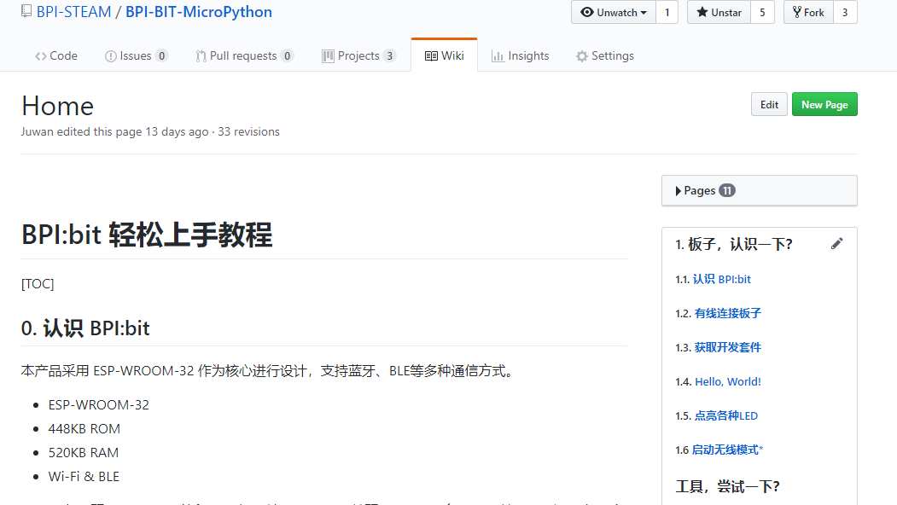
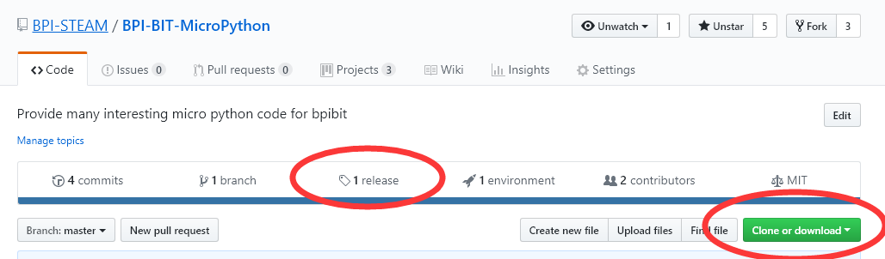

# 认识 Github 项目

在这里以 [BPI-BIT-MicroPython](https://github.com/BPI-STEAM/BPI-BIT-MicroPython) 为例。

提示：图片内容已经过时，仅是教会你如何使用 Github ，以便于你之后寻找需要的代码和知识。

## 1. 认识项目

- Github 是一个公共免费的版本管理仓库，大部分也都是开源项目，你可以在这里获得许多你需要的资料或代码等等，而我们的代码等等开源的东西都是存放在 github 的 git 仓库里。
  
- 
  
- 圈起的按钮选项，它对用户而言可以提供以下功能（虽然文档内容可能会与时俱进的更新，但图片所示的大体内容不会改变）。
  
1. **Code** 指项目存放的开源代码，在这里指的是可以给板子直接使用的示例代码。
    - 
2. **Issues** 若存在任何疑问都可以在这里发布消息，无论是错误报告还是需要帮助等等。
    - 
3. **Project** 指现在项目的开发情况，在这里可以看到整个项目的开发情况。
    - 
4. **Wiki** 查看项目的使用文档，也就是你现在所在的位置。
    - 
5. **commits** 指现在项目的更新或提交情况，在这里就可以知道项目的实际进展情况。
    - 
6. **release** 这里就是存放给用户可以直接使用的工具套件以及源代码等。
    - 

## 2. 下载项目

- 如下图可以看到 Clone or Download 按钮，它是将当前项目的示例代码直接打包下载（不包含开发套件）。
- 
- 而获取开发套件需要点 release 或点此进入 [BPI-BIT-MicroPython/releases](https://github.com/BPI-STEAM/BPI-BIT-MicroPython/releases)
- 
- 点击 蓝色字体 即可下载文件，在这个项目里，开发套件工具都是按需下载的，所以需要什么工具的时候，文档开头会提及所需材料。

