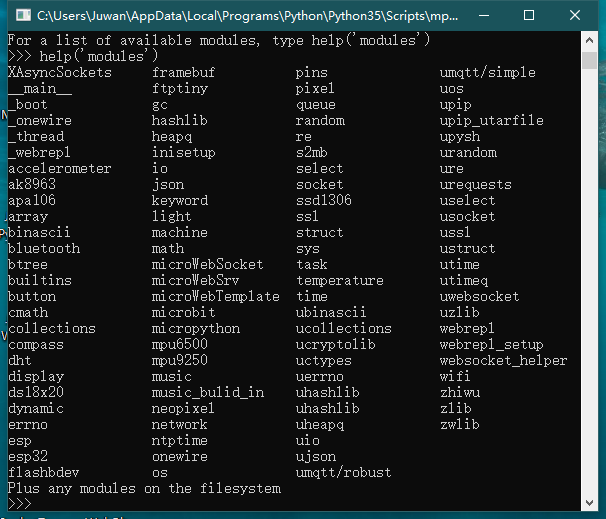

内建模块
====================================================

以下模块是 BPI-BIT MicroPython 的当前固件所拥有的全部模块，底部列表提供非官方内建（build-in）的模块文档。

增添的模块有如下列表：

.. toctree::
    :maxdepth: 1
    :numbered:
    
    microbit
    urequests
    umqtt.simple
    s2mb
    ssd1306
    XAsyncSockets
    ftptiny
    accelerometer
    light
    display
    button
    bluetooth
    temperature
    microWebSocket
    microWebSrv
    microWebTemplate
    music
    music_bulid_in
    wifi
    dynamic
    compass
    ak8963
    mpu6500
    mpu9250
