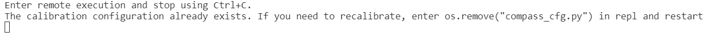

制作一个指南针
=====================================================

注意：在 1.2 的版型上没有磁力计功能。

这个模块可以让你访问内置的电子罗盘(即 AK8963 )。在使用指南针之前，应该校准指南针，否则读数可能会出错。

校准罗盘会导致程序暂停，直到校准完成。校准由一个小游戏组成，通过旋转板子在空中画圈完成校准。

有关指南针的函数
--------------------

.. function:: compass.calibrate()

执行此函数开始校准过程，你会收到一条有指导意义的信息，然后我们需要旋转板子，在空中画一个倒立的’8’或着转圈，(这个动作可以参考你的手机，手机的指南针功能在使用之前都会有一个校准的步骤)，这个校准的过程会占用大概1分钟的时间，校准期间你无法执行其他程序
提示信息

.. function:: compass.is_calibrated ()

如果罗盘校准成功，返回True，否则返回False。

.. function:: compass.get_x ()

返回x轴上磁场强度的读数，它是一个正整数或负整数，取决于磁场的方向。

.. function:: compass.get_y ()

返回y轴上磁场强度的读数，它是一个正整数或负整数，取决于磁场的方向。

.. function:: compass.get_z ()

返回z轴磁场强度的读数，它是一个正整数或负整数，取决于磁场的方向。

.. function:: compass.heading()

给出从上述读数计算出的罗盘航向，为0到360范围内的整数，表示按顺时针方向的角度，12点钟方向为0

.. function:: compass.get_field_strength()

返回设备周围磁场大小，它是一个整数。

体验一下指南针
--------------------

.. code:: python

   """
       compass.py
       Creates a compass.
       The user will need to calibrate the compass first. The compass uses the
       built-in clock images to display the position of the needle.

   """
   from microbit import *

   # Start calibrating
   compass.calibrate()
   # Try to keep the needle pointed in (roughly) the correct direction
   while True:
       sleep(100)
       needle = ((15 - compass.heading()) // 30) % 12
       display.show(Image.ALL_CLOCKS[needle])

在这个例子中第一步程序先校准了电子罗盘（mpu），校准完成后我们可以看到我们的led面板上有一个指南针它不管我们如何转动板子它始终指向南方
|compass|

.. |compass| image:: compass/compass.gif
