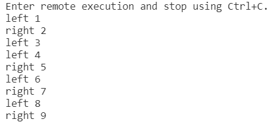

光敏及手势检测
=====================================================

认识光敏传感器
---------------------------

细心的同学可能已经发现了，在bpibit这块板子上面有这样两个小东西，没错，这两个小东西就是光敏传感器。它是一个对光线敏感的传感器，经过采样电路可以把光的强度转换成电压的大小。

.. image:: light/bpi.png

它的型号是 PTSMD021 。

.. image:: light/ptsmd021.png

获取周围光照强度
---------------------------

在固件里有一个 light 内建模块，调用这个模块中的函数我就可以轻松的获取到光线的强度。

.. code:: python

   import light
   from time import sleep_ms
   R = light.Intensity(39)
   L = light.Intensity(36)

   while True:
       print('R=',R.read())
       print('L=',L.read())
       sleep_ms(1000)

我们要使用 light 这个模块，首先就要先导入这个模块，可以通过 import light
来导入。

同理我们需要延时函数所以要导入 sleep_ms() 这个函数。

那么 light.Intensity(39) 和 light.Intensity(36) 是什么意思呢，实际上这里做的是初始化光敏传感器的工作。 但那为什么是 36 和 39 呢，这个问题，我们留到内建模块的 API 文档中再进行补充说明。

在完成了初始化之后，我们就可以调用 read() 函数来获取光线的强度了。 read() 函数返回的是一个 0 1000 的数值，这个数值表明的当前大概的光照强度

我们可以此时串口 REPL 打印出来的数据，图中用得 REPL 工具是（ `mpfshell-lite <https://github.com/BPI-STEAM/mpfshell-lite>`_ ）。

.. image:: light/message.png

通过光敏识别手势
---------------------------

从上面我们已经知道了，在我们的板子上面有两个光线传感器，那么我们就利用这两个光敏传感器来做一些有趣的事情吧，比如说简单的手势识别。

在我们的 light 模块中预置了 Gesture() ，通过它就是让我们实现简单的手势识别，那就让我们来试一下吧。

.. code:: python

   import light
   from display import*
   ts = light.Gesture()
   display = Display()
   t = 0
   while True:
       res = ts.get_gesture()
       if res != None:
           t = t+1
           print(res, t)
           if res == 'right':
               display.show(Image.ARROW_E)
           else:
               display.show(Image.ARROW_W)

首先导入我们的 light 模块，然后实例化 Gesture() 这个类，ts = light.Gesture() 通过这段代码完成了检测手势动作的初始化

调用 get_gesture() 方法来检测我们的动作，这个检测函数执行需要大概 25ms 的时间，用 while True 是因为在这里我们想让它一直检测我们的手势，如果不想运行那么长的时间的话，我们可以用一个 for 语句来决定循环的次数，比如我们想让它在10S内检测手势动作，那就通过 for i in range(10 * 1000 / 25) 让 get_gesture() 循环400次就可以了。

调用 get_gesture() 方法后，如果检测到向左的动作就会返回 ‘right’ ，如果是向左的动作就会返回 ‘left’ 。

我们用手扫过两个光敏传感器，它就能检测到动作并返回结果。我们用手来回在板子上面扫过的执行的结果如下图所示

实测效果如下

.. figure:: light/light.gif

.. Attention::

    在使用 get_gesture() 是要注意几个地方

    要在光线强度适中的环境下使用，不要在光线太强或太弱的环境下使用，在室内日光灯下面使用，识别的准确率是最好的

    使用时要确保光敏传感器面向光源，这个很重要，再强调一下要把板子朝向光源。

我们了解可光敏传感器的使用方法后，我们就可以利用它来做一些有趣的事情，比如用手势来点亮led，检测光线强度来控制开关等等，还可以结合前面的 display ，开始你的脑洞并尝试动手做一些有趣的小东西吧

.. Hint::

    如果你想知道为什么是 light.Intensity(39) 和 light.Intensity(36) ？

    就让我们来看一下电路图就一目了然了 (`查看 bpibit 的原理图`_)

    .. figure:: light/sensor.png

    左边的光敏传感器连接的是引脚 pin36 ，右边的光敏传感器连接的是引脚 pin39。

    .. _查看 bpibit 的原理图: https://github.com/BPI-STEAM/BPI-BIT/blob/master/doc/BPI-WEBDUINO-BIT-V1_4.pdf