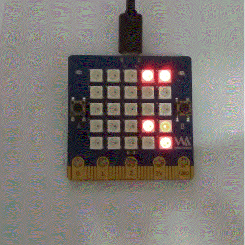
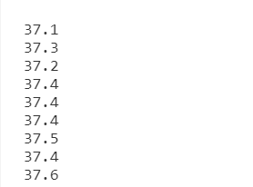
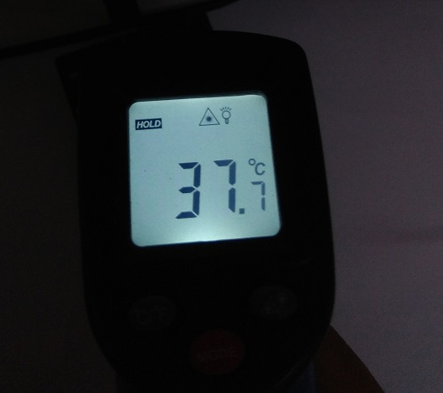

获取周围温度
=====================================================

这个 LED 面板底下的 热敏电阻 可以让你获得周围的环境温度。在使用它之前，建议将板子置于冷却下再采集，否则读取的温度和周围的温度有偏差，因为板子会发热，所以它的周围的影响最大的热源是板子自身的温度，所以环境的温度就会变成板子的温度。

所以在板子还没开始发热之前，起初获取的一定是环境温度，后来才逐渐变成板子温度。

赶快来试试吧
---------------------------

.. code:: python

   from microbit import *

   while True:
       temp = temperature() # get temperature ℃
       print(temp)
       display.scroll(str(temp))
       sleep(10000)

实测对比效果
---------------------------

LED 面板显示的内容

print 打印出来的数据

温度枪实测的温度

