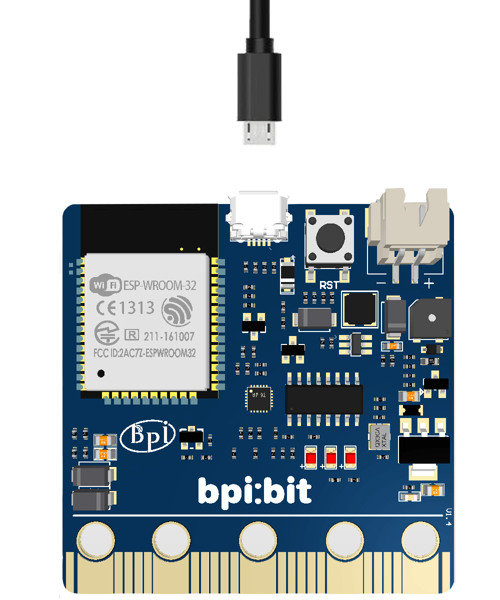

## 驱动安装

为什么需要安装驱动，根据百度百科定义，驱动程序一般指的是设备驱动程序（Device Driver），是一种可以使计算机和设备通信的特殊程序。相当于硬件的接口，操作系统只有通过这个接口，才能控制硬件设备的工作。

因此，若是有需要专业开发硬件的用户，可以参考本文进行电脑驱动的安装，没有这种需要的话，可以跳过本文。

### 连接板子

板子采用 CH340 / CH341 串口驱动芯片，可以轻松的在 Windows 、 Linux 、macOS 等系统下自动安装驱动。

> [CH341SER Win 系统驱动](http://www.wch.cn/downloads/file/5.html)
>
> [CH341SER 其他系统驱动](https://blog.csdn.net/jazzsoldier/article/details/70169732)
>

将板子通过 MicroUSB 线连接到你的电脑里，以下以 Windows 10 为例。

### 查看驱动

进入 **设备管理器** 确认串口驱动（Serial）是否安装，进入方法如下。

- （右键）此电脑 -> 属性 -> **设备管理器**
- 开始菜单 -> （输入）**设备管理器**
- 控制面板 -> （搜索）**设备管理器**

可以看到 设备显示 **USB2.0-Serial** ，说明**未安装驱动**，若此前已安装驱动，可以跳至步骤 5 。

### 安装驱动

点此获取 [Serial CH341](http://www.wch.cn/downloads/file/5.html) 驱动，并按如下说明操作安装驱动

打开下载的 **CH341SER.ZIP** 压缩包，进入 **CH341SER** 文件夹，打开 **SETUP.EXE**，即可看到如下图。

点击 **INSTALL** （安装），等待片刻即可完成安装。

### 确认串口

核对板子是否连接成功

可以看到原来的 **USB2.0-Serial** 消失了，取而代之的是 **USB-SERIAL CH340(COM3)**，这意味着你已经成功安装驱动，并且得到板子串口名称为（**COM3**），你可以通过各种串口工具来查看串口名（COM3）的板子传出的信息。

### 其他系统

#### macOS 安装

- [CH340 macOS 驱动使用教程](https://blog.csdn.net/jazzsoldier/article/details/70171771)

#### Linux 安装

- 官方 linux Kernel2.6 以后默认自带，也可在[此处下载](http://www.wch.cn/download/CH341SER_LINUX_ZIP.html)。
