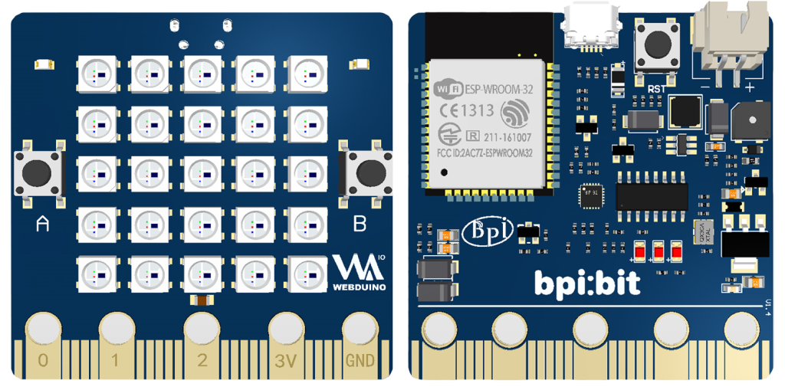
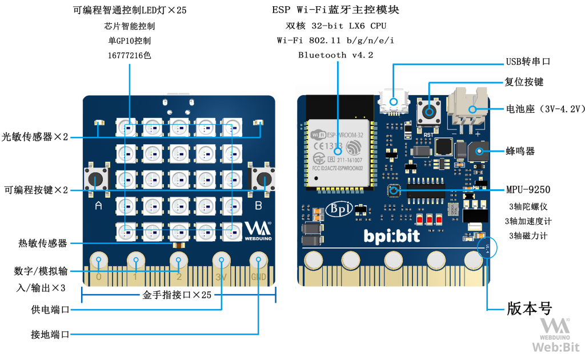
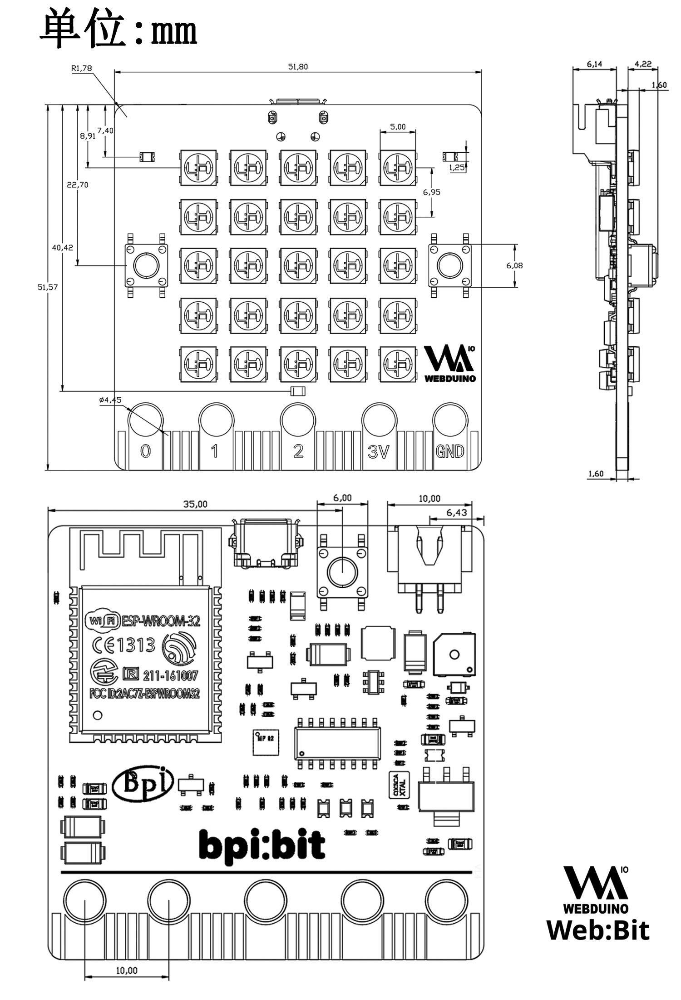
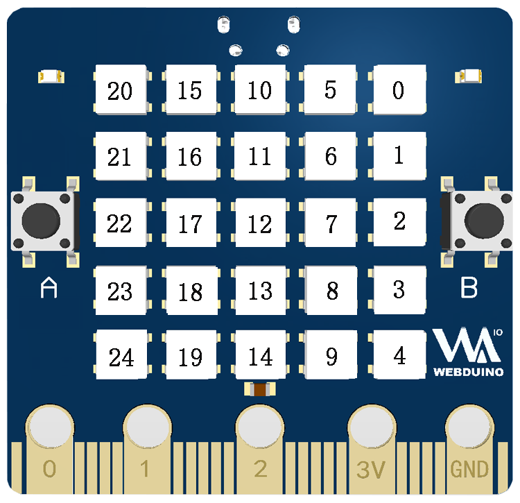
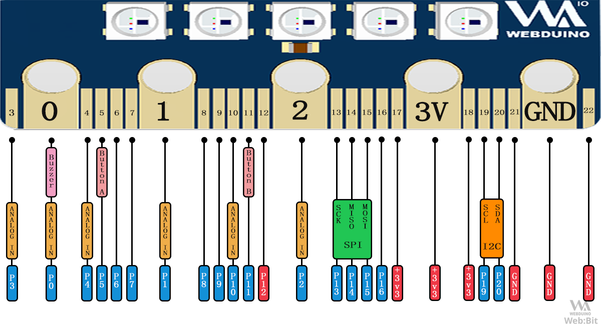
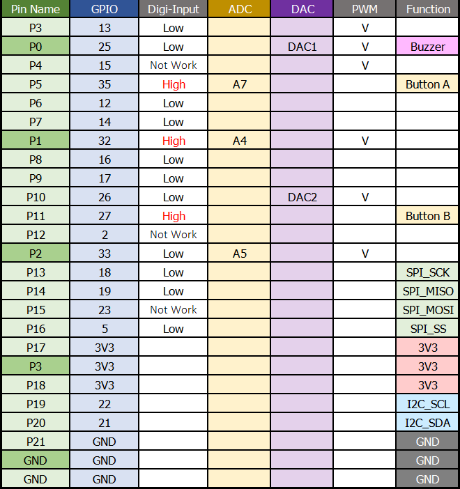
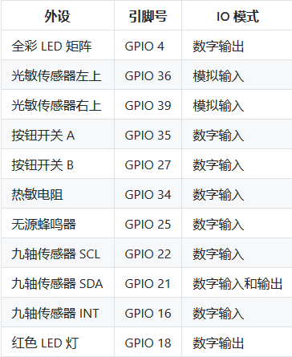

## 开发板介绍

> 以下内容介绍硬件 1.4 版，编辑日期 2019年7月24日。

Bpi:Bit 又名 Web:Bit ，是 Webduino 的专用开发板，采用 ESP-WROOM-32 （ESP32）模组作为核心，拥有 Wi-Fi & Bluetooth 无线功能，支持多设备协同控制，更是内置了许多的传感器，用户可以轻松体验到开发的无穷乐趣。

### 正面与背面

Web:Bit 外观长约 5 公分，宽约 5 公分，重量约 10 ~ 12 公克，带 25 颗 LED 灯为正面（图左侧），反之为是背面（图右侧）。

### 尺寸规格图

### 矩阵 LED 定义

Web:Bit 按照 5 * 5 排列方式焊接了 25 颗(编号 0 ~ 24 ) 1600 万色矩阵 LED (WS2812) ，所有的 LED 的控制仅使用一个引脚 (GPIO 4) 即可控制。

### 底部金手指定义

在 Web:Bit 的底部具有一排 25 Pin 的「金手指」接口，其定义如下。

**注意：背面的金手指未连接硬件，所以无法使用**

### 内置传感器定义

Web:Bit 搭载了 25 颗矩阵 LED ，两个光敏传感器、两个按钮开关、一个热敏电阻、一个无源蜂鸣器和一个九轴传感器（分别为三轴加速度、三轴陀螺仪与三轴磁力计）对应引脚如下：

### 相关硬件资料

- [BPI-WEBDUINO-BIT-V1_2](https://github.com/BPI-STEAM/BPI-BIT-Hardware/tree/master/docs/BPI-WEBDUINO-BIT-V1_2.pdf)

- [BPI-WEBDUINO-BIT-V1_4](https://github.com/BPI-STEAM/BPI-BIT-Hardware/tree/master/docs/BPI-WEBDUINO-BIT-V1_4.pdf)

- [Buzzer-SS-S050020Z-120](https://github.com/BPI-STEAM/BPI-BIT-Hardware/tree/master/docs/Buzzer-SS-S050020Z-120.pdf)

- [CH340DS1-ch](https://github.com/BPI-STEAM/BPI-BIT-Hardware/tree/master/docs/CH340DS1-ch.pdf)

- [CH340DS1-en](https://github.com/BPI-STEAM/BPI-BIT-Hardware/tree/master/docs/CH340DS1-en.pdf)

- [esp32_hardware_design_guidelines_en](https://github.com/BPI-STEAM/BPI-BIT-Hardware/tree/master/docs/esp32_hardware_design_guidelines_en.pdf)

- [ESP32-datesheet_english](https://github.com/BPI-STEAM/BPI-BIT-Hardware/tree/master/docs/ESP32-datesheet_english.pdf)

- [esp-wroom-32_datasheet_cn](https://github.com/BPI-STEAM/BPI-BIT-Hardware/tree/master/docs/esp-wroom-32_datasheet_cn.pdf)

- [LightSensor-PTSMD021-0805](https://github.com/BPI-STEAM/BPI-BIT-Hardware/tree/master/docs/LightSensor-PTSMD021-0805.pdf)

- [LM1117](https://github.com/BPI-STEAM/BPI-BIT-Hardware/tree/master/docs/LM1117.pdf)

- [MPU-9250 Datasheet-v1.1-ch](https://github.com/BPI-STEAM/BPI-BIT-Hardware/tree/master/docs/MPU-9250%20Datasheet-v1.1-ch.pdf)

- [MPU-9250 Datasheet-v1.1-en](https://github.com/BPI-STEAM/BPI-BIT-Hardware/tree/master/docs/MPU-9250%20Datasheet-v1.1-en.pdf)

- [MPU-9250 Register Map-v1.6](https://github.com/BPI-STEAM/BPI-BIT-Hardware/tree/master/docs/MPU-9250%20Register%20Map-v1.6.pdf)

- [NTC-0805-103F-3950F](https://github.com/BPI-STEAM/BPI-BIT-Hardware/tree/master/docs/NTC-0805-103F-3950F.pdf)

- [SY7208](https://github.com/BPI-STEAM/BPI-BIT-Hardware/tree/master/docs/SY7208.pdf)

- [WS2812B](https://github.com/BPI-STEAM/BPI-BIT-Hardware/tree/master/docs/WS2812B.pdf)

- [DS-000189-ICM-20948-v1.3](https://github.com/BPI-STEAM/BPI-BIT-Hardware/tree/master/docs/DS-000189-ICM-20948-v1.3.pdf)

