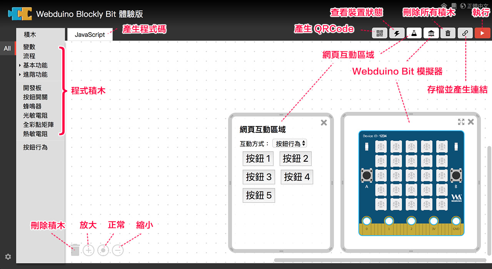
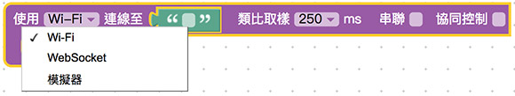
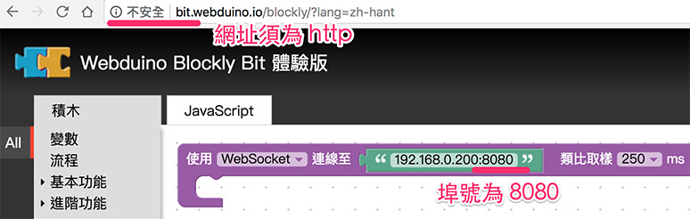
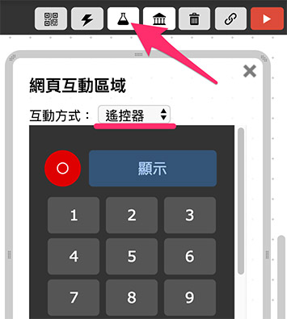

# 认识 Webduino Blockly Bit

Webduino Blockly Bit 体验版是 Webduino 所研发出来的图像化编辑工具，采用 Google Blockly 设计而成，提供虚实整合、程序积木、远程操控的环境，可尽情体验物联网的使用情境与操作感受， 快速实现各式各样的创意。

打开：[Webduino Blockly Bit 体验版](https://webduino.com.cn/link.html?lang=zh-hans&type=blockly)

> 更多 Webduino Blockly 功能请参考：[Webduino Blockly 基本操作](https://tutorials.webduino.io/zh-tw/docs/basic/blockly/blockly-tutorial-01.html)、[Webduino Blockly 特殊功能](https://tutorials.webduino.io/zh-tw/docs/basic/blockly/blockly-tutorial-02.html)、[连动多块开发板](https://tutorials.webduino.io/zh-tw/docs/basic/blockly/multi-board.html)。

## 工具接口说明

Webduino Blockly 的接口主要分成三个部分，第一个部分是左边与左上方的选单列，里头有「程序积木」与「JavaScript」两个互相切换的页签，右上方依序为「产生 QRCode」、「查看装置状态」、「网页互动测试」 、「Webduino Bit 仿真器」、「删除所有积木」、「存盘并产生链接」和「执行」。

## 控制 Webduino Bit 开发板

ebduino Blockly Bit 目前可以 Wi-Fi 和 WebSocket 操控，如果没有实体开发板，亦可透过「仿真器」的方式操控。

注意，若要使用 WebSocket，**网址必须为 http，且端口号须为 8080**。

## 储存盘案

当我们编辑完之后，可以点选 Webduino Blockly 右上方的「链接」图标，会产生一组链接网址，这组链接网址代表的是当前画面，只要把这组网址记到浏览器的「我的最爱」或「书签」内，下次再打开就会出现一模一样的画面了。

## 在线 Webduino Bit 仿真器

打开 Webduino Blockly Bit 体验版后，画面上会自动打开仿真器，仿真器里包含一块虚拟的 Bit 开发板，程序执行后，开发板上的 Webduino logo 会变成绿色，同时下方出现灯泡与火焰的虚拟元素，如果有使用「 光敏电阻」，则可以透过灯泡元素进行互动，若有使用「温敏电阻」，则可以透过火焰元素进行互动。

## 网页互动区

Webduino Blockly 内嵌网页模板，点选网页互动测试的按钮，就可以从下拉选单选择这些网页模板，并透过这些网页操控物联网装置，网页模板包含：显示文字、点击灯泡、控制图片、颜色调整、按钮行为、拉霸操作、Youtube 、影像追踪、遥控器、绘制图表。

## 完美支持手机

Webduino Blockly 内建了 QRCode 的按钮，点选这个按钮就会产生 QRCode ，用行动装置扫描，就可以将目前「网页互动区」的网页，呈现于手机的浏览器。

