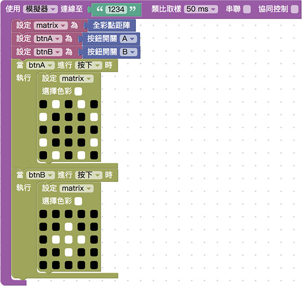

# 按钮开关

开关常见于日常生活中，在 Webduino Bit 开发板正面的左右两侧，默认了两颗按钮开关，透过开关的操控，我们更能实作物联网的情境，甚至打造真实的游戏遥控器或智能家电的应用。

## 基本操作

打开 [Webduino Blockly Bit 体验版](https://webduino.com.cn/link.html?lang=zh-hans&type=blockly)，在编辑区放入*开发板积木*， 开发板默认使用「*仿真器*」，联机到画面中「*虚拟的 Bit 开发板*」，默认 Device ID 为 「*1234*」。

> 开发板相关积木，在「*开发板*」目录下。

如果是使用「*实体 Bit 开发板*」，下拉选单选择「*Wi-Fi*」，并于后方字段填入开发板的 Device ID。

在开发板内放入两个「*设定 button 为按钮开关*」的积木，从后方按钮开关的下拉选单，可以选择按钮 A 或按钮 B，选择完成后，点选在前方设定积木的下拉选单，使用「*新变量*」将变量分别命名为 btnA 和 btnB。

> 按钮开关相关积木，在「*按钮开关*」目录下。

点选右上方的选单，打开网页互动区，下拉选单选择「*显示文字*」，左侧选单也会出现对应的积木功能。

放入「当 button 进行按下」的积木，透过下拉选单选择对应的 btnA 或 btnB，设定当按下 btnA 的时候，在网页互动区显示「按下 A」，当按下 btnB 的时候，显示「按下 B」。

> 显示积木在「*显示文字*」目录下，文字积木在「*基本功能 > 文字*」目录下。

点选右上方红色按钮执行，用鼠标点选虚拟开发板的按钮开关，或是按压自己的实体开发板的按钮开关，就会看见网页互动区里出现不同的文字。

> 范例解答：[点击 Webduino Bit 按钮开关，显示不同文字](https://webduino.com.cn/link.html?lang=zh-hans&type=example&blockly=button01)

## 按钮开关操控全彩点矩阵

按钮开关除了可以和网页元素互动，也可以直接操控 Bit 开发板上的其他组件，接着我们就让按钮开关和全彩点矩阵互动，在点击不同按钮的时候呈现不同的图案，因为要和全彩点矩阵互动，所以在开发板内放入一个全彩点矩阵的积木，* 名称设定为 matrix*，放入两个按钮开关的积木，*名称分别设定为 btnA 与 btnB*。

放入当按钮按下执行动作的积木，分别设定按下 btnA 和 btnB 时，全彩点矩阵会显示不同图案。

点选右上方红色按钮执行，用鼠标点选虚拟开发板的按钮开关，或是按压自己的实体开发板的按钮开关，就会看见全彩点矩阵出现不同的图案。

> 范例解答：[Webduino Bit 按钮开关操控全彩点矩阵](https://webduino.com.cn/link.html?lang=zh-hans&type=example&blockly=button02)

