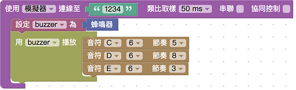
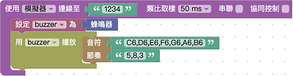
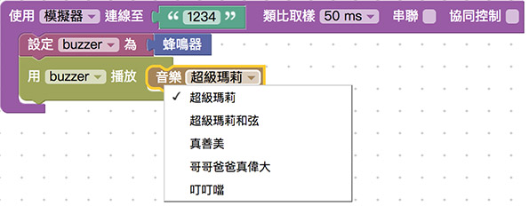
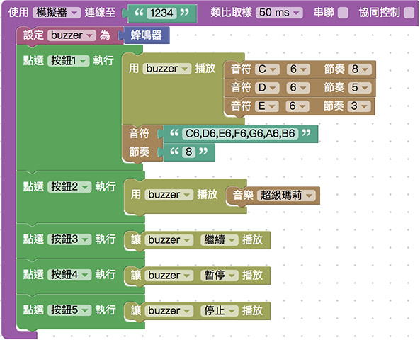

# 蜂鸣器

蜂鸣器是一个可以产生声音信号的装置，使用直流电供电，接通讯号源之后，音频信号电流通过电磁线圈，使电磁线圈产生磁场，造成振动膜片周期性地振动发声，Webduino Bit 内建的蜂鸣器，能够播放七个八度音阶的声音， 藉由网页填入音符代码，就能播放指定的声音。

## 基本操作

打开 [Webduino Blockly Bit 体验版](https://webduino.com.cn/link.html?lang=zh-hans&type=blockly)，在编辑区放入*开发板积木*， 开发板默认使用「*仿真器*」，联机到画面中「*虚拟的 Bit 开发板*」，默认 Device ID 为 「*1234*」。

> 开发板相关积木，在「*开发板*」目录下。

如果是使用「*实体 Bit 开发板*」，下拉选单选择「*Wi-Fi*」，并于后方字段填入开发板的 Device ID。

在开发板内放入「*设定 buzzer 为蜂鸣器*」的积木。

> 蜂鸣器相关积木，在「*蜂鸣器*」目录下。

放入「使用 buzzer 播放」的积木，里头先摆入音符与节奏，「音符」第一个下拉选单有「*无声、C、CS、D、DS、E、F、FS、G、GS、A、AS、B*」，可以想象成钢琴的黑键与白键，有 S 的就是黑键， 第二个下拉选单就是有几个八度音，这里可以设定七个八度音 ( 1~7 )，*数字越大声越高*，「节奏」就是*几分之一秒*，最少可以到 1/10 秒。

> 可以连续放入好几个音符节奏，播放的时候会依据放入的位置顺序播放。

如果觉得一个个的放入音符节奏麻烦，也可以使用一次填入音符节奏的积木。

> 如果节奏的数量小于音符，多出来的音符就会使用最后一个节奏数字播放。

如果完全不会编辑音乐，甚至可以直接使用「音乐」的积木，里头默认有五种不同的曲调旋律。

最后也可以将上面三种播放音乐的模式混合在一起，先播放单音、再播放音乐最后播放一次性的音符节奏。

点选右上方红色按钮执行，如果是虚拟开发板，就会从喇叭或耳机听到声音，如果是实体开发板，就会听见上头的蜂鸣器发出声音了。

> 范例解答：[Webduino Bit 蜂鸣器播放音乐](https://webduino.com.cn/link.html?lang=zh-hans&type=example&blockly=buzzer01)

## 网页按钮操控蜂鸣器

打开网页互动测试区，下拉选单选择「按钮行为」，画面里会出现好几个网页按钮，此时在右下角也会出现对应的积木功能可以选择。

放入「*点选按钮... 执行*」的积木，放入对应蜂鸣器要播放的声音，或是放入设定蜂鸣器播放状态 ( 暂停、停止、继续 ) 的积木，如此一来在点击按钮的时候，蜂鸣器就会播放声音、或是暂停播放。

> 此处常常会忘记放入「*使用 buzzer 播放」的积木，要特别注意*。

> 范例解答：[网页按钮操控 Webduino Bit 蜂鸣器](https://webduino.com.cn/link.html?lang=zh-hans&type=example&blockly=buzzer02)