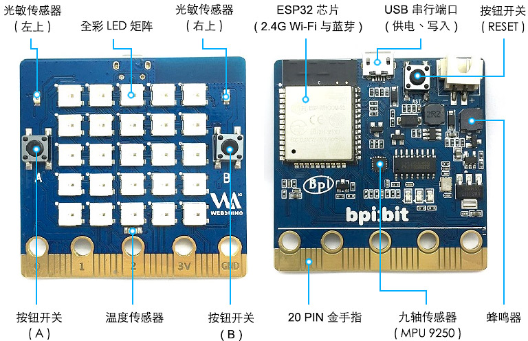

# Webduino Bit 详细规格

Webduino Bit 是 Webduino 最新的开发板，除了原本的功能一应俱全 ( Wi-Fi 操控、多装置串连、协同作业... 等 )，更内建许多新的组件与传感器，Webduino Bit 采用 ESP32 模块，内建 2.4G Wi-Fi 和蓝牙功能，具备 448KB ROM 和 520 KB SRAM 的内存容量，处理速度达 600 DMIPS，搭配 40nm 工艺的超低功耗，是目前市面上最高效能、最稳定以及最通用的产品之一。

> 如欲操控 Webduino Bit，务必阅读 [Webduino Bit ( 初始化设定 )](setting.html#_top) 进行相关网络设定。

## 默认组件脚位介绍

Webduino Bit 开发板长 5 公分宽 5 公分，重量约 10~12 公克，除了下方 20 Pin 的「金手指接口」，更内建一个 25 颗全彩 LED 灯的矩阵，两个光敏电阻、两个按钮开关、一个温度感应电阻 一个蜂鸣器和一个九轴传感器 ( 三轴加速度、三轴陀螺仪与三轴磁力指南针 )，脚位配置如下：

- *全彩 LED 矩阵*：A10 ( GPIO 4 )
- *光敏传感器*：左上 A0 ( GPIO 36 )、右上 A3 ( GPIO 39 )
- *按钮开关*：按钮 A P5 ( GPIO 35 )、按钮 B P11 ( GPIO 27 )
- *温度传感器*：A6 ( GPIO 34 )
- *蜂鸣器*：P0 ( GPIO 25 )
- *九轴传感器 MPU-9250*：P20 ( GPIO 21 )、P19 ( GPIO 22 )

## 外观介绍

