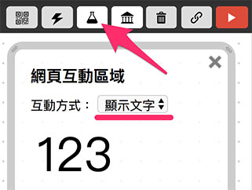
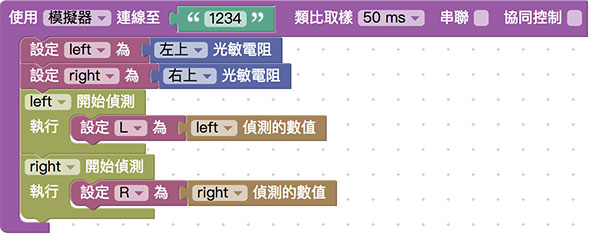
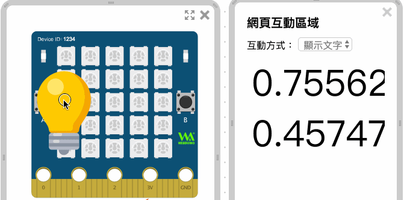
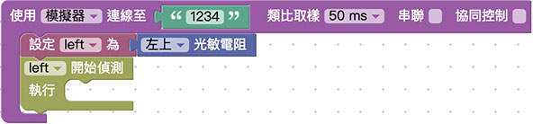
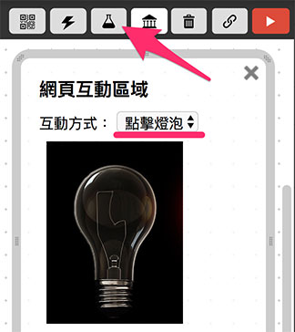
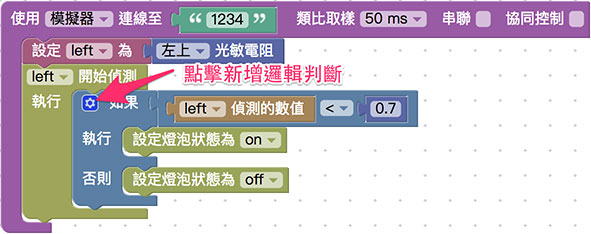

# 侦测光线

Webduino Bit 内建许多的传感器，其中一项就是光敏电阻，藉由默认的两个光敏电阻，能够侦测光线的强弱，甚至互相搭配实作智能家电或自动侦测的相关应用。

## 基本操作 ( 显示光线数值 )

打开 [Webduino Blockly Bit 体验版](https://webduino.com.cn/link.html?lang=zh-hans&type=blockly)，在编辑区放入*开发板积木*， 开发板默认使用「*仿真器*」，联机到画面中「*虚拟的 Bit 开发板*」，默认 Device ID 为 「*1234*」。

> 开发板相关积木，在「*开发板*」目录下。

如果是使用「*实体 Bit 开发板*」，下拉选单选择「*Wi-Fi*」，并于后方字段填入开发板的 Device ID。

在开发板内放入两个「*设定 photocell 为光敏电阻*」的积木，从后方光敏电阻的下拉选单，可以选择左上或右上，选择完成后，点选在前方设定积木的下拉选单，使用「*新变量*」将变量分别命名为 left 和 right。

> 光敏电阻相关积木，在「*光敏电阻*」目录下。

点选右上方的选单，打开网页互动区，下拉选单选择「*显示文字*」，左侧选单也会出现对应的积木功能。

因为有两个光敏电阻，所以如果要同时侦测，需要分别放入 left 和 right 侦测的积木。

为了让两个光敏电阻的数值同时显示，必须使用「变量」的积木来装载光线数值，这里分别建立 L 变量装载 left 侦测的数值，R 变量装载 right 侦测的数值。

> 变量相关积木在「*变量*」目录下。

使用显示文字的「显示」积木，搭配「*建立字符串*」的积木，将 R 与 L 变量的数值同时显示在网页互动区内，点选建立字符串积木的「*蓝色小齿轮*」可以新增组合的缺口，就能放入逗号做为分隔。

> 建立字符串相关积木在「*基本功能 > 文字*」目录下。

点选右上方红色按钮执行，会看见虚拟 Bit 开发板下方出现一个灯泡和一个火焰的图案，这时候只要用鼠标拖曳灯泡靠近光敏电阻，就会看见不同的数值呈现，如果是使用实体 Bit 开发板，则可以使用灯光照射光敏电阻，或用手遮挡光敏电阻， 观察光线数值变化。

> 范例链接：[Webduino Bit 光敏电阻侦测光线](https://webduino.com.cn/link.html?lang=zh-hans&type=example&blockly=photocell01)

## 逻辑互动 ( 点亮网页灯泡 )

已经能够从光敏电阻获得光线数值后，接着就可以透过逻辑判断，来实作一个虚拟的小夜灯功能，因为小夜灯通常只需要一个光敏电阻，所以这里先使用左上的光敏电阻，名称设定为 left。

打开网页互动区，下拉选单选择「*点击灯泡*」，左侧也会出现对应的积木选单。

放入「*逻辑判断*」的积木，判断光线数值小于 0.7 的时候，就点亮互动区的灯泡，若光线大于 0.7 则让灯泡熄灭，若要新增逻辑判断，可以点选逻辑积木的「*蓝色小齿轮*」新增。

> 逻辑相关积木在「*基本功能 > 逻辑*」目录下，数字相关的积木在「*基本功能 > 数学式*」目录下。

点选右上方红色按钮执行，虚拟 Bit 开发板下方出现一个灯泡和一个火焰的图案，用鼠标拖曳灯泡靠近左上的光敏电阻，就会看见互动区的灯泡熄灭，离开则灯泡就会亮起，如果是使用实体 Bit 开发板，则可以使用灯光照射光敏电阻， 或用手遮挡光敏电阻，观察网页虚拟灯泡变化。

> 范例链接：[Webduino Bit 侦测光线点亮网页灯泡](https://webduino.com.cn/link.html?lang=zh-hans&type=example&blockly=photocell02)

