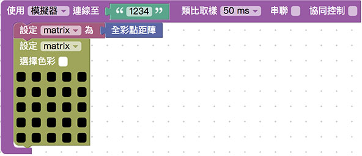
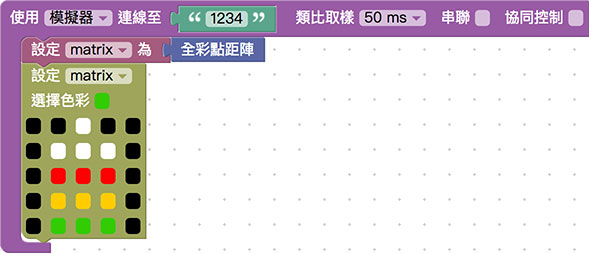
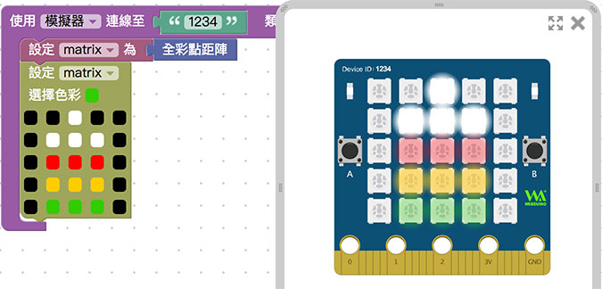

# 5x5 全彩 LED 点矩阵

Webduino Bit 的正中央内嵌一组 5x5 共 25 颗全彩 LED 的点矩阵，每个灯都可透过红绿蓝三原色进行混色，透过不同位置的灯号与颜色显示，就能呈现各种不同的图案造型。

## 基本操作

打开 [Webduino Blockly Bit 体验版](https://webduino.com.cn/link.html?lang=zh-hant&type=blockly)，在编辑区放入*开发板积木*， 开发板默认使用「*仿真器*」，联机到画面中「*虚拟的 Bit 开发板*」，默认 Device ID 为 「*1234*」。

> 开发板相关积木，在「*开发板*」目录下。

如果是使用「*实体 Bit 开发板*」，下拉选单选择「*Wi-Fi*」，并于后方字段填入开发板的 Device ID。

在开发板内放入「*设定 matrix 为全彩点矩阵*」的积木，在其下方接着摆入「*设定 matrix 色彩*」的积木。

> 全彩点矩阵相关积木，在「*全彩点矩阵*」目录下。

先用鼠标选择颜色，点击下方空格就能将颜色填入并绘制图案，如果选择黑色则该颗灯不会发光。

点选右上方红色按钮执行，就可以看到仿真器的虚拟开发板，或是自己的实体开发板显示对应的颜色和图案。

> 范例解答：[Webduino Bit 全彩点矩阵显示颜色](https://webduino.com.cn/link.html?lang=zh-hans&type=example&blockly=rgbmatrix01)

## 网页按钮互动

已经了解全彩点矩阵的基本应用之后，接着要使用「网页互动区」的「网页按钮」操控灯号显示，点选上方选单的网页互动区按钮，下拉选单选择「*按钮行为*」，选择后在画面中会出现五个按钮，同时在左侧也会出现对应的积木选单。

将「*点选按钮执行*」的积木放到画面里，分别设定点选按钮 1 和点选按钮 2 时会出现不同图案，点选按钮 3 则会将全彩点矩阵关闭。

点选右上方红色按钮执行，就可以用网页互动区的按钮，控制仿真器的虚拟开发板，或是自己的实体开发板显示对应的颜色和图案。

> 范例解答：[网页按钮切换 Webduino Bit 全彩点矩阵图案](https://webduino.com.cn/link.html?lang=zh-hans&type=example&blockly=rgbmatrix02)

