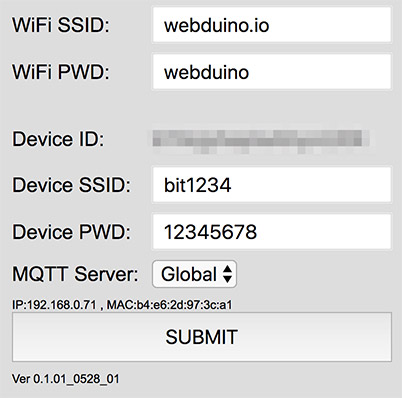
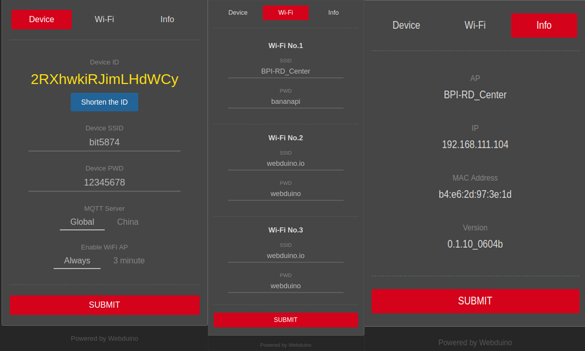
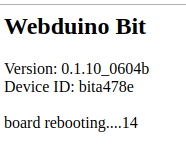
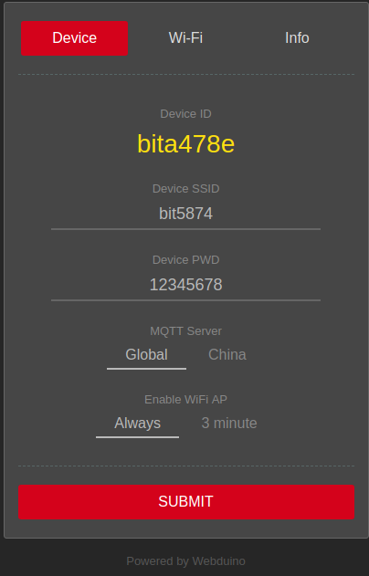
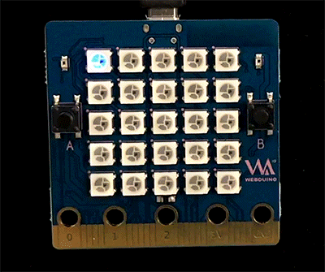
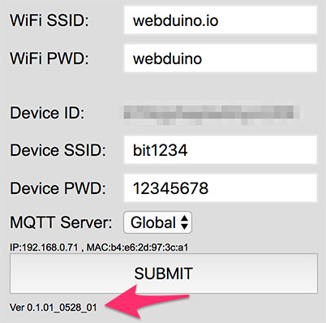

# Webduino Bit 初始化设定

使用 Webduino Bit 之前，最重要的就是进行初始化设定，初始化设定的目的在于让 Webduino 开发板可以自动上网 ( Internet )，或是在局域网络透过 WebSocket 联机，有了初始化设定， 我们也能够自定义开发板的显示名称和密码，更可以连上 internet 进行远程更新。

## Webduino Bit 初始化步骤说明

### 1. 接上电源，输入 WiFi 账号密码联机

把 Webduino Bit 接上电源，一开始在开发板正面的全彩 LED 点矩阵，会依序显示四个数字，这四个数字对应到计算机或行动装置 WiFi 搜寻里的 SSID 名称 ( 例如显示 1234，在 WiFi 搜寻中就会看到 bit1234 的名 称 )。

因为开发板尚未设定联机至局域网络，所以一开始 *会闪红灯，接着红灯恒亮*。 接着请准备一台具备 WiFi 功能的计算机、笔电或行动装置，使用这台装置进行 WiFi 搜寻刚刚看到为「*bitXXXX*」的装置 ( 以上述的例子而言，就是搜寻 bit1234 )。

输入默认密码 **12345678**，进行联机。

### 2. 设定 WiFi 账号密码与显示名称

*确认联机成功后*，打开浏览器 ( 建议使用 Chrome )，网址列输入 **192.168.4.1** 联机到 Bit 开发板的设定画面，包含以下几种设定：

- *WiFi SSID、PWD*：*必填*，表示开发板要连接哪个无线网络。
- *Device ID*：默认空白，*OTA 更新后就会取得 Device ID* ( **若默认 18 码 ID，在 OTA 更新后会更换为长度较短的 ID** )。
- *Device SSID、PWD*：装置在 WiFi 搜寻中所显示的名称和密码，若不填写会自动产生 ID 以及默认密码 12345678 ( **尚未 OTA 远程更新前请勿修改** )。
- *MQTT Server*：开发板要连接的服务器，默认 *Global*，如果在中国地区请选择 *China*。

设定完成后按下 SUBMIT 储存，出现 SAVE OK 的字样表示储存成功，此时 Bit 开发板会重启并闪烁红灯，当红灯熄灭，且绿灯亮起一次之后，表示 Bit 开发板已经成功链接上家里或环境内的 WiFi 基地台。 ( 若红灯持续闪烁或恒亮，请移除电源，重新操作步骤 1 与步骤 2 )

**新版界面介绍：**

上图可以看到我们将新版本界面分为了三个部分，第一部分是设置板子基本信息，同时反馈bit板Device ID，第二个部分设置板子需要连接的WiFi，可以同时设置三个WiFi，方便用户在开发环境与演示环境等不同场景键无缝切换，免去了换个地方即要重设WiFi的麻烦。第三个部分显示板子现在连接的WiFi信息以及版本信息。同时上图中的Device ID依旧为长ID，但是可以通过点击下面的按钮获取短ID，但是此时需要板子保持联网状态。点击获取`Shoren the ID`之后，会看到如下过程信息：

获取短ID结果：

> 小提醒，版本号 Ver 0.1.06_0719_01 之后的版本，若红灯闪完后亮起「**蓝灯**」而不是绿灯，表示已有新版本可以进行 OTA 更新。

### 3. OTA 远程更新

OTA 远程更新可以在 Webduino Bit 连上网络后，联机服务器更新取得最新版本韧体，更新步骤如下：

> 注意！ 更新过程中请勿移除开发板电源，避免更新失败。

- 步骤 1、确认开发板已经可以正常连上 WiFi，若不行，请检查 WiFi 联机或重新进行初始化设定。
- 步骤 2、移除开发板电源。
- 步骤 3、接上开发板电源，**在白灯显示数字的时候，按住按钮 A**。
- 步骤 4、**按住按钮 A 不放，直到开发板闪完红灯、绿灯熄灭上线后，此时会再听到蜂鸣器发出轻微的一个声响，再放开按钮 A**。 ( 若是第一次进行 OTA 更新，声响可能会在放开按钮 A 之后才会出现 )

- 步骤 5、完成后会看到开发板的点矩阵，**由第一颗灯开始亮蓝灯**，表示开始进行更新，**当蓝灯全部亮起接着熄灭后，表示更新完成**。

- 步骤 6、更新完成后开发板会闪红灯自动进行联机，联机成功会亮绿灯后绿灯熄灭，当 OTA 远程更新完成，可以看到一开始显示开发板的号码的白灯，由「闪灯」变成「跑马灯」的方式呈现，此时如果想修改 Device 的 SSID 显示名称， 就可以透过 WiFi 联机开发板，由 192.168.4.1 进行修改，而在设定画面最下方，也会看到开发板的版本号，变成 0528 以上的版本。

### 4. 打开 Webduino Blockly ( Bit 体验版 ) 进行测试

如果要测试实体开发板，可以打开下方 Webudino Blockly ( Bit 体验版 ) 的范例程序，在「开发板」的积木空格内，填入开发板的 Device ID，接着点击右上方红色的执行按钮，执行后按钮会变成绿色，同时也会看见 Bit 开 发板亮起红绿蓝三色的菱形。

如果没有实体开发板，但想要体验 Webduino Bit，也可以打开下方范例程序，打开后可以看到画面中多出一个「仿真器」的区域，这个区域中包含一块虚拟的 Webduino Bit，其 Device ID 为 1234，因此只要开发板的下拉选单选择「仿真器」，Device ID 输入 1234，执行后就会看见虚拟的 Bit 开发板，亮起红绿蓝三色的菱形。

> 范例程序：[https://goo.gl/PnK4FN](https://goo.gl/PnK4FN) & [Webduino Bit 全彩点矩阵显示颜色](https://webduino.com.cn/link.html?lang=zh-hans&type=example&blockly=rgbmatrix01)

