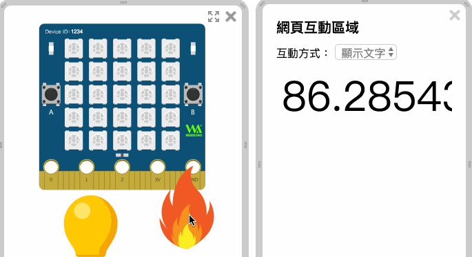
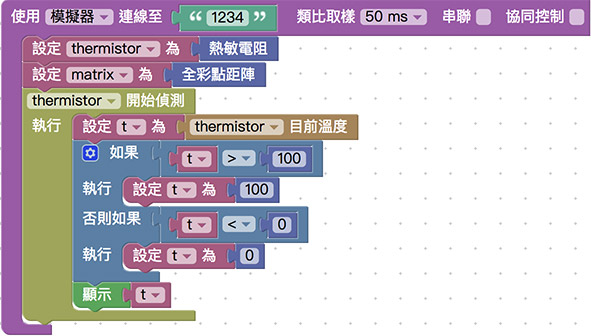
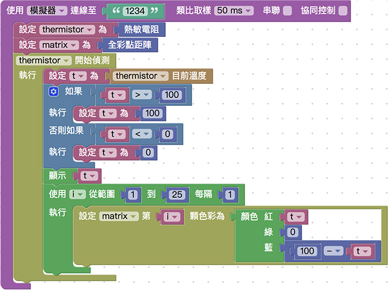

# 侦测温度

Webduino Bit 的内建一个温敏电阻，温敏电阻类似光敏电阻的原理，实时透过模拟讯号反馈温度数值并侦测温度的变化，进一步更能实现智能居家监测的相关应用。

## 基本操作 ( 显示温度数值 )

打开 [Webduino Blockly Bit 体验版](https://webduino.com.cn/link.html?lang=zh-hans&type=blockly)，在编辑区放入*开发板积木*，开发板默认使用「*仿真器*」，联机到画面中 「*虚拟的 Bit 开发板*」，默认 Device ID 为 「*1234*」。

> 开发板相关积木，在「*开发板*」目录下。

如果是使用「*实体 Bit 开发板*」，下拉选单选择「*Wi-Fi*」，并于后方字段填入开发板的 Device ID。

	

在开发板内放入「*设定 thermistor 为热敏电阻*」的积木。

> 热敏电阻相关积木，在「*热敏电阻*」目录下。

点选右上方的选单，打开网页互动区，下拉选单选择「*显示文字*」，左侧选单也会出现对应的积木功能。

放入 thermistor 开始侦测的积木，在侦测的同时，于网页互动区显示侦测到的温度。

点选右上方红色按钮执行，会看见虚拟 Bit 开发板下方出现一个灯泡和一个火焰的图案，这时候只要用鼠标拖曳「火焰图案」靠近热敏电阻，就会看见温度呈现在网页中，如果是使用实体 Bit 开发板，则可以用手指按压热敏电阻，或用嘴吹气， 观察温度数值变化。

> 范例链接：[Webduino Bit 侦测温度](https://webduino.com.cn/link.html?lang=zh-hans&type=example&blockly=temperature01)

因为热敏电阻为模拟讯号，所以呈现的数值会有许多小数点以下的位数，我们可以透过四舍五入的积木，显示小数点两位的数值。

> 四舍五入到小数点的积木在「*进阶功能 > 数值转换*」目录下。

## 组件互动 ( 全彩点矩阵颜色显示温度 )

在 [5x5 全彩 LED 点矩阵](rgbmatrix.html) 教学里有介绍全彩点矩阵的用法，接着将会介绍如何透过不同的颜色，呈现温度的变化，当温度越高颜色越红，反之温度越低颜色越蓝，一开始除了温敏电阻，也放入设定 matrix 为全彩点矩阵的积木。

因为要改变颜色，所以会用到颜色目录里的「红、绿、蓝」颜色积木，由于在 Blockly 的设定中，混合颜色的最大值为 100，最小值为 0，待会将要把温度的数值局限在这个范围内。

首先使用一个变量 t 表示侦测到的温度，接着透过逻辑判断：「*如果 t 大于 100 则 t 只等于 100，如果 t 小于 0 则 t 只等于 0*」，就能将 t 局限在 0 到 100 之间，完成后也可透过网页互动区显示 t 的数值。

> 变量的积木在「*变量*」目录下，逻辑积木在「*基本功能 > 逻辑*」目录下，数字积木在「*基本功能 > 数学式*」目录下。

放入「设定 matrix 第一颗色彩」的积木，设定红色为 t，蓝色为 100-t，如此一来当温度越高就会越红，温度越低就会越蓝。

> 数学式加减的积木在「*基本功能 > 数学式*」目录下。

点选右上方红色按钮执行，要用鼠标拖曳「火焰图案」靠近或远离热敏电阻，就会看见全彩点矩阵的第一颗灯，呈现红色蓝色的变化，如果是使用实体 Bit 开发板，则可以用手指按压热敏电阻，或用嘴吹气，观察颜色变化。

> 范例链接：[Webduino Bit 全彩点矩阵颜色显示温度 1](https://webduino.com.cn/link.html?lang=zh-hans&type=example&blockly=temperature02)

如果要一次让全彩点矩阵的 25 颗灯一起亮，可以透过循环的方式，让 25 颗灯一起依据温度而产生红色蓝色的颜色变化。

> 范例链接：[Webduino Bit 全彩点矩阵颜色显示温度 2](https://webduino.com.cn/link.html?lang=zh-hans&type=example&blockly=temperature03)

