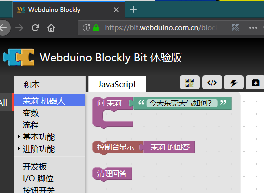
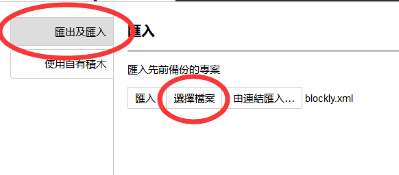
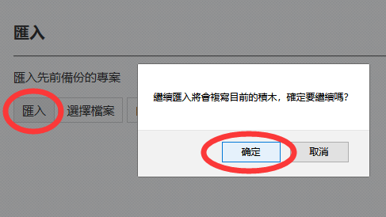

# 使用方法

## 载入拓展积木

> 以此示例模板为例：[webduino-blockly-template](https://bpi-steam.com/webduino-blockly-template/) 。

进入 [ webduino blockly Bit ](https://bit.webduino.com.cn/blockly/?lang=zh-hans)。

点击左下角的 菜单键（设置） 然后可以看到 使用自有积木。

在该框粘贴拓展 `https://bpi-steam.com/webduino-blockly-template/blockly.json` 地址并点击 汇入 即可。

汇入成功，再次点击 左下角的 × 返回主页吧。

此时你可以在主页的菜单们看到它们了。

## 载入使用范例

> 标准的积木示例中应该提供 blockly.xml 供他人参考和使用。

如果提供的示例积木，可以通过下载项目的 demos/blockly.xml 文件并导入。

选择文件后，点击汇入即可载入使用范例。

可以看到如下效果

可以点击右上角运行按钮，运行查看效果。

修改一下提问参数，再次运行得到新的结果。

如果想要自己制作和设计积木，可以参考[开发者文档](http://dev.bpi-steam.com)。