# 阵列

阵列可以将数字、文字、列表或变量，按照顺序组合起来，这些按序排列资料集合就称作阵列，一个阵列可以再细分为多个元素，或是一个阵列内还包含其他阵列，在进行比较复杂的运算时，也会透过阵列的操作来实现。

## 阵列积木清单

阵列积木包含建立阵列、建立空阵列、使用文字建立阵列、阵列取值、阵列编辑...等常用功能。

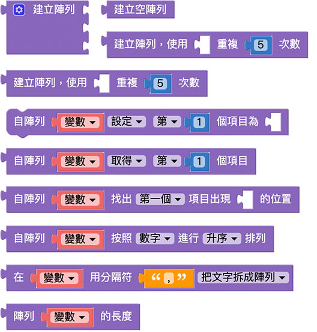

## 空阵列

「空阵列」积木会建立一个阵列容器，也就是里面没有包含任何元素的阵列

如果要用变量进行阵列的操作，首先必须把这个变量定义为阵列或空阵列，才能针对这个变量进行阵列数值的添加、删除、编辑...等动作。

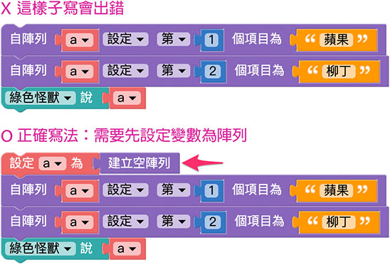

## 建立阵列

「建立阵列」积木可以透过指定位置放入对应的内容，建立一个带有数值的阵列。

点击蓝色小齿轮，可以增加放入内容的缺口。

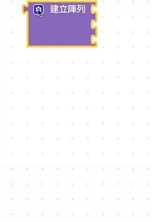

建立阵列完成后，可以透过小怪兽讲出阵列 ( 阵列内容会用逗号分隔 )。

或是也可以透过重复回圈，依序讲出阵列内容。

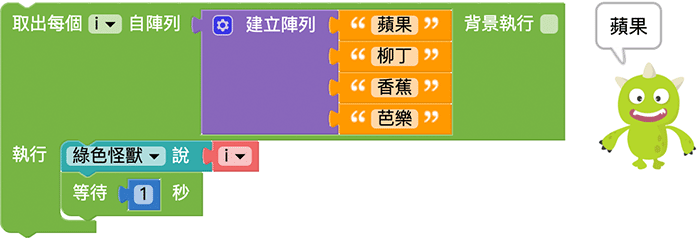

## 建立重复内容阵列

「建立重复内容阵列」积木可以建立具有重复数值重复的列表，数值可以变量、文字、数字或阵列阵列，将熟放入缺口内，就会根据重复设定的次数建立阵列。

举例来说让「芭乐」文字重复五次并建立阵列，绿色小怪兽就会念出五个芭乐的文字。

## 设定阵列内容

「设定阵列内容」积木可以针对阵列的内容 ( 第几个、倒数第几个、第一个、最后一个和随机 ) 进行三种编辑行为 ( 设定、插入或移除 )。

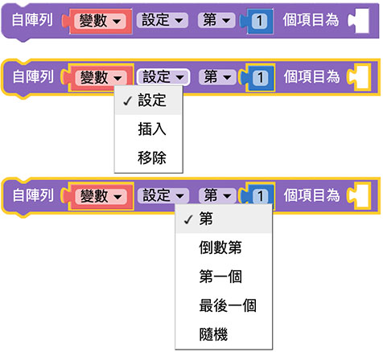

举例来说，原本的阵列有四种水果苹果、柳丁、香蕉和芭乐，透过「设定阵列内容」积木将阵列中第一个水果元素换成莲雾，绿色小怪兽讲出的阵列第一个元素就变成了莲雾，接着随机移除阵列的一个内容，红色小怪兽讲出的阵列就会变成只有三种水果。

如果接着使用「插入」桃子元素在「最后一个项目」，就可以看到阵列又变成四种水果，最后一种是桃子。

## 取得阵列内容

「取得阵列内容」积木可以取得一个阵列中某个元素的值( 第几个、倒数第几个、第一个、最后一个和随机)，或是取得某个元素的值之后，同时移除该元素。

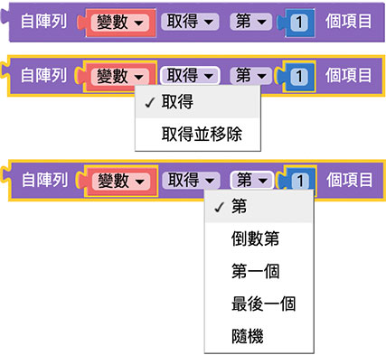

如果单纯取得某个元素的值，并不会影响原本阵列的内容和长度，但如果是「取得后移除」，这个阵列就不再包含这个元素，例如一开始有四种水果，如果只是取得内容，取得内容后的阵列依然是四种水果，不过如果取得后移除内容，取得内容之后阵列就变成了只有三种水果。

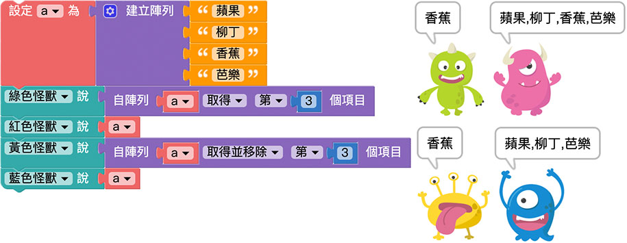

## 寻找阵列内容

「取得阵列内容」积木能从一个阵列中，找到特定元素所在的位置，并回传该位置的号码。

透过取得阵列积木来取得水果阵列，就能知道苹果位在第一个位置、柳丁位在第二个位置、香蕉位在第三个位置、芭乐位在第四个位置。

> 注意，如果是「写程序码」而非使用「积木」，第一个位置通常都是0，第二个位置是1，因为和生活习惯一至，在程序积木里头第一个位置的显示为1，第二个位置为2，依此类推。

## 阵列排序

「阵列排序」积木会将指定的阵列做字母、数字的排序，排序后会形成一个新的阵列，*不会影响原本阵列的排序*。

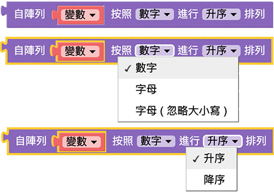

从下图的例子可以看出，绿色小怪兽会讲出按照字母排序过后的水果阵列( a,b,c,.... )，而红色小怪兽讲出原本的水果阵列并没有受到排序积木的影响。

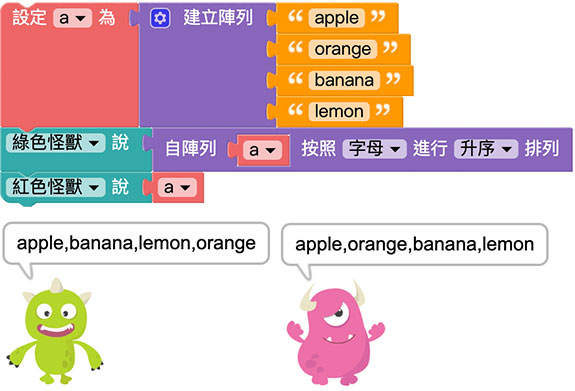

如果选择字母排序，就会「*先按照字母大小写排序，大写在前，小写在后，排序后再按照第二个字母排序*」，如果选择不区分大小写，就会直接进行排序，「 *如果第一个字母相同，就用第二个字母排序*」，以下图的例子，大写A 在前小写a 在后，排序后再按照123、456 进行排序。

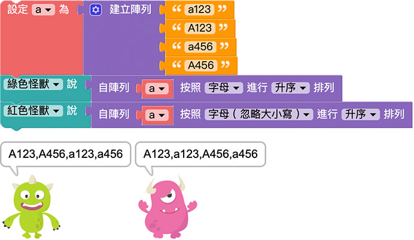

## 文字与阵列转换

「文字与阵列转换」积木可以将带有「分隔符」( 类似空白、逗号、分号...等分隔符号 ) 的文字转换为阵列，或是将阵列合并为一串文字。

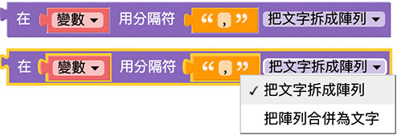

如果一串文字没有变成阵列，其中第二个元素就会是第二个字( 绿色小怪兽就会讲出「果」 )，如果将文字拆分为阵列，第二个元素就会是阵列中的第二个内容( 红色小怪兽就会讲出「柳丁」 )。

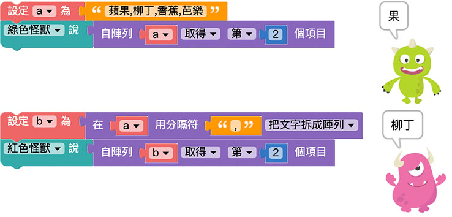

反之如果是将阵列合并为文字，可以将分隔符留空，就会看见阵列的内容变成一整串的文字，中间不会有逗号分隔，如果带有分隔符( 例如a )，就会看见结合成的文字中间都有a。

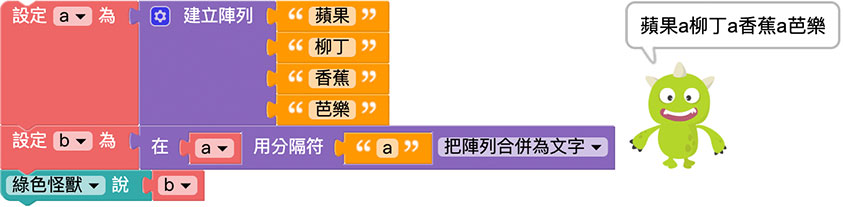

## 阵列长度

「阵列长度」积木可以取得个阵列的元素总数，如果是空阵列则阵列长度为 0。

因为阵列长度表示的是「阵列的空格数」( 阵列可以放入多少个元素)，所以如果「有空格」但没有放入元素，仍然会影响阵列长度，例如有个四格空格的阵列，但只放入了三种水果，最后呈现出来的阵列长度就是3。

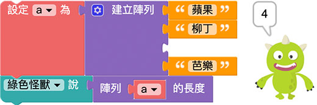