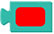
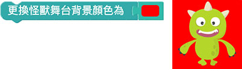
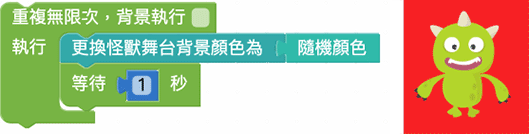
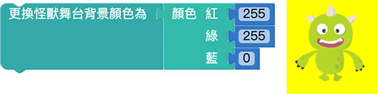
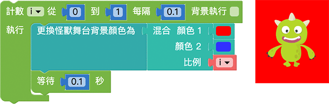

# 颜色

透过改变网页中元素的颜色，或指定实际 开发板全彩 LED 矩阵的灯光颜色，藉由五颜六色的趣味变化，就能做出许多绚丽夺目的效果。

## 颜色积木清单

阵列积木包含指定颜色、随机颜色、RGB 三原色、混合颜色...等四种常用颜色积木。

## 指定颜色

「指定颜色」积木可以让我们透过色彩选取面板，选择对应的颜色。

如果我们指定小怪兽互动舞台的背景为红色，网页执行后舞台背景就会变成红色。

## 随机颜色

「随机颜色」会在每次网页执行时，随机从各种颜色中取出一种颜色显示。

如果搭配重复回圈，网页执行后，就能看到小怪兽舞台背景的颜色不断随机变化。

## RGB 三原色

「RGB 三原色」积木能够指定网页中三原色的数值，直接透过数值来呈现不同的颜色。

> 三原色表示 *R 红色、G 绿色、B 蓝色*，三种颜色分别有 256 种从暗到亮的变化，透过三种颜色的混合，就能产生一千六百多万种的颜色。 ( 但人的眼睛无法分辨这么多种颜色 )

因为颜色有 256 种，对应的数值就是 0 ~ 255，0 是最暗，255 是最亮，输入对应的数值就能产生对应的颜色，举例来说红色 255 搭配绿色 255 就会是黄色。

> 网页的三原色为「*色光*」，*红色 + 绿色 = 黄色*，*绿色 + 蓝色 = 青色*，*红色 + 蓝色 = 紫色*。

搭配重复回圈，就能够做出红色到黄色的颜色转换效果。

## 混合颜色

「混合颜色」积木是指两种颜色积木按照比例混合产生新的颜色，比例为 0~1 之间的数值，数字越小颜色越接近颜色 1，数字越大颜色越接近颜色 2。

如果把颜色 1 设定为红色，颜色 2 设定为蓝色，比例 0.2 的混合颜色就是偏红色的紫色。

搭配重复回圈，就能够做出从红色到蓝色的颜色转换效果

