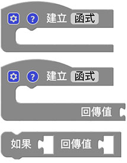
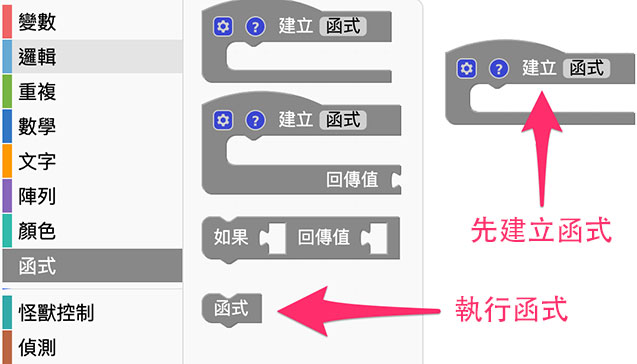
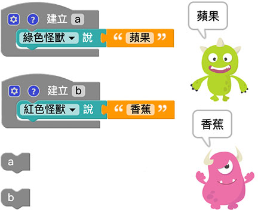
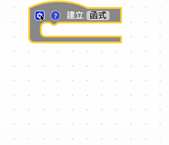
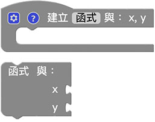
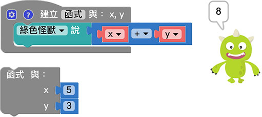
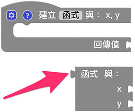
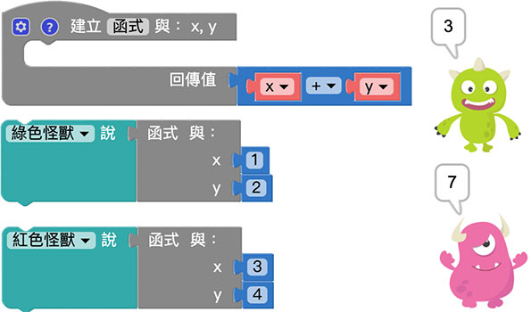
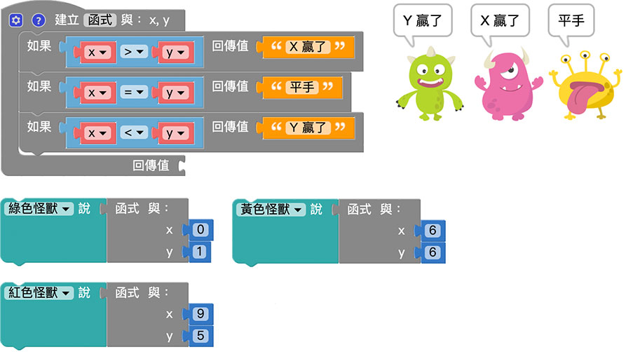
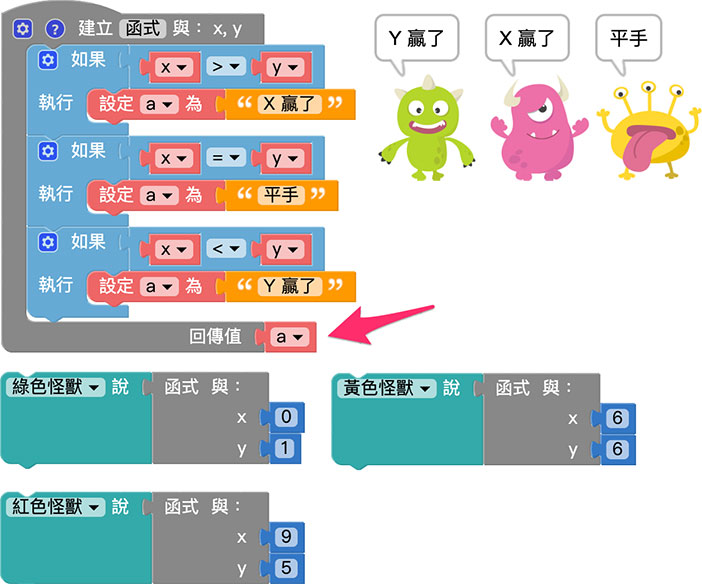

# 函式

函式積木可以幫助我們簡化或管理較為複雜的程序邏輯，因為在寫程序的時候，常會遇到需要重複撰寫並執行的程序碼，如果每重複一次都得重寫一次，勢必會造成整份程序邏輯的複雜度，透過函式，將這些重複的程序集中管理，需要使用的時候再去呼叫函式，就可以執行對應的內容。

## 函式積木清單

函式積木預設有三塊，分別是建立函式、建立帶有回傳值的函式、函式內判斷並回傳值。

## 建立函式

「建立函式」積木可以將許多重複會用到的程序積木包裝成函示。

使用建立函式積木*並不會執行函式*，因為函式是*定義「需要執行的內容」*，建立完成函式積木內容後，在函式積木的目錄裡，就會出現對應的*執行函式積木*，使用這塊積木才表示執行這個函式。

下圖建立了 a 和 b 兩個函式之後，使用*呼叫函式 a 和 b*，網頁執行後，綠色小怪獸就會說出蘋果，紅色小怪獸就會說出香蕉。( *如果單純只有建立函式而不呼叫，執行後什麼事情都不會發生* )

除了單純的使用函式，我們也可以建立「*函式內的变量*」，點選函式積木前方的小齒輪，就可以新增变量。

新增函式內的变量後，執行函式時也會看到放入变量數值的缺口。( 有幾個函式內的变量就會有幾個缺口 )

函式內的变量讓程序增加了許多彈性，並也可以減少許多重的程序碼，舉例來說，透過函式和函式內变量，就能做出提供变量數值，就算出數值加總的函式。

## 建立帶有回傳值的函式

「建立帶有回傳值的函式」積木可以讓執行的函式，變成單純的數值，這對於一些複雜的程序應用相當有幫助。

如果使用的是「建立帶有回傳值的函式」，就會發現執行函式時積木前方多了一個作為組合用的形狀。( 下圖是延伸前一段建立帶有函式內变量的函式 )

透過函式內的变量，搭配函式回傳的數值，就能做到依據提供的变量數值不同 ( x、y 不同值 )，而產生不同的結果。

## 函式內判斷並回傳值

「函式內判斷並回傳值」積木必須和「建立帶有回傳值的函式」的積木搭配，主要作為判斷要回傳什麼數值使用。( 這個積木也必須放在函式內才能正常運作 ) 

透過這個積木，搭配函式內的变量，就可以透過傳入的变量數值，最後回傳 x 和 y 哪個比較大的結果。

因為「函式內判斷並回傳值」積木具備邏輯判斷的功能，所以也可以使用邏輯積木加上一個变量來做判斷，就能做出一模一樣的效果。

