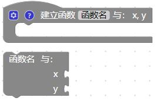
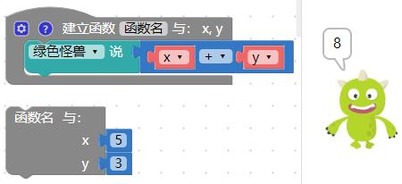
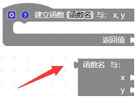
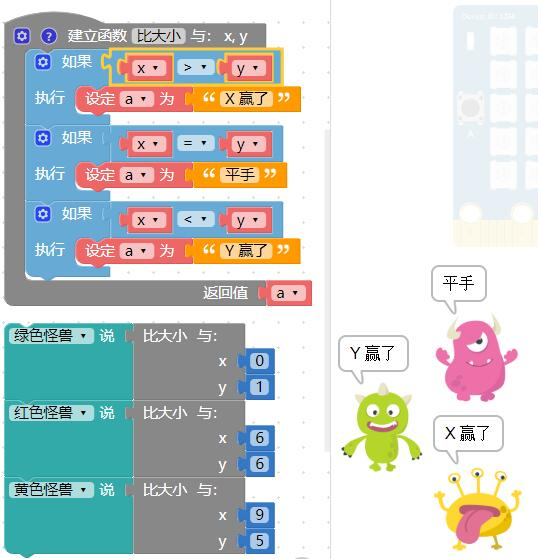

### 函数

在计算机中，函数是指一段在一起的、可以做某一件事儿的程序。

函数积木可以帮助我们简化或管理较为复杂的程序逻辑，因为在写程序的时候，常常会遇到需要重复编写并执行的程序积木，如果每重复一次都得重写一次，就会导致整份程序逻辑的混乱复杂，通过函数可以将这些重复的程序集中管理，需要使用的时候再去调用函数，就可以执行内部对应的程序。

#### 函数积木清单

#### 建立函数

「建立函数」积木可以将许多重复会用到的程序积木包装成函数。

使用建立函数积木*并不会执行函数*，因为函数是*定义「需要执行的内容」*，建立完成函数积木内容后，在函数积木的目录里，就会出现对应的*执行函数积木*，当去使用这块积木才表示执行这个函数。

下图建立了 a 和 b 两个函数之后，调用*函数 a 和 b*，执行后，绿色小怪兽就会说出苹果，红色小怪兽就会说出香蕉。 ( *如果单纯只有建立函数而不拉取出来调用，执行后什么事情都不会发生* )

除了单纯的使用函数，我们也可以建立「*函数内的参数变量*」，点选函数积木前方的小齿轮，就可以新增参数变量。

新增函数内的参数变量后，执行函数时也会看到放入变量数值的缺口。 ( 函数内有几个参数变量就会有几个缺口 )

函数内的参数变量让程序增加了许多弹性，并也可以减少许多重复的程序，举例来说，通过函数和函数内参数变量，就能做出提供参数变量数值，并算出数值总和的函数。

#### 建立带有返回值的函数

「建立带有返回值的函数」积木可以让执行的函数，变成单纯的数值，这对于一些复杂的程序应用相当有用。

如果使用的是「建立带有返回值的函数」，就会发现执行函数时积木前方多了一个作为组合用的形状。 ( 下图是一段建立带有函数的参数变量的函数 )

通过函数的参数变量，搭配函数返回的数值，就能做到依据提供的变量数值不同 ( x、y 不同值 )，而产生不同的结果。

#### 在函数内判断并返回值

「在函数内判断并返回值」积木必须和「建立带有返回值的函数」的积木搭配，主要作为判断后要返回什么数值使用。 ( 这个积木也必须放在函数内才能正常运作，如下图示例用法。)

通过这个积木，搭配函数内的变量，就可以通过传入的变量数值，最后返回 x 和 y 哪个比较大的结果。

因为「函数内判断并返回值」积木具备逻辑判断的功能，所以也可以使用逻辑积木加上一个变量来做判断，就能做出一模一样的效果。

