# 重复

在程序领域里，重复( 回圈) 是常常使用的基本功能，重复顾名思义就是重复执行的过程，也可以将需要重复执行的程序码放在回圈内，就能指定次数、延迟时间，或是无穷尽的执行。

## 重复积木清单

重复的积木分别有一个「等待」的积木，五种不同重复模式的积木和一个「停止重复」的积木。

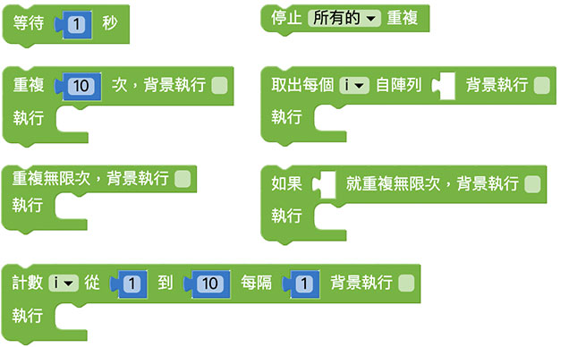

## 等待

「等待」积木可以让我们让程序暂停一段指定的时间，当程序积木里遇到等待积木，就会等待指定的时间之后才会进行接续的动作。

以下方的例子来说，如果不加上等待，四只小怪兽会同时说出 hello，如果加上等待 1 秒，四只小怪兽就会以每隔一秒的时间依序说出 hello。

> 注意，上述所谓的「同时」，是针对人类肉眼来说的意思，对于程序而言仍然是按照顺序进行，只是间隔时间非常短，短到人类的肉眼分辨不出来

没有加上等待积木

有加上等待积木

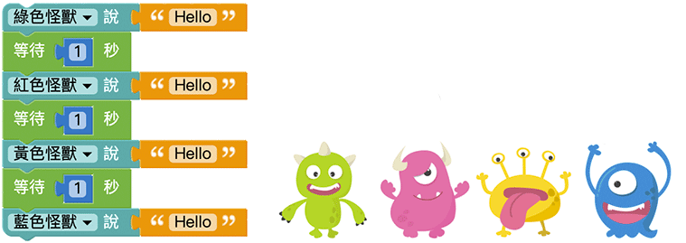

## 重复执行几次

「重复执行几次」积木，可以指定回圈内的积木程序重复的次数，预设次数为 10 次。

透过重复十次，可以让小怪兽旋转 100 度。

延续前面介绍过的等待，如果在重复里头不加入等待，就会看见怪兽瞬间旋转了100 度，如果我们在加上等待0.5 秒的积木，就会看到怪兽每隔0.5 秒旋转10 度，旋转十次。

## 计数

「计数」积木有点类似「重复执行几次」积木的进阶版，差别在于计数积木使用了一个变量，透过改变这个变量的数值，来决定重复几次、如何重复以及重复的间隔。

> 因为内含一个变量，所以当编辑画面里有计数的积木，在变量的目录下也会出现一个对应的变量。

使用「计数积木搭配等待」，可以让绿色小怪兽每隔0.5 秒讲出变量i 的数值，这个变量i 会*根据我们指定的起始数值、最终数值和间隔作数值进行递增或递减*，以下图的例子而言，变量i 会每隔1 进行加总，直到变成10 为止( 也就会依序念出1234...10 )。

> 注意，*如果要「依序」念出数字，一定要加上等待的积木*，不然就会呈现最后的数字。

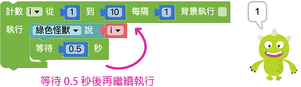

## 重复无限次

「重复无限次」积木会无止尽的一直执行回圈内容，除非使用「停止重复」，重复的事件才会停止。

延续前面介绍过的等待，在重复无限次的积木内加入「等待」，搭配小怪兽的旋转，就可以让小怪兽不断地旋转。

## 判断为真，就重复无限次

「判断为真，就重复无限次」积木等同于「重复无限次」积木加上「逻辑」判断，*只要空格内的逻辑判断为「真」( true )，就会开始进行无限重复*。

举例来说，我们可以先设定一个变量 a 为 2 到 9 之间的数字，透过判断如果 a 是偶数，就让小怪兽开始旋转，否则就不旋转。

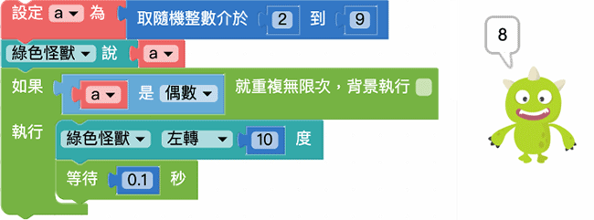

上面的例子也可以使用「逻辑」搭配「重复无限次」来实现同样的效果。

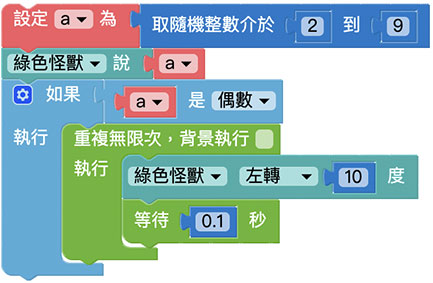

## 取出阵列元素并执行

有别于上述的重复方式，「取出阵列元素并执行」积木是以阵列长度作为重复次数的依据，因此空格内必须放入阵列积木，网页执行后就会依序取出阵列内容并执行对应动作。

我们可以设定变量 a 为一个阵列，里头放入五种水果名称，接着设定一个变量 i，依序让变量 i 等于水果名称，再让小怪兽讲出水果名称并进行旋转的动作。

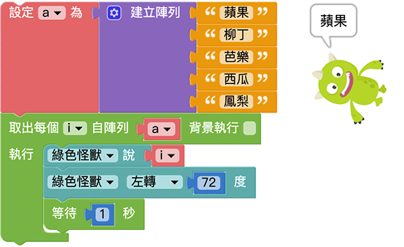

## 背景执行

「背景执行」是所有重复积木里头的功能选项，由于程序码的执行顺序缘故，「**前一段程序尚未完成前，无法执行下一段程序**」，也因此*大多数的情况在画面上只能同时执行一个重复回圈*，然而背景执行**可以让重复的动作进入背景执行，就能同时使用多个重复回圈**。

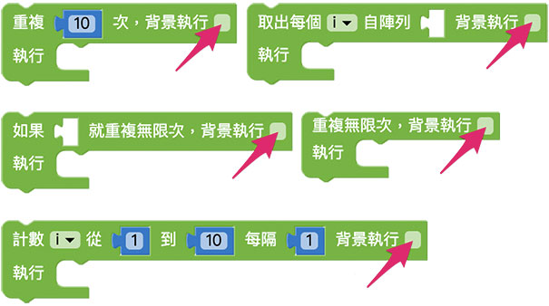

举例来说，如果我们使用两个「重复十次」的积木，都*不勾选背景执行*，第一个放入小怪兽旋转，第二个放入小怪兽移动，网页执行后，就会看到小怪兽*先旋转再移动*。

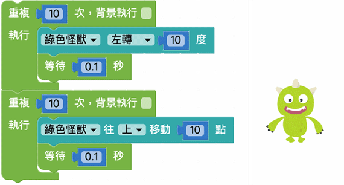

如果我们把上面的例子中的重复，*都勾选背景执行*，网页执行后就会发现小怪兽*一边移动一边旋转*。

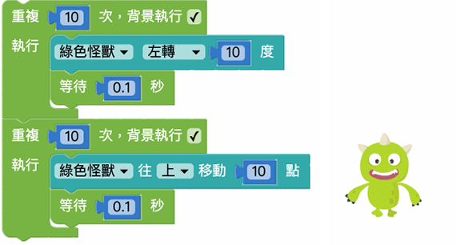

是否有背景执行，在「重复无限次」的情况下会更容易发现差异，**如果画面中有两个重复无限次的回圈，如果没有勾选背景执行，因为行为还停留在前一个重复无限次，在后面的重复无限次就不会执行**。

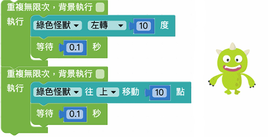

## 停止重复

上述所有的重复行为，都可以透过「停止重复」积木来停止，停止重复又分成「*停止画面上所有重复*」，或「*放在重复回圈内，停止所在位置的重复*」。

例如在「重复无限次」积木里加入「小怪兽旋转角度大于 90 度就*停止这个重复*」的判断，就会在小怪兽角度大于 90 度时停止重复，继续执行下方的讲话程序。

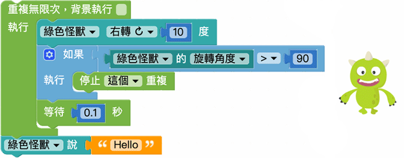

如果有多个重复，也可以使用「停止所有重复」来停止，例如下方的程序，当小怪兽旋转角度大于 90 度，就会停止所有重复。 ( 此处勾选了背景执行，请参阅「[背景执行](loop.html#loop07)」章节 )

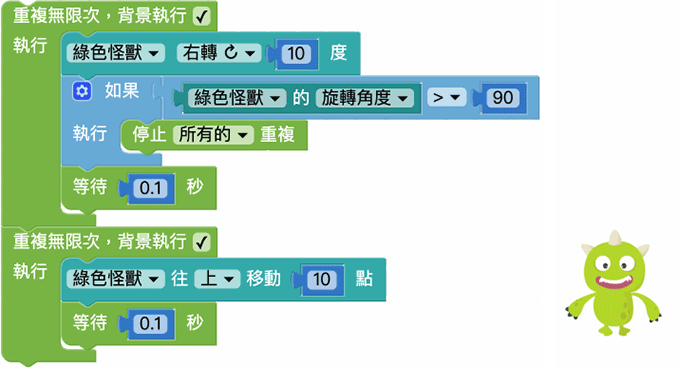