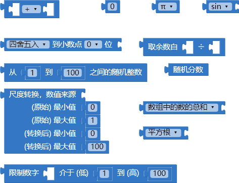
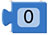
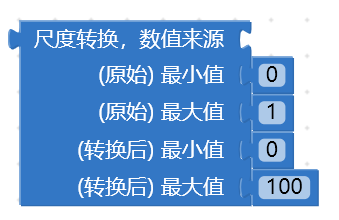
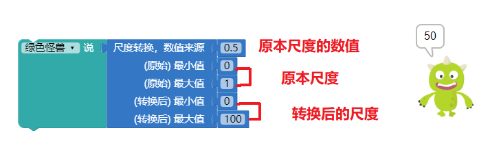
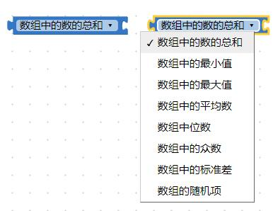
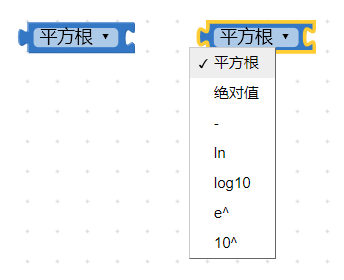
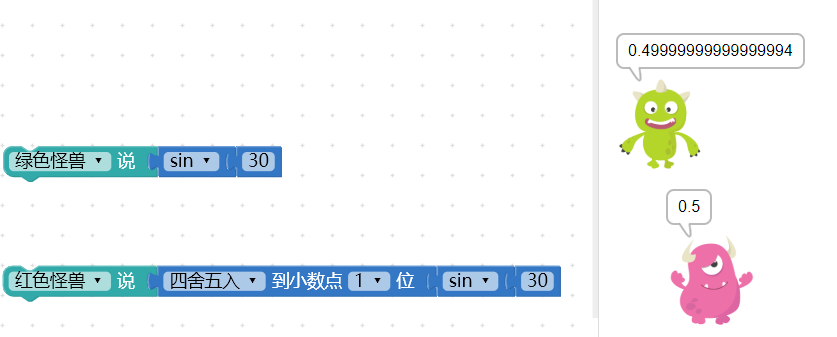
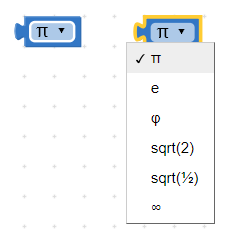

## 数学

数学积木包含了许多数学运算，从基本的加减乘除，到四舍五入、平均值、中位数...等应有尽有，无论是简单的程序或复杂应用，都能通过各式各样的数学运算实现。

### 数学积木清单

数学的积木分别有数字、运算、基础函数、加和、随机数和尺度转换...等常用的数学运算式。

### 指定数字

「指定数字」积木用来让我们输入数字，可输入整数或是带有小数点的浮点数，常用于运算和判断。

### 取得范围内随机整数

「取得范围内随机整数」积木会指定一个数字范围，在每次执行这块积木时，就会从这个数字范围内取出随机的整数。

搭配「循环无限次」积木和「等待」积木，可以让小怪兽每隔一秒说出一个随机整数。

### 取得随机分数

「取得随机分数」积木会在每次执行时，随机取得一个 0 到 1 之间的浮点数。

搭配「循环无限次」积木和「等待」积木，可以让小怪兽每隔一秒说出一个随机浮点数。

### 数学运算

「数学运算」积木可以针对数字进行加、减、乘、除和乘方五种运算。

如果使用多个数学运算的积木，需要注意的是*每个运算积木在计算上都会使用括号，类似的运算式有可能得到不同的结果*，例如下图积木看起来都是5 + 2 x 2，但因为括号位置的不同，得到的结果也不相同。

数学运算除了可以放入数字，也可以用于变量的相加，例如指定变量 a 为 5，变量 b 为 3，通过数学运算就能算出 a + b 等于 8。

### 取得余数

「数学运算」积木可以取得两个数字相除所得的余数。

### 限制数字范围

「限制数字范围」积木可以设定最大值与最小值，并将数字限制在这个指定的范围内。

### 四舍五入

「四舍五入」积木可以对带有浮点数的数字进行四舍五入、无条件舍去或无条件进位三种运算，同时亦可选择舍去或进位到第几位小数点。

将需要四舍五入的数字，放在「四舍五入」的积木后方，就可以得到四舍五入之后的结果。

### 尺度转换

「尺度转换」积木可以将某个尺度区间内的数值，转换为另外一个区间尺度对应数值。

如下图， 0.5 为 0-1 尺度区间的数值，转换为 0-100 尺度区间得到的结果就是 50。

「尺度转换」积木可以帮助我们完成许多较为复杂的尺度转换，例如 0.5 位于 -5-5 之间，转换到 250-400 之间的数值就是 332.5。

「尺度转换」积木常常会和「四舍五入」积木搭配使用，*建议将「四舍五入」积木放在尺度转换积木前方*，因为尺度转换后的数值有可能会带有小数点，转换后再四舍五入能得到较精确的答案。

### 数组运算

「数组运算」积木能针对以数字组成的数组，进行加总、取出最小值、取出最大值、计算平均值、取得中位数、取得比较众数、计算标准差和随机抽取的计算。

在数组运算后方接上数组积木，就可以开始行取值或运算。

### 常用数学函数

「常用数学函数」提供常用的数学计算积木，常用数学函数包含以下几种：开根号、绝对值、负数(-)、对数函数(ln)、log10 函数(log10)、指数函数(e^)和10 的几次方(10^)。

### 三角函数

「三角函数」积木里头提供了两种三角函数用法，分别是角度 ( sin、cos、tan ) 以及弧度 ( asin、acos、atan )，三角函数可以从下拉选单选择切换。

注意，因为JavaScript 网页语言特性，有些情况使用三角函数时，小数点后方会变成无限循环9999，例如sin(30) 应该等于0.5，出来却变成0.49999...，当遇到这种情况，需使用四舍五入的方式才能呈现预期的结果。

### 常数

「常数」积木会表现是一个不会变动的常数数值，常数包含了以下几种：圆周率(π)、指数(e)、黄金分割率(φ)、sqrt(2)、sqrt(½) 和无限大(∞)。

