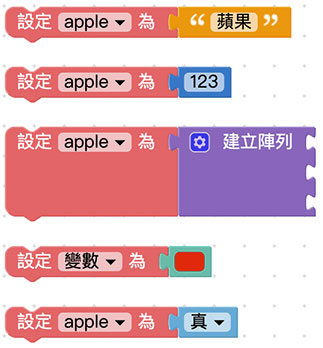
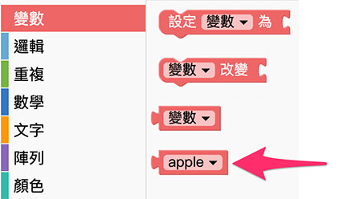
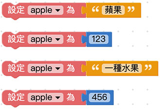
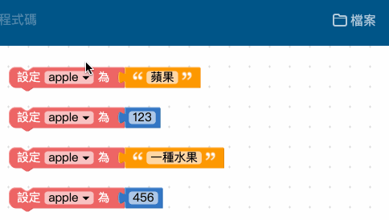
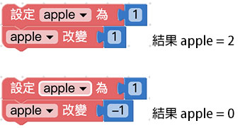
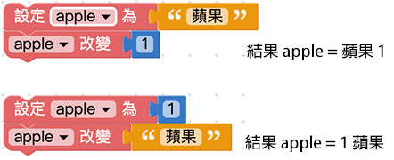
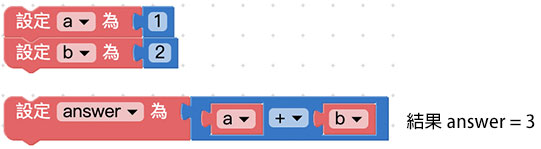

# 变量

变量，是所有程序都會用到的基本元素，使用前會賦予变量一個名稱，接著就可以用這個变量來表示文字、數字、陣列、顏色或邏輯，為什麼要使用变量呢？因為在編輯程序往往會遇到許多「重複」的部分，如果用变量或函式裝載這些重複的部分，就能很簡單的進行「一次性」新增、刪除或修改動作。

舉例來說，如果一段文章出現了五十次「A」，要把「A」修改為「B」，若不使用变量則得要手動修改五十次才辦得到 ( 不考慮編輯软件的搜尋取代功能 )，但如果今天我們用「变量 a 等於 A」，在修改的時候只需做一次動作：「把变量 a 等於 B」，就能把所有的「A」換成「B」，下方的教學內容將會深入介紹。

## 新增变量

使用变量的第一步，就是「新增一個变量」，打開 編輯器，將「*設定变量為*」的積木拖拉到畫面中，下拉選單選擇「*新变量*」，點選後彈出對話視窗，輸入新变量的名稱及可新增一個变量。( 建議变量的命名盡可能以「英文 + 數字」為主 )

在新增的变量後方加上對應的值 ( 值可以是文字、數字、陣列、顏色或邏輯 )，這個变量就等同於這個值，如果沒有賦予值，這個变量就是空变量。

新增变量後，在左側積木清單的变量目錄下，也會看到新增的变量積木。

> 注意，如果在編輯畫面裡完全沒有「設定变量為 XXX」的積木，積木清單裡就不會看見 XXX 的变量積木。

## 設定变量

設定变量表示賦予变量一個值，使用方式和新增变量完全相同，由於程序語言有「*後面覆蓋前面*」的特性，所以*如果变量名稱相同，後面設定的值會覆蓋掉前面設定的值*，以下圖的例子而言，变量 apple 最後的值為 456。

## 重新命名变量

有別於「新增变量」，重新命名变量可以將畫面中所有的变量一次改名，例如畫面裡出現了四次 apple 的变量，透過重新命名，可以將四個 apple 变量名稱全部換成 ball。

## 改變变量

改變变量表示「*讓变量的值改變多少*」，假設原本变量的值為 1，使用改變变量 1 之後，這個变量就會變成 2，同理，如果使用改變变量 -1，那麼這個变量就會變成 0。

注意，如果是不同類型的改變，例如原本的变量是文字「蘋果」，卻改变量字「1」，最後得到的結果是「蘋果1」三個字，同理如果是变量是「1」，而改變文字「蘋果」，得到的結果是「1蘋果」。

## 使用变量

新增变量或設定变量完成後，就可以在編輯區中使用变量，以下圖為例，先設定 a 变量為 1，b 变量為 2，接著就能計算 a + b 或 a 除以 b 之類的數學運算，或透過邏輯判斷 a 和 b 哪個值比較大，當程序邏輯越來越複雜，就得藉由不同的变量來實作。

