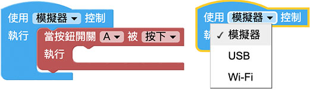
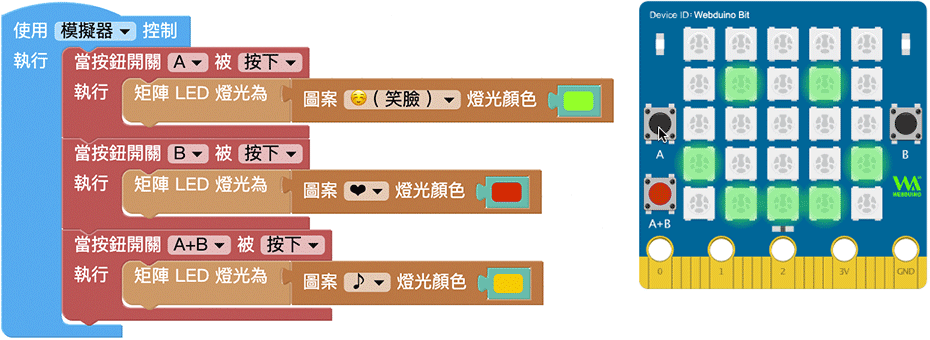
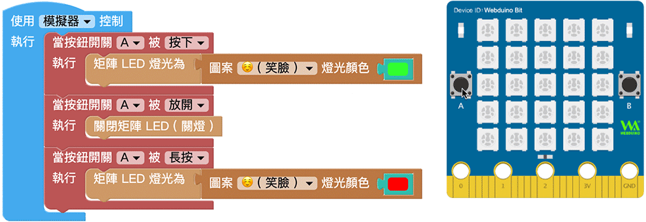

# 按钮开关

在 开发板正面的左右两侧，预设了两颗按钮开关，透过开关的操控，更能实作物联网的情境，甚至打造真实的游戏遥控器或智慧家电的应用。

## 按钮开关积木说明

按钮开关积木可以指定「按下、放开、长按」三种开关行为，三种行为可分别套用至 A、B 或 A 和 B 同时。 ( 长按的定义为持续按下一秒 )

> *使用按钮开关积木必须搭配「开发板」积木*，选择模拟器，执行后可以使用滑鼠点击模拟器，选择USB，执行后会透过USB 连线方式控制实体开发板，选择Wi-Fi 则可透过Wi-Fi 指定Device ID 操控。
> - USB 控制模式为「安装版编辑器」限定，请参考 [编辑器](../index.html#software)
> - Wi-Fi 模式需要开发板连接 Wi-Fi，请参考 [硬体开发板 ( 初始化设定 )](../info/setup.html)

## 按下开关改变 LED 矩阵图案

在编辑画面放入按下A、按下B 和按下A+B 的积木，接着分别在各自的区块内放入LED 矩阵显示图形的积木，执行后，如果是使用模拟器，就可以用滑鼠点击A 、B 或A+B 按钮查看变化效果，如果是使用实体开发板，则可以直接用手指按压开关。

> 模拟器里的 A+B 按钮开关，只有在编辑画面有 A+B 按钮开关的积木时才会出现。

## 按下、放开和长按

透过开关的按下、放开和长按三种行为，就能做出「按下时有图案，变成长按后图案会变色，最后放开开关就会关灯」的范例，执行后，如果是使用模拟器，就可以用滑鼠点击A 按钮查看变化效果，如果是使用实体开发板，则可以直接用手指按压开关。

