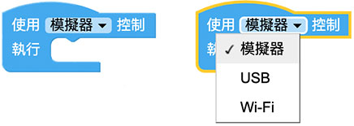
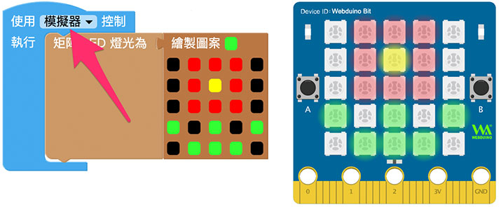
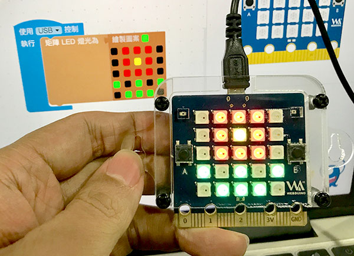
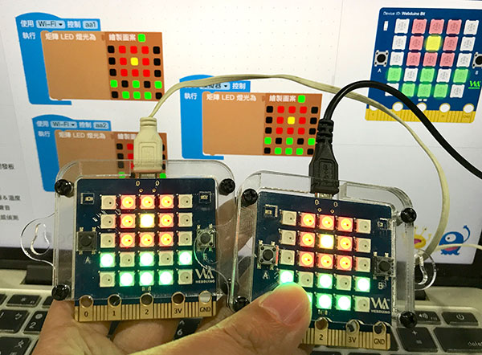
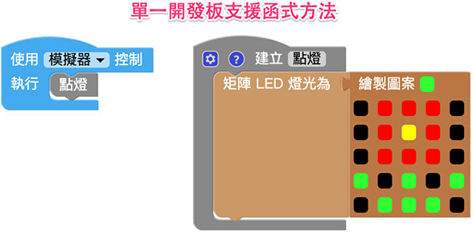
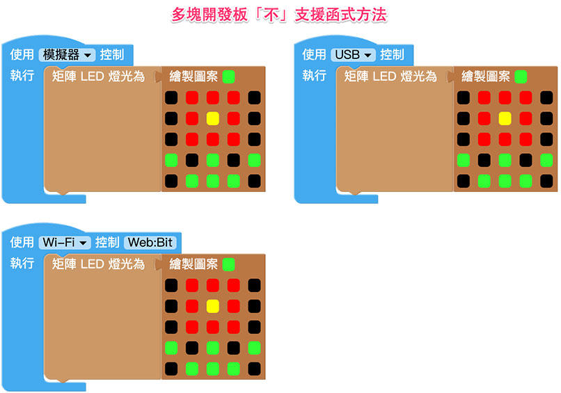

# 开发板

提供了三种控制开发板的方式，分别是「模拟器」、「USB」和「Wi-Fi」，模拟器能够在没有硬体的状况下进行学习，USB 可以在没有网路的情况下，透过USB 连线操控，而Wi-Fi 则可以进行无线远端遥控，透过三种不同操控方式的互相搭配，不论各种情境都能随心所欲的控制。

## 使用方式

下拉选单选择「模拟器」，表示*使用右侧的「虚拟开发板」*，开发板积木里所有控制的元件，都会指向右侧的虚拟开发板，例如绘制一个图案，执行后，虚拟开发板就会显示图形。

下拉选单选择「USB」，表示*使用「USB 线」连接「硬体开发板」*，**必须使用「安装版编辑器」操作**，例如绘制一个图案，执行后，透过USB 连接的开发板就会显示图形。

> 安装版编辑器请参考：[编辑器 ( 安装版工具列 )](../info/toolbar.html)

下拉选单选择「Wi-Fi」，表示*使用「Wi-Fi」连接「硬体开发板」*，也就是透过**每块开发板的Device ID 进行控制**，只要知道Device ID，不论开发板身在何处，都能远距操控。 ( 使用行动电源供电，会更有「远距操控」或「无线操控」的感受 )

> 开发板 Device ID 请参考：[硬体开发板 ( 初始化设定 )](../info/setup.html)

## 控制多块开发板

编辑器可*同时控制多块开发板*，只需要在编辑画面里放入开发板，指定开发板的操控方式，执行后就会看到所有开发板同时发生变化，下图的例子，在同一个编辑画面里，让一块模拟器开发板和两块Wi-Fi 开发板，同时呈现花朵图案。

> 多块开发板*最多包含一块「模拟器」开发板和一块「USB」开发板，「Wi-Fi」开发板则没有数量限制*。

在控制多块开发板的情况下，**不支援使用函式控制**，要特别注意！

