# 音乐＆声音

开发板内建一个微型蜂鸣器，可以发出三个八度音阶的单一声响，藉由不同音符代码的组合，或者搭配内建的范例音乐，就能让开发板发出各种美妙的旋律。

## 音乐＆声音积木清单

音乐＆声音的积木包含演奏某个音阶、休息、预设音乐和停止演奏...等积木。

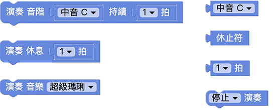

> *音乐＆声音积木必须搭配「开发板」积木*，选择模拟器，执行后可以听见电脑喇叭发出声音，选择USB，执行后会透过USB 连线方式控制实体开发板，让开发板的蜂鸣器发出声音，选择Wi-Fi 则可透过Wi-Fi 指定Device ID 操控。
> - USB 控制模式为「安装版编辑器」限定，请参考 [编辑器](../index.html#software)
> - Wi-Fi 模式需要开发板连接 Wi-Fi，请参考 [硬体开发板 ( 初始化设定 )](../info/setup.html)

## 演奏音阶

「演奏音阶」积木可以演奏三个八度音阶，同时亦可指定每个音阶的拍子，拍子分为 1/16、1/8、1/4、1/2、1 和 2 拍。

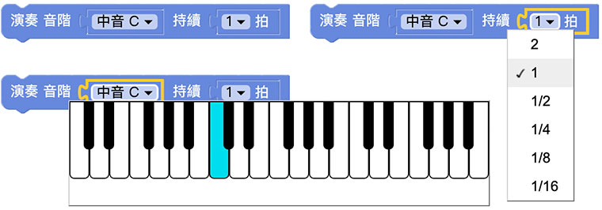

点选音阶的选项会弹出一个虚拟的钢琴键盘，使用滑鼠移到琴键上，电脑的喇叭就会发出对应的声响。

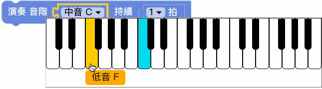

在音阶的缺口，可以分别放入音阶和休止符积木，持续的缺口只能放入拍子积木。

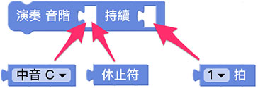

放入好几个音阶，执行后可以听到一个音阶接着一个音阶播放。

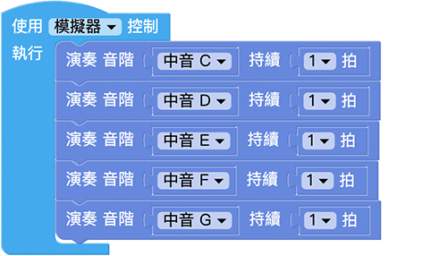

由于演奏音阶积木会是「*演奏完成才会继续执行后方程序*」的类型，若程序放在音阶之后，在所有音阶演奏完成后，才会执行后方程序。

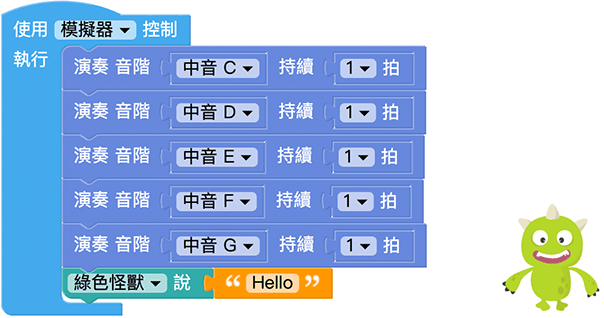

演奏音阶积木也可以搭配重复回圈，做到不断重复播放一段旋律的效果。

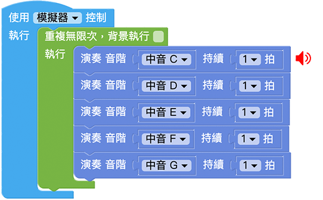

音阶积木支援阵列的使用，藉由阵列的排列组合，就能自行编辑音乐并重复使用，下图的例子，分别将音阶和拍子独立成两个阵列。

> 使用阵列的情况下，若音阶数量少于拍子，多出来的拍子会采用最后一个音阶播放，若拍子数量少于音阶，多出来的音阶会采用最后一个拍子播放。

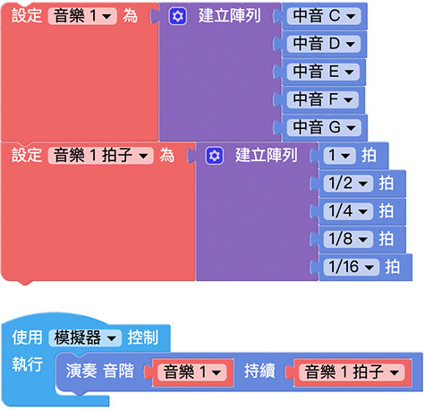

## 演奏休息

「演奏休息」积木表示该拍子没有声音，等同于使用演奏音阶积木搭配休止符积木。

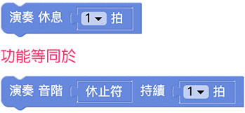

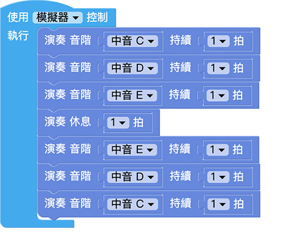

## 演奏音乐

「演奏音乐」积木包含超级玛琍、超级玛琍和弦、真善美、哥哥爸爸真伟大和叮叮当五首音乐，可以独立使用或和音阶积木搭配使用。

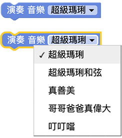

由于演奏音乐积木会是「*演奏完成才会继续执行后方程序*」的类型，若有音阶或其他程序放在演奏音乐之后，音乐演奏完成后，才会执行后方程序。

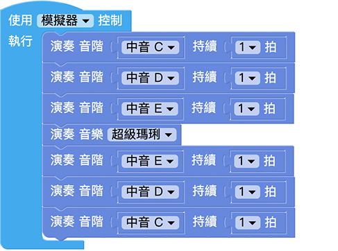

## 停止/暂停/继续演奏

「停止/暂停/继续演奏」积木可以控制音乐演奏的行为。

下图的例子透过 开发板的按钮开关控制音乐播放，A 和 B 同时按下时开始播放，播放进行中按下 A 就会暂停，按下 B 就会继续播放。

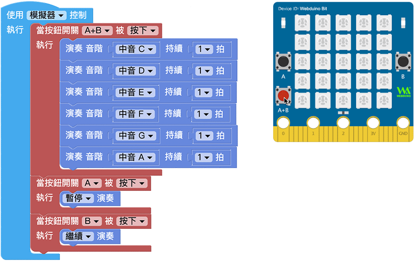

如果要将音乐、音阶拍子积木混合控制，在切换音乐之前加入「停止播放」的积木，就可完全停止现有的音乐并进行切换。

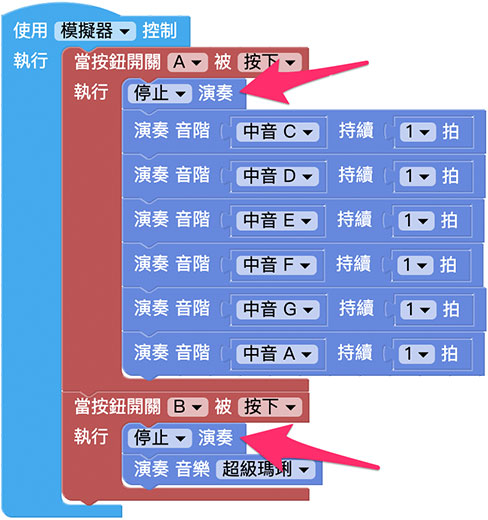