# 九轴体感侦测

内建一个MPU-9250 九轴感测器，除了可以侦测空间内的加速度与旋转，实作体感侦测、体感游戏...等应用，更能透过磁力计的辅助侦测，实现侦测姿态角度、指南针...等进阶效果。

## 九轴体感侦测积木清单

九轴体感侦测积木有两种，一种可侦测指定的动作，另一种则可取得九轴感测器的数值。

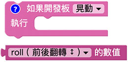

> *九轴体感侦测积木必须搭配「开发板」积木*，选择模拟器时无法取得九轴体感数值，但可以透过指定动作的按钮模拟对应动作，选择USB，执行后会透过USB 连线方式控制实体开发板，选择Wi-Fi 则可透过Wi-Fi 指定Device ID 操控。
> - USB 控制模式为「安装版编辑器」限定，请参考 [编辑器](../index.html#software)
> - Wi-Fi 模式需要开发板连接 Wi-Fi，请参考 [硬体开发板 ( 初始化设定 )](../info/setup.html)

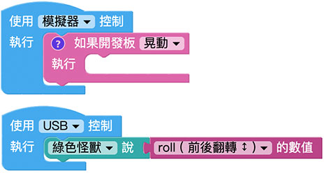

## 侦测指定的动作

「侦测指定的动作」积木能侦测静止、晃动、正面朝上、背面朝上、向后向前翻转、向左向右翻转、向左向右旋转、指向东西南北...等14 种开发板动作。

下图的例子，开发板往右旋转会出现向右的绿色箭头，开发板往左旋转会出现向左的蓝色箭头，如果开发板晃动则会出现红色笑脸。

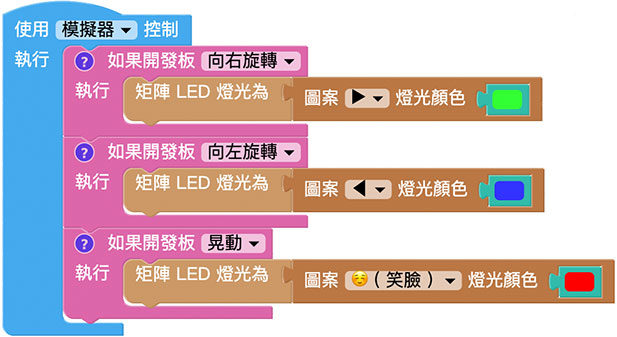

如果是使用模拟器，执行后再开发板的右侧会出现一排按钮，并用文字提示正在侦测的指定动作，以上图的例子而言，表示正在侦测向右旋转、向左旋转以及晃动。

## 取得九轴感测器的数值

「取得九轴感测器的数值」积木能够取得加速度、磁力计、陀螺仪以及水平旋转、前后左右翻转的数值。 ( *模拟器无法模拟此块积木，必须使用实体开发板* )

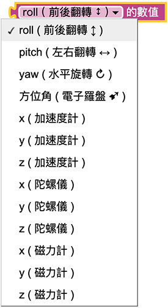

### 加速度计

加速度计主要侦测x、y 和z 三轴直线移动时「瞬间」加速度变化，将开发板正面朝上，金手指接脚朝向自己，*垂直上下的方向为z 轴( 往上为负，往下为正)，水平左右为x 轴( 往左为负，往右为正) 水平前后为y 轴( 往自己的方向为负，远离自己的方向为正)*。

> 由于侦测的数值为「加速度」，在启动或停止的瞬间，可能会产生反向的加速度( 就如行驶的公车突然煞车或启动，乘客会往前倾或后仰)，因此在开发时要透过一些逻辑判断来排除，或避免瞬间太大的启动与停止动作。

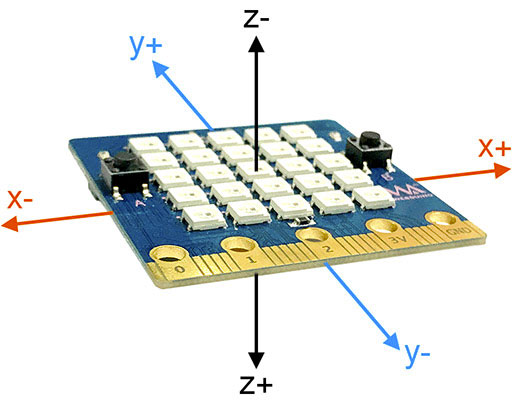

由于「取得九轴感测器的数值」积木使用时只会侦测一次，搭配无限重复回圈便可连续侦测，执行后上下左右挥动 开发板，就能看见小怪兽讲出加速度的数值。

> 因为所在位置以及感测器初始化校准的不同，每块开发板在启用加速度侦测时，都会有些微的误差，Z 通常都会是负一千多( 单位为mg，1 g 通常为一个重力参数)，X 和 Y 通常会在200 ~ -200 之间，此时可以拿起开发板上下左右挥动，就会看见数值发生变化，由于所侦测的数值为「加速度」，因此当开发板没有移动或等速移动的时候，加速度会保持在一个稳定的数值区间内。

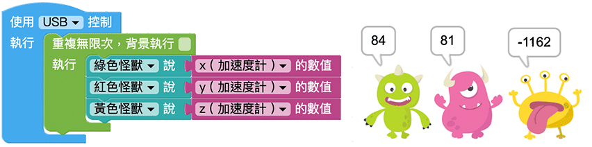

### 陀螺仪

陀螺仪则是侦测旋转时「瞬间」的角度变化，如下图所示，将开发板正面朝上，金手指接脚朝向自己，*绕着z 轴旋转为yaw ( 顺时针旋转为正，逆时针旋转为负)，绕着x 轴旋转为roll ( 顺时针朝自己旋转为负，逆时针旋转为正) 绕着y 轴旋转为pitch ( 顺时针旋转为正，逆时针旋转为负)*。

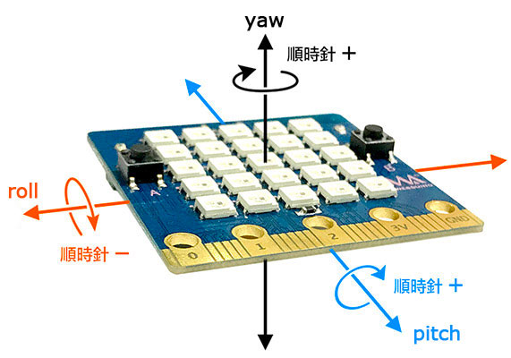

搭配无限重复回圈便可连续侦测，执行后转动开发板，就能看见小怪兽讲出陀螺仪的数值，因为是瞬间角度变化，所以当我们*停止转动，角度就会回归启动时的数值* ( 预设是0，若数值不为零，请重插开发板USB 线，重新启动再试一次)。

### 姿态角度 ( roll、pitch、yaw )

姿态角度主要透过加速度计和陀螺仪的数值，组合成可以侦测开发板前后翻转( roll )、左右翻转( pitch ) 和水平旋转( yaw )，将开发板正面朝上，金手指接脚朝向自己，*绕着z 轴旋转为yaw ( 逆时针旋转角度递增，区间为-180~180 度)，绕着x 轴旋转为roll ( 顺时针旋转角度递增，区间为-180~180 度) 绕着y轴旋转为pitch ( 逆时针旋转角度递增，区间为-180~180 度)*。

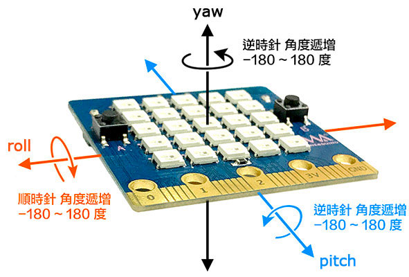

搭配无限重复回圈便可连续侦测，执行后转动 开发板，就能看见小怪兽讲出姿态角度的数值

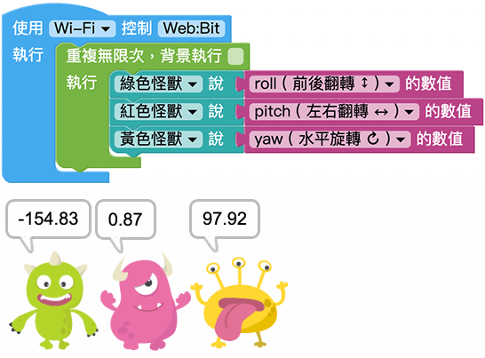

### 磁力计

磁力计可以侦测所在磁场的变化( 主要是针对地球磁场)，将开发板正面朝上，金手指接脚朝向自己，*垂直上下的方向为z 轴( 往上为正，往下为下) ，水平左右为y 轴( 往左为正，往右为负) 水平前后为x 轴( 往自己的方向为负，远离自己的方向为正)*。

使用磁力计之前，需要对开发板进行「*8 字校正*」，将开发板插上电并拿起开发板，在空中画出8 的形状进行校正，若遇到不准确的状况，进行8字校正后就会准确许多。

搭配无限重复回圈便可连续侦测，执行后转动或移动开发板，就能看见小怪兽讲出磁力计的数值( 测试时可以拿磁铁靠近，会发现显著的数值变化，但因为*磁铁会干扰磁力计，使用磁铁后需要重新进行8 字校正还原初始状态* )。

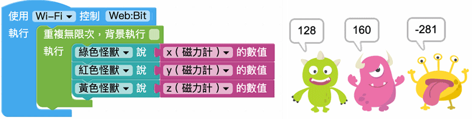

### 电子罗盘

电子罗盘为磁力计的延伸应用，使用前需要对开发板进行「*8 字校正*」，8 字校正后可以做为指南针，侦测东西南北方位，将开发板正面朝上，金手指接脚朝向自己，*开发板的顶端指向正北方，正北方角度约为0，正东方角度约为90，正南方角度约为180 或-180，正西方角度约为-90*。

下图的范例，除了让绿色小怪兽讲出方位角，更进一步透过逻辑判断，让红色怪兽说出东西南北的方位。

> 范例下载：[指南针](../images/zh-tw/docs/webbit/board/mpu9250-sample-01.json#_blank) ( 使用滑鼠右键另存新档 )

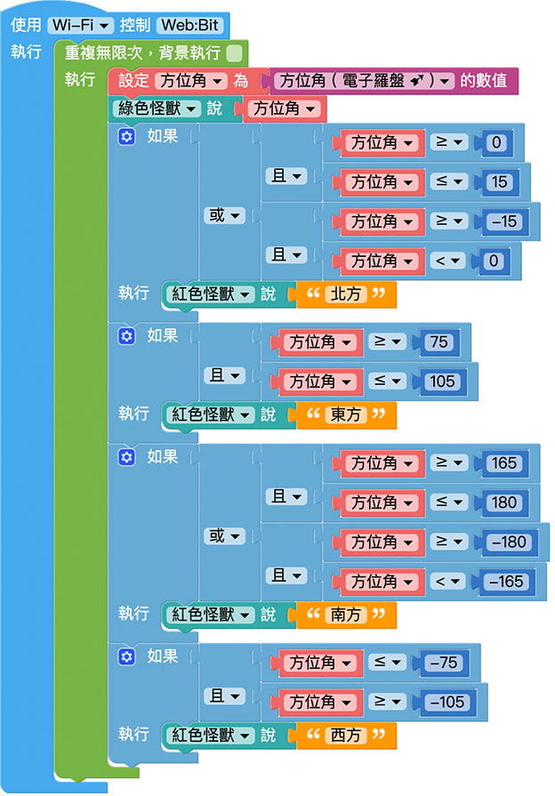