# 矩阵 LED

开发板的正中央内嵌了25 颗全彩LED 所组成的的矩阵，每个LED 都可透过红、绿、蓝三种颜色进行混合产生各种不同颜色，透过不同位置的灯号与颜色搭配显示，就能呈现各种图案造型。

## 矩阵 LED 积木清单

矩阵 LED 积木清单包含显示颜色、关灯、绘制图案、预设图案、指定第几颗灯的颜色、跑马灯和亮度等积木。

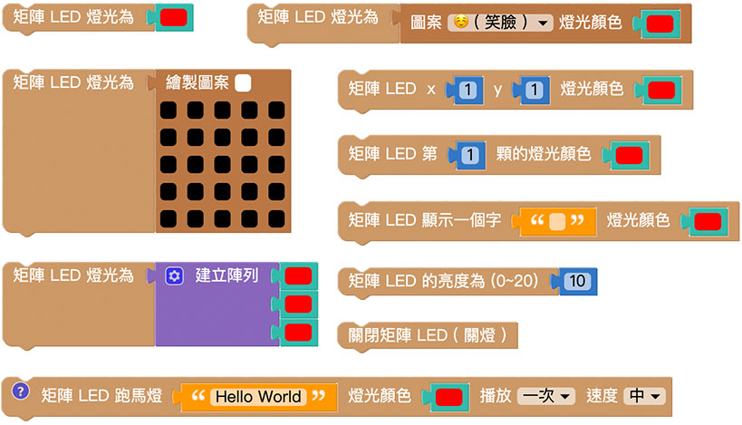

> *使用矩阵LED 积木必须搭配「开发板」积木*，选择模拟器，执行后会控制右侧模拟器灯号，选择USB，执行后会透过USB 连线方式控制实体开发板，选择Wi-Fi 则可透过Wi-Fi 指定Device ID 操控。
> - USB 控制模式为「安装版编辑器」限定，请参考 [编辑器](../index.html#software)
> - Wi-Fi 模式需要开发板连接 Wi-Fi，请参考 [硬体开发板 ( 初始化设定 )](../info/setup.html)

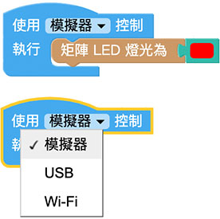

## 显示颜色

「显示颜色」积木可以让 25 颗灯同时亮起指定的颜色。 ( 若选择黑色，效果等同不亮灯 )

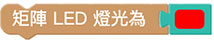

开发板选择模拟器，显示颜色积木选择红色，执行后，虚拟的开发板 25 颗灯都变成红色。 ( 若手边有 开发板，可以使用 USB 或 Wi-Fi 连线控制 )

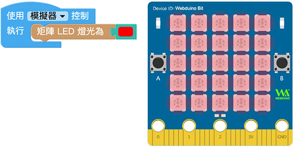

## 绘制图案

「绘制图案」积木能够自定义每颗灯不同的颜色，绘制一个 5x5 的图案。

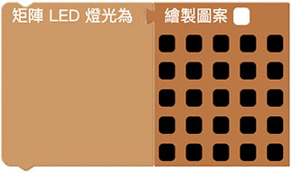

点选积木上方的颜色区块就能选择不同颜色，如果是同颜色，重复点击就可以还原为黑色 ( 直接使用黑色也是同样的效果 )。

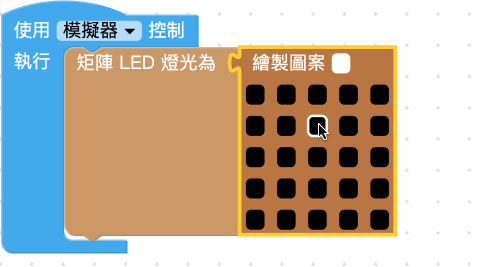

例如绘制一朵花，让花瓣为红色，花梗和叶子为绿色，执行后，虚拟的开发板就会呈现一朵彩色的花。

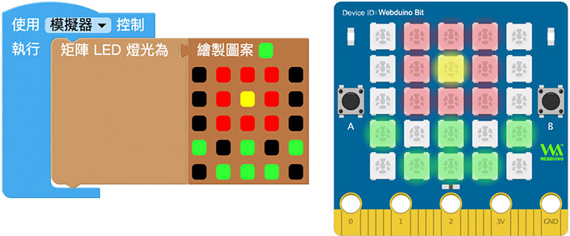

## 预设图案

「预设图案」积木提供 56 种预设图案，以及一个随机图案选项 ( 60 种图案随机取出一种 )。

选择图案和颜色，执行后，虚拟的开发板就会出现对应的图案和颜色。

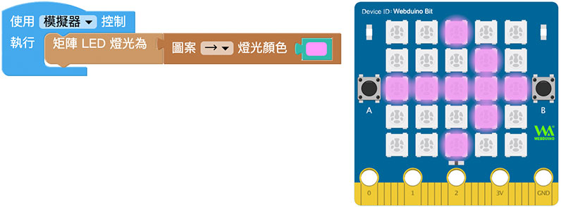

## 显示一个字

「显示一个字」积木可以显示*单一个*大小写英文字母、数字或标点符号 ，并指定显示的颜色。 ( 不支援中文字 )

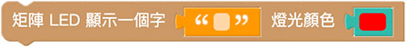

在文字积木输入字母或数字并指定颜色，执行后就会看到指定颜色的字母或数字出现。

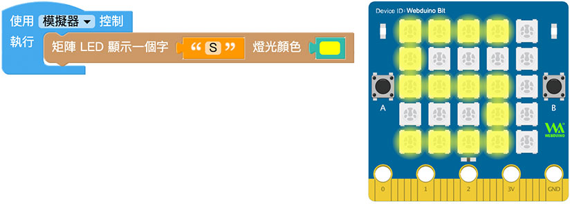

## 跑马灯

「跑马灯」积木可以透过跑马灯的方式，以指定的颜色显示一串文字，跑马灯可以只进行一次或无限次重复播放，并能设定文字移动的速度。 ( 不支援中文字 )

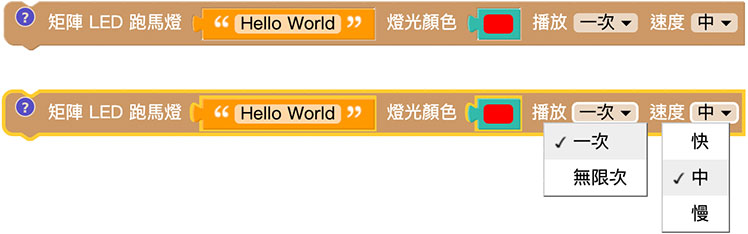

如果设定跑马灯次数为「一次」，跑马灯积木会是「*执行完成才会继续执行后方程序*」的类型( 点击前方问号小图示会提示)，*跑马灯结束后才会接着执行其他程序*，若设定为「无限次」，*后方程序会继续执行，但和LED 矩阵有关的行为会被跑马灯所取代*，使用上要特别注意。

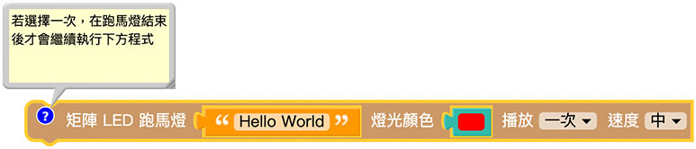

下图的例子，执行后会先出现红色 Hello 文字的跑马灯，结束后紧接着出现绿色笑脸。

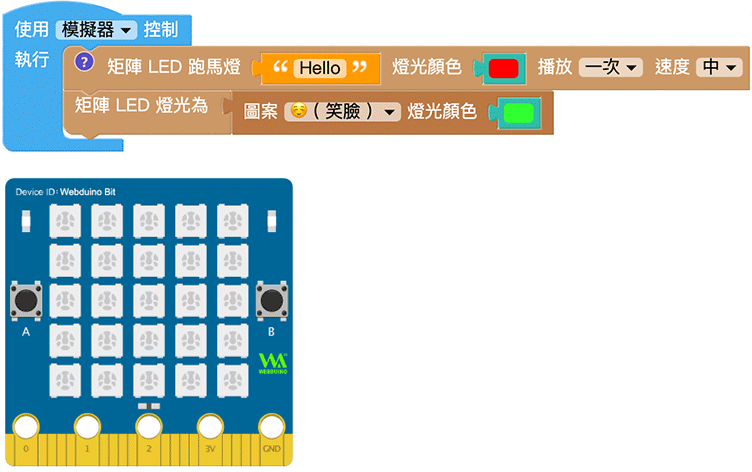

## 阵列控制灯号

「阵列控制灯号」积木可以使用阵列的方式控制矩阵 LED 灯号的运作。

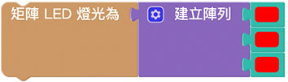

阵列的顺序对应到 开发板的灯号顺序，开发板灯号 1~25 的顺序为从左到右、从上到下。

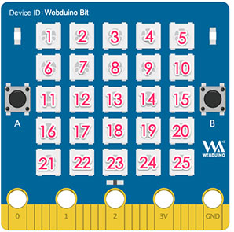

举例来说，若设定阵列的三个值为红色、绿色和蓝色，开发板的第 1~3 个灯就会呈现对应的颜色。

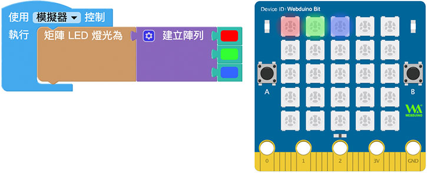

如果是多维阵列，会按照阵列元素的顺序进行显示，若元素内容留空，该颗 LED 会呈现熄灯状态。

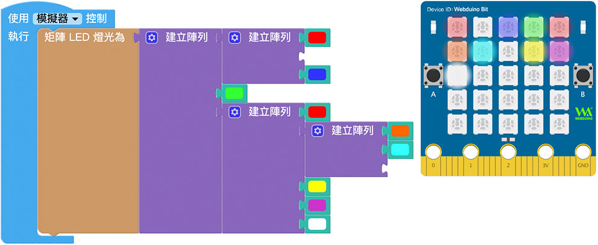

## 第几颗灯

「第几颗灯」积木可以指定第几颗灯的颜色。

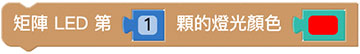

第几颗灯的顺序对应到 开发板的灯号顺序，开发板灯号 1~25 的顺序为从左到右、从上到下。

分别指定不同位置的灯号颜色，执行后就会看见指定位置的灯号亮起。

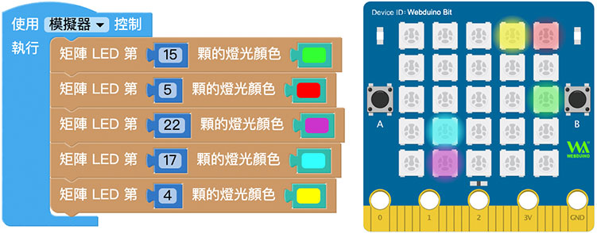

## X、Y 座标控制灯号

「X、Y 座标控制灯号」积木可以透过 X 和 Y 的座标值指定灯号的颜色显示。

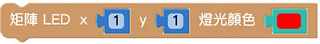

开发板的 X、Y 座标以左上角为 ( 1, 1 )，往右 X 加 1，往下 Y 加 1，依此类推。

分别指定不同 X、Y 的灯号颜色，执行后就会看见指定位置的灯号亮起。

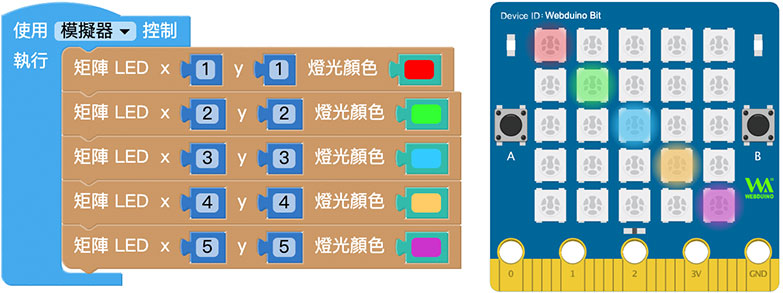

## 亮度

「亮度」积木可以控制「*全部 LED 灯*」的亮度，该积木无法指定单一颗灯的亮度，亮度最暗到最亮的数值为 0 ~20，预设值 10。

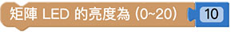

## 关灯

「关灯」积木可以关闭「*全部 LED 灯*」，效果等同于把 25 颗灯的颜色同时设定为黑色。

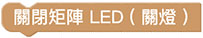