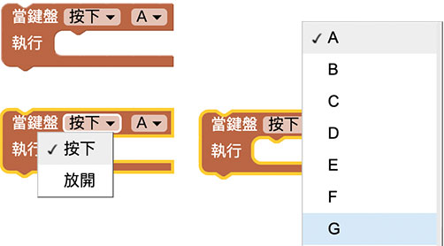
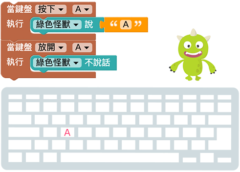
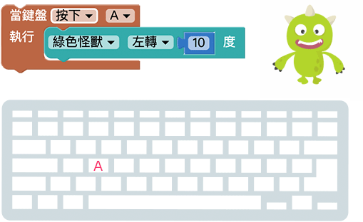
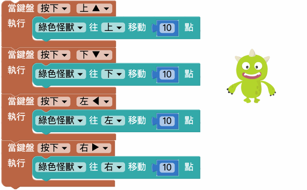

# 键盘行为

滑鼠和键盘是电脑不可或缺的两大输入装置，熟悉了操控键盘行为的方式，就可以简单地将键盘转换为有趣的互动元件，不论是要做成钢琴键盘或游戏控制器都是轻而易举，更可以搭配文字的输入，做出许多意想不到的互动效果。

## 侦测键盘行为

「侦测键盘行为」积木可以侦测电脑键盘上大多数的按键，侦测方式包含按下与放开两种。

> 侦测键盘行为积木*处于随时侦测*的状态，*不需要搭配无限重复回圈*。

透过按下和放开两种行为，就可以在按下键盘的同时，让小怪兽说出对应按键名称，放开键盘后就不说话。

按下键盘的行为会「*连续执行指令*」，类似在打字的时候，如果按着某个按键不放，画面中就会出现一连串这个按键的文字，例如下图，设定按下键盘A 的时候小怪兽会往左旋转，网页执行后，持续按住A 怪兽就会持续旋转，放开A 怪兽就会停止，不需要设定放开的指令。

## 键盘控制小怪兽移动

积木可以*同时侦测多个键盘按键行为*，透过键盘行为就能很简单的做出「按下上下左右键，小怪兽就会上下左右移动」。

