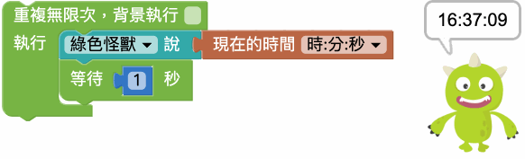
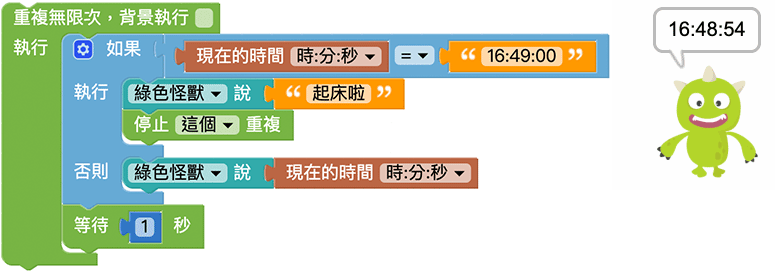

# 日期＆时间

日期与时间的积木，可以读取电脑的日期和时间并在网页上显示，可以搭配重复回圈、开关或键盘...等行为，做出时钟、码表、游戏计时...等趣味应用。

## 取得目前日期与时间

「日期」积木能够取得目前的年、月、日，「时间」积木能够取得目前的小时、分钟、秒，小时采用 24 小时计算，如果是下午三点会显示 15。

## 时钟

因为取得日期和时间的积木「*只会取得一次*」目前的日期时间，所以如果要持续侦测，可以搭配重复回圈，每一秒侦测一次时间，网页执行后就能呈显时钟效果。

## 闹钟

延伸时钟的范例，搭配逻辑的积木，网页执行后就能做到在某个时间点发生提醒的闹钟功能。

> 判断时间到了之后，可以透过停止重复的积木将时间停止，避免时间继续显示。

