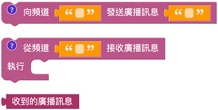
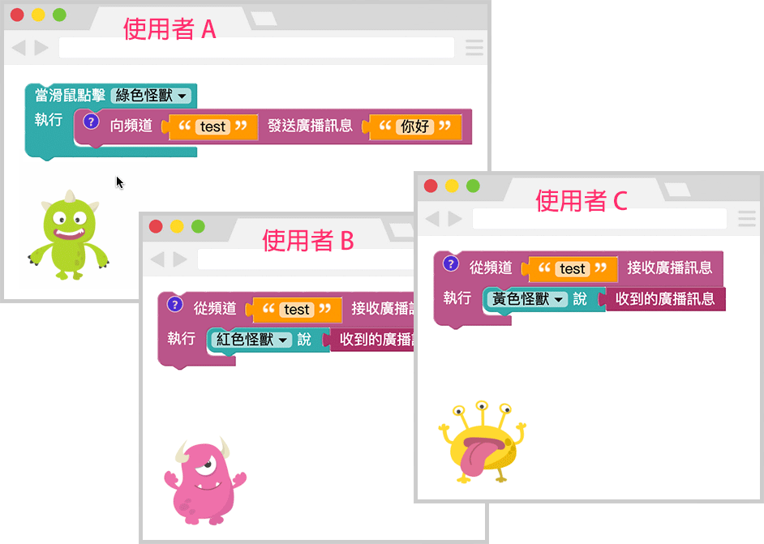
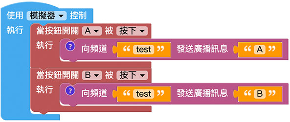
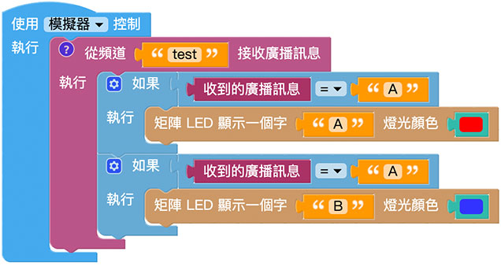

# 网路广播

的网路广播功能，不仅能让与开发板彼此资讯互动，更可以实现一对多、多对一、虚实互动、远距广播...等多样化的操控情境，透过广播功能的实现，便能将物联网的应用发挥到极致。

## 广播积木清单

广播积木包含一块负责发送广播讯号的积木、一块负责接收广播讯号的积木和一块呈现广播讯号的积木。

## 发送广播讯息

「发送广播讯息」积木可以指定一个频道名称，以及要向这个频道发送的讯息文字，只要频道名称相同，所有在该频道上的装置或人员，都能收到广播讯息，*发送广播讯息不限制只有实体装置能发送，不论是实体装置、虚拟装置、没有开发板的程序...等，都能够向指定频道发送讯息*。

> 「发送广播讯息」积木属于「*发送完成才会继续执行后方程序*」的类型( 点击前方问号小图示会提示)，当编辑画面中有这块积木，*执行时当程序遇到这块积木会暂停，直到发送广播讯息后才会再继续*。

## 接收广播讯息

「接收广播讯息」积木可以指定一个频道名称，就能不断收听这个频道的变化，只要有人或开发板向这个频道发送讯息，就能够透过广播讯息的积木显示，*接收广播讯息不限制只有实体装置能接收，不论是实体装置、虚拟装置、没有开发板的程序...等，都能够接收指定频道的讯息*。

> 「接收广播讯息」积木属于「*不间断收听频道*」的类型 ( 点击前方问号小图示会提示 )，不需要放在重复回圈内，就会自行不断收听频道讯息。

举例来说，使用者A 可以在「点击小怪兽」的同时，向频道test 发送广播讯号，而使用者B 和C 负责收听test 频道，如果有收到，就让的小怪兽显示收到的广播讯号。

又或者可以使用 开发板的按钮开关，按下 A 的时候向 test 频道发送文字 A，按下 B 的时候发送文字 B。

收听 test 频道的的开发板可以撰写逻辑判断，当收到 A 的时候显示红色的 A，收到 B 的时候显示蓝色的 B。

两块开发板的程序都执行后，点击负责发送广播的开发板的按钮开关，就可以看到另外一块开发板显示对应的讯号。

