# LINE 聊天操控

编辑器预设 LINE 即时通讯相关功能，除了支援 LINE Notify 的推播，更可以接收 LINE 的聊天讯息，透过聊天的方式操控 开发板或和小怪兽进行互动。

## LINE 聊天操控积木清单

LINE 聊天操控的积木包含发送推播专用的 LINE Notify 积木、聊天专用 LINE Chat 积木，以及接收讯息、回传讯息、表情符号三种积木。

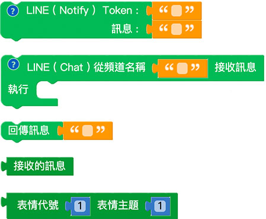

## LINE Notify

LINE Notify 是LINE 所提供的一项非常方便的推播服务，每个人的LINE 帐号都可以使用，使用之前，必须先前往LINE Notify 的网站( [https://notify-bot.line.me/zh_TW /](https://notify-bot.line.me/zh_TW/#_blank) )，使用自己的LINE 帐号登入，申请LINE Notify 权杖。

> 更多详细资讯可参考：[自建 LINE Notify 讯息通知](https://www.oxxostudio.tw/articles/201806/line-notify.html#_blank)

登入后，滑鼠移至上方个人帐号，选择「个人页面」。

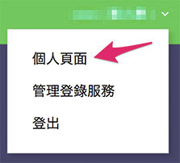

在个人页面可以发行「权杖」，权杖的作用在于让「连动的服务」可以透过LINE Notify 发送讯息通知，发行后的权杖与其名称会出现在上方的清单中，如果之前有申请过像是IFTTT 的连动通知，就会发现上方出现IFTTT 的服务。

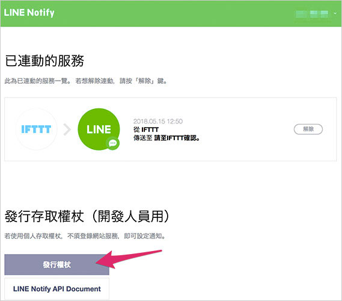

点选「发行权杖」，指定权杖名称 ( 传送通知讯息时所显示的名称 )，以及选择是要一对一接收，或是让群组也可以接收通知。

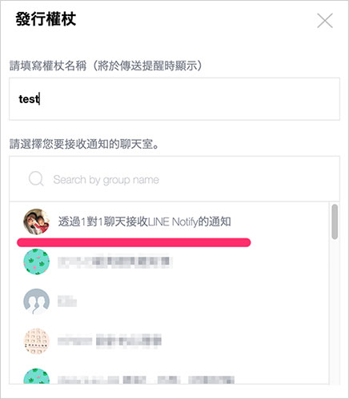

点选「发行」，会出现一段权杖代码，由于这段代码「**只会出现一次**」，请先复制这段代码，找个笔记本或文件储存这段代码，就可以点选下方按钮「关闭」。

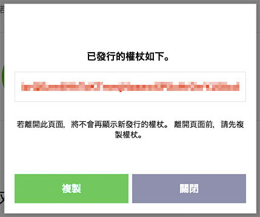

完成后在连动的服务里，就会出现了自订的服务。

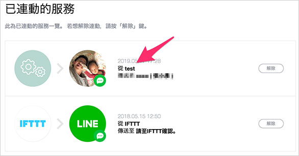

同时，LINE 讯息里也会收到 LINE Notify 发出「已发行个人存取权杖」的讯息，到这一步 LINE Notify 已经设定完成，已经可以开始从 发送讯息。

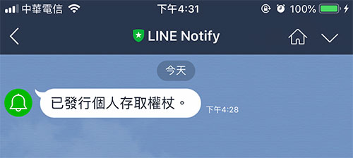

回到 编辑器，使用 LINE Notify 积木，在 Token 的位置填入刚刚产生的权杖代码，在发送讯息的位置填入欲发送的讯息，执行后，自己的 LINE 就会收到 LINE Notify 的讯息。

> 「LINE Notify」积木属于「*发送讯息后才会继续执行后方程序*」的类型( 点击前方问号小图示会提示)，当编辑画面中有这块积木，*执行时当程序遇到这块积木会暂停，直到发送讯息后后才会再继续*。

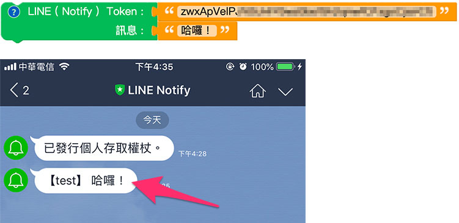

搭配 开发板，也可以做到按下 A 开关就发送 A，按下开关 B 就发送 B 的效果。

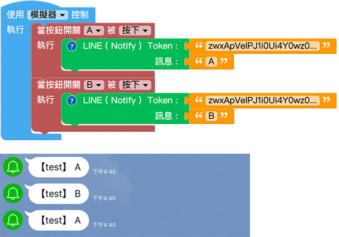

如果要发送图片，只要填入图片网址即可发送，搭配 开发板，也可以做到按下 A 开关就发送一张皮卡丘的图片。

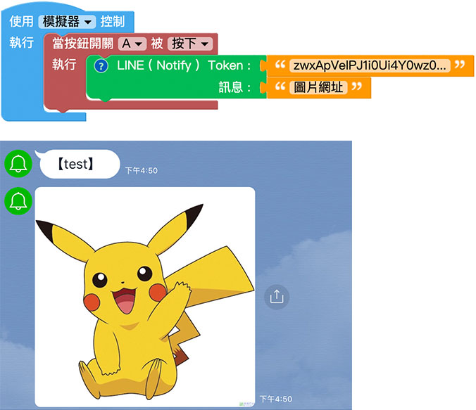

如果要传送表情贴图，可使用「表情贴图」积木，表情贴图有三种( 初次安装LINE 时预设的三种)，每种贴图分成表情代号( STKID ) 和表情主题( STKPKGID )，可以透过[表情清单](https://devdocs.line.me/files/sticker_list.pdf#_blank)查询对应的号码，输入指定的号码，执行后就可以发送表情贴图，举例来说，搭配开发板，按下A 开关就发送生气图案，按下B 开关就发送开心图案。

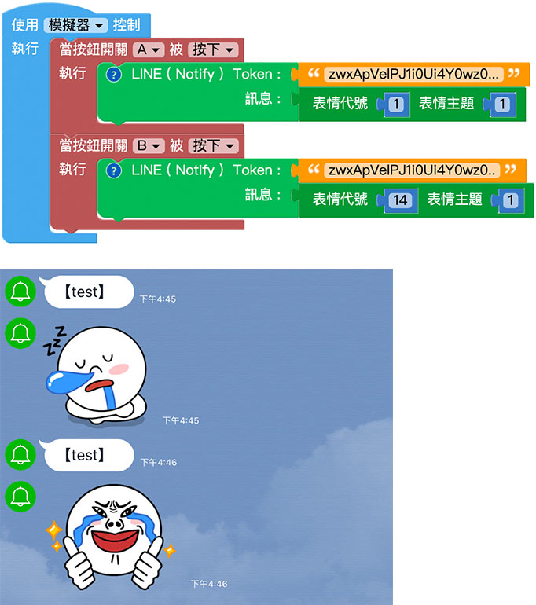

## LINE Chat 聊天操控

「LINE Chat」积木能让我们透过「聊天」的方式，接收从 LINE 发送过来的讯息，透过讯息和 编辑器或 开发板互动。

> LINE Chat 积木是属于「一来一往」的积木，，接收一则讯息才能回应一则讯息，无法像 LINE Notify 积木可以主动发送讯息，或接收一则讯息而回传多则讯息。

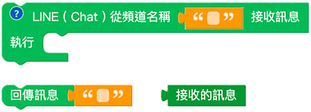

要使用 LINE Chat 功能，必须先加入 Webduino Bot 为 LINE 的好友，*使用 LINE 扫描下方 QRCode 加入好友*。

加入好友后，会收到一则欢迎讯息，欢迎讯息包含了三个提示：

> - 输入「id」两个英文字母，取得频道名称 ( 不是你的 id )。
> - 输入「newid」产生新的频道名称。
> - 输入「id:名称」自订频道名称 ( 可能会重复 )。

按照指示，输入i 和d 两个英文字母，就会收到系统配发的聊天频道名称，如果是系统配发的频道名称，每个人的聊天频道都不相同，如果是自订频道名称，则可能会和别人的名称重复，也就可能会收到别人的讯息。

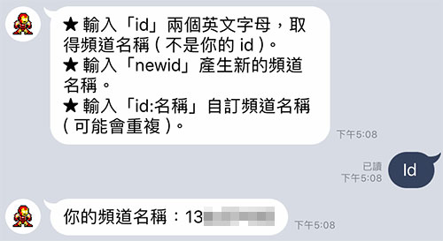

在 编辑画面放入 LINE Chat 的积木，接收到讯息时让小怪兽说出 LINE 的讯息，执行后，就可用 LINE 传送讯息给 Webduino Bot，讯息收到的当下，小怪兽就会说出讯息。

如果要回传讯息，只需要放入回传讯息的积木，写入回传的内容( 支援文字、表情贴图和图片，使用方式请参考上方LINE Notify 教学)，执行后，就会在收到讯息后回传对应的讯息，下图的范例会在收到讯息后，回传一模一样的讯息。

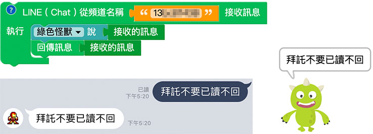

除了单纯的接收讯息，也可以使用LINE Chat 来控制开发板，透过逻辑判断，就能收到「开灯」的文字就点亮LED，收到「红色」的指令就发出红光，实现真正物联网的应用情境。

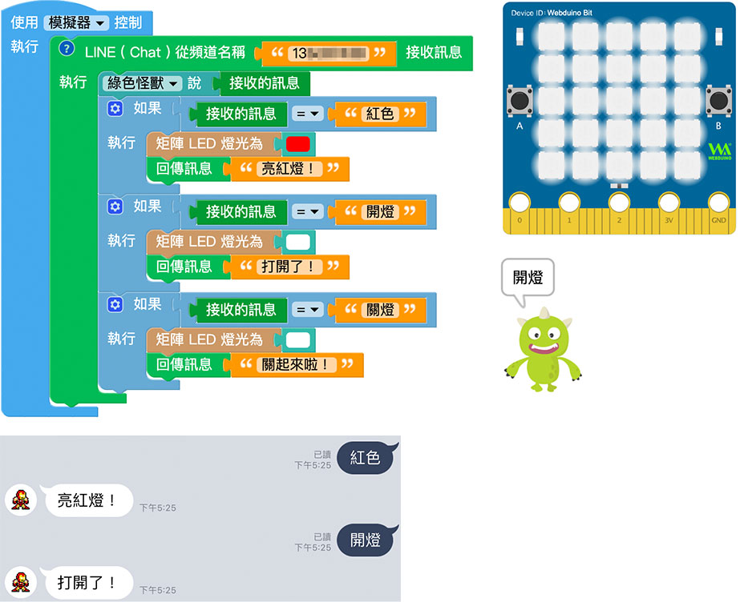