# 气象资讯

气象资讯积木能够即时从中央气象局取得开放资料，包含即时气象、空气品质、天气预报、地震资讯、水库水情和雷达回波图...等常用气象资讯，透过这些气象资讯搭配物联网的实作，更能落实气象资讯的有效应用。

## 气象资讯积木清单

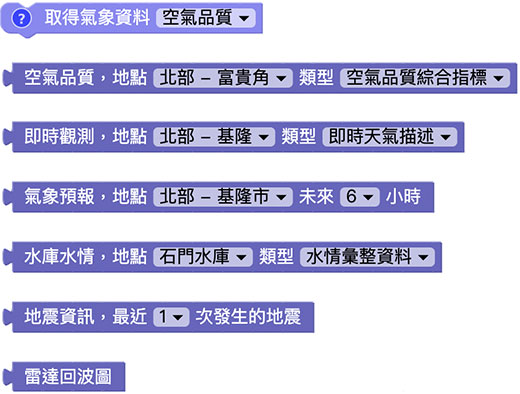

## 取得气象资料

气象资讯有一块「取得气象资讯」积木，可以取得六种常用资讯，分别是「空气品质」、「即时观测」、「天气预报」、「地震资讯」、「水库水情」和「雷达回波图」。

> 取得气象资讯的积木属于「*取得资讯后才会继续执行后方程序*」的类型，当编辑画面中有这块积木，*执行时当程序遇到这块积木会暂停，直到取得气象资讯之后才会再继续*。

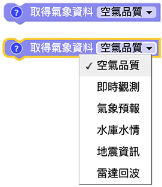

## 空气品质

「空气品质」积木能够显示空气品质的相关资讯，包含AQI、PM2.5、PM10...等相关数值以及综合指标的文字描述，侦测的地点为中央气象局在台湾的观测站台，可选择离住家最近的地点作为观测依据。

> 空气品质积木需搭配「取得气象资料」积木取得「空气品质」资讯。

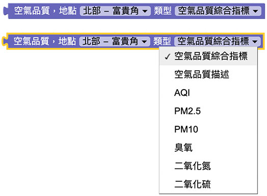

下图的例子，取得前镇区空气品质资料，并透过小怪兽讲出空气品质综合指标，以及个别的侦测数值。

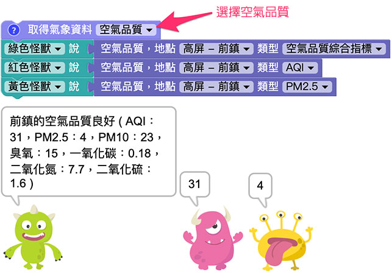

## 即时观测

「即时观测」积木能够显示目前天气的相关资讯，包含温度、湿度、风力、累积雨量...等相关数值，侦测的地点为中央气象局在台湾的观测站台，可选择离住家最近的地点作为观测依据。

> 即时观测积木需搭配「取得气象资料」积木取得「即时观测」资讯。

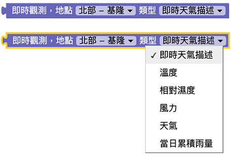

下图的例子，分别透过小怪兽讲出高雄与台北的即时气象资讯。

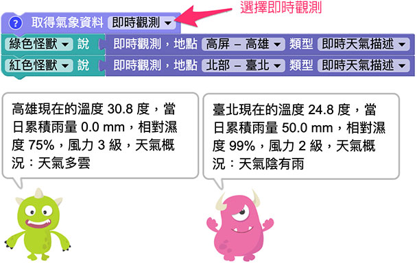

## 气象预报

「气象预报」积木能够显示未来六小时、十八小时和三十六小时的气象预报，预报地点为台湾的主要县市，可选住家所在县市作为观测依据。

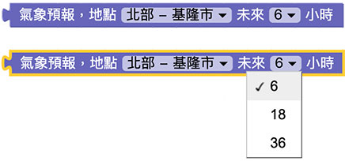

下图的例子，分别透过小怪兽讲出高雄八小时的气象预报，以及新竹十八小时的气象预报。

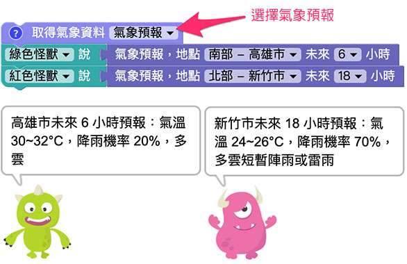

## 水库水情

「水库水情」积木能够取得全台湾所有水库的水情资心，包含蓄水百分比、有效蓄水量和降雨量...等。

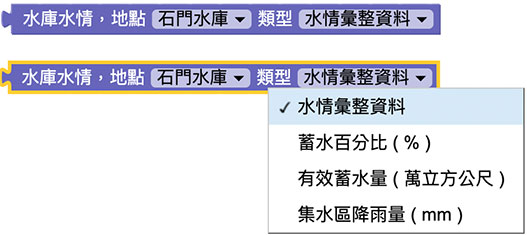

下图的例子，分别透过小怪兽讲出石门水库和曾文水库的水情资讯。

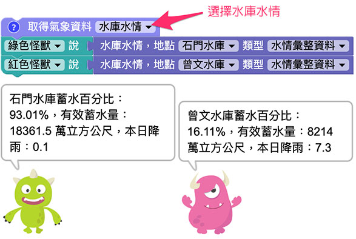

## 地震资讯

「地震资讯」积木能够取得最近 1~3 次的地震资讯。

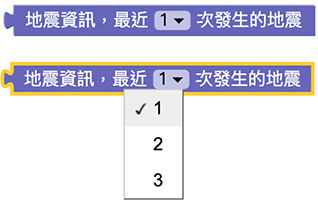

下图的例子，透过小怪兽讲出最近一次的地震资讯 ( 范例日期为 5/17 )。

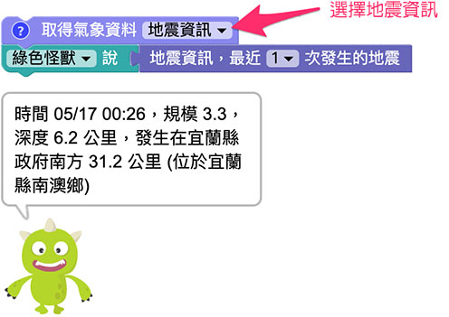

## 雷达回波

「雷达回波」积木能够取得一张雷达回波图，图片格式为 jpg。

下图的例子，透过小怪兽展示雷达回波图。

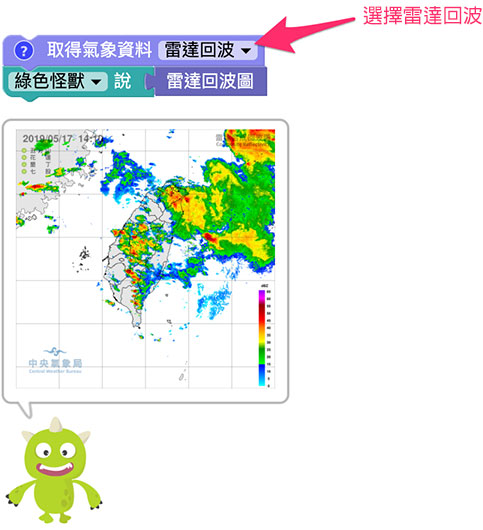