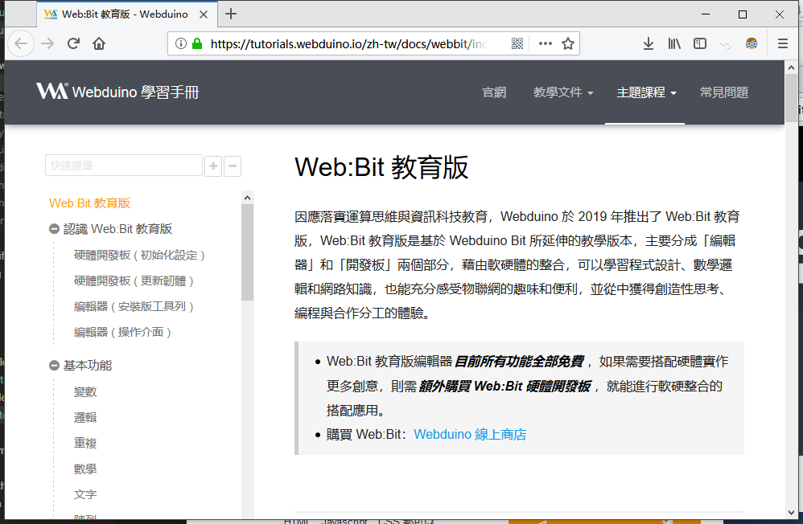

基础教程
========================================

.. Hint::

    `教育版安装程序（ Windwos7+ ） <https://github.com/BPI-STEAM/BPI-BIT-MicroPython/releases/tag/DevTools>`_
    
.. toctree::
   :maxdepth: 2

   flash_web.rst
   

正在准备简体版内容，敬请期待。

- `在线编程 <https://webbit.webduino.io/blockly/>`_ & `學習手冊（繁体版） <https://tutorials.webduino.io/zh-tw/docs/webbit/index.html>`_

