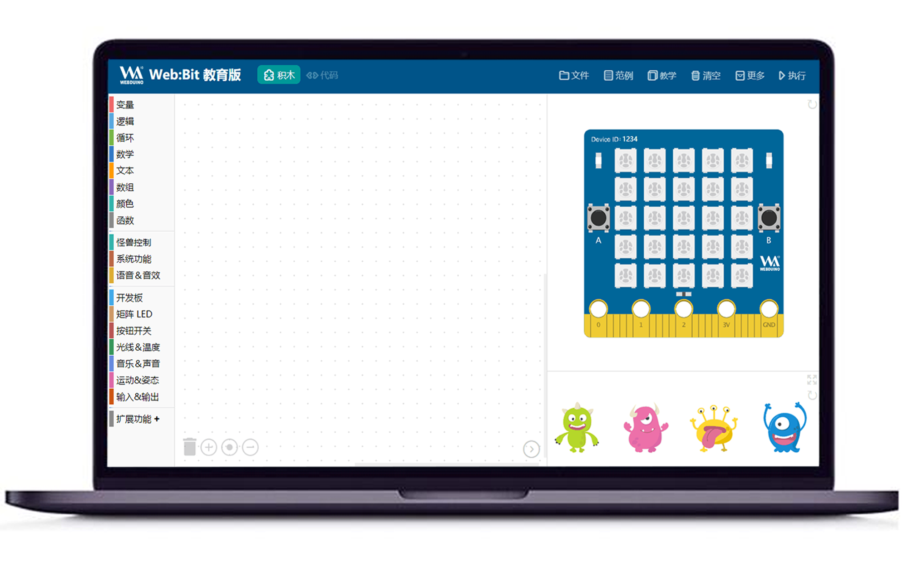

Web:Bit 教育版
--------------

Web:Bit 是 Webduino Bit 开发板的缩写，Web:Bit 教育版是由 Webduino
与台湾许多优秀的信息化教育的教师们，共同合作研发出的一款用于 STEAM
课堂的教学套件。

下面介绍一下积木编辑器相关文档目录。

.. image:: menu.png

想知道更多？可以点击目录或底部 [ Next ] 按钮继续往下阅读。

.. toctree::
    :maxdepth: 2
   
    info/index
    basic/index
    monster/index
    detect/index
    sound/index
    board/index
    extension/index

相关链接
~~~~~~~~

-  `Web:Bit 中文社区`_
-  `Web:Bit 英文社区`_
-  `Webduino 国内版`_
-  `Webduino 国际版`_

.. _`Web:Bit 中文社区`: https://forum.banana-pi.org.cn/c/bpi-bit
.. _`Web:Bit 英文社区`: http://forum.banana-pi.org/c/bpi-bit
.. _Webduino 国内版: https://webduino.com.cn
.. _Webduino 国际版: https://webduino.io/
