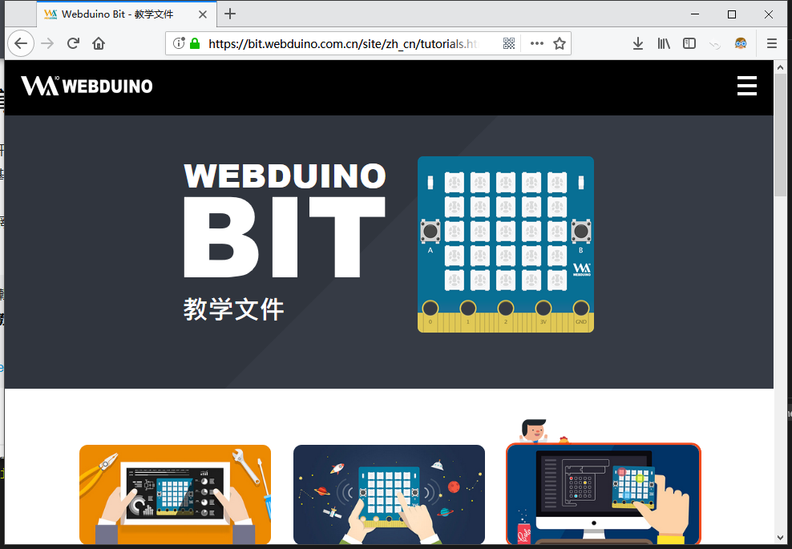

基础教程
========================================

.. toctree::
   :maxdepth: 2

   flash_web.rst
   
.. Hint::

    正在准备简体版内容，敬请期待。

學習手冊（繁体版）
------------------

- `安装程序（离线版） <https://github.com/BPI-STEAM/BPI-BIT-MicroPython/releases/tag/DevTools>`_ & `在线编程 <https://webbit.webduino.io/blockly/>`_ & - `學習手冊（繁体版） <https://tutorials.webduino.io/zh-tw/docs/webbit/index.html>`_

.. image:: images/webduino_tutorials_tw.png

教学文件（简体版）
------------------

- `在线积木编程网站 <https://bit.webduino.com.cn/blockly/>`_ & - `教学文件（简体版） <https://bit.webduino.com.cn/site/zh_cn/tutorials.html>`_

