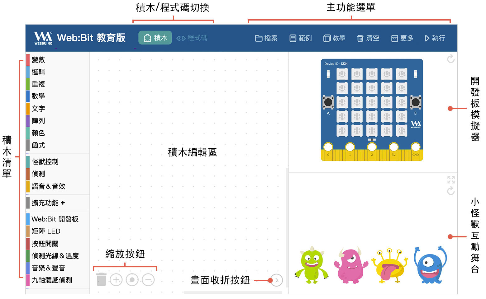
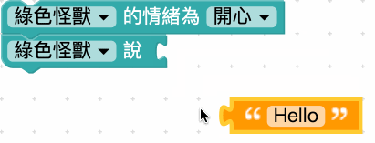
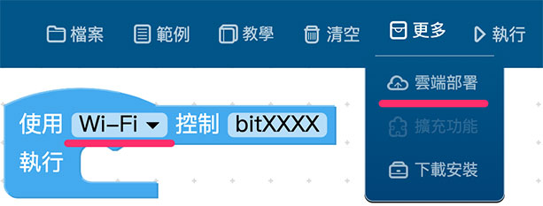
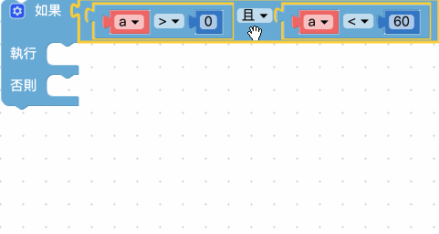
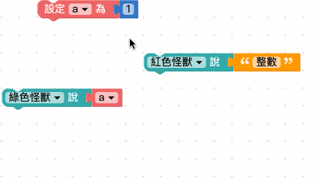

# 编辑器 ( 操作介面 )

编辑器是Webduino 最新的程序编辑＆学习软件，除了基于Webduino Blockly 的操作方式，也大幅简化了操作的步骤流程，甚至额外添加了虚拟开发板以及小怪兽互动舞台，不论是大朋友小朋友，都可以快速又轻松的入门Web:Bit。

> - 网页版：[https://webbit.webduino.io](https://webbit.webduino.io#_blank)
> - 安装版下载：[WebBitSetup.zip](http://webduinoio.github.io/samples/content/bit-download/WebBitSetup.zip#_blank)

## 操作介面一览

编辑器的操作介面分成下列几个区块：

- **主功能选单**：包含档案的储存与开启、范例和教学、删除所有积木、更多功能和执行按钮。
- **积木/程序码切换**：将写好的程序转换为标准 Javascript，让学习程序更简单。
- **积木清单**：包含基本功能、小怪兽互动、开发板操控和物联网扩充...等积木。
- **积木编辑区**：进行积木的逻辑组合，产生各种不同的情境应用。
- **开发板模拟器**：包含一块虚拟的 开发板，可以模拟实际开发板的状况和应用。
- **小怪兽互动舞台**：包含四种不同造型颜色的小怪兽，可以透过积木设定相关动作和互动情境。
- **缩放按钮**：够快速缩放画面积木或删除积木。
- **画面收折按钮**：快速收折开发板模拟器和小怪兽互动区，让积木编辑区域放大或缩小。

## 程序积木是什么？

对于第一次接触的人来说，会不太清楚「程序积木」的由来，「积木」是翻译自「block」这个英文单字，其操作方式类似「组装积木」或「拼图」的概念，透过互相堆叠和搭配组合，就能判断不同的逻辑或依据指定的排列顺序，实现对应的动作。

编辑器是基于Google 的图像式程序编辑工具Blockly 所开发出的编辑工具，每块积木都有对应的功能和用途，如果想了解该积木的使用方式，可以「*使用滑鼠在指定的积木上按右键*」，就能开启积木的功能列表，点击「教学」可以阅读该积木的教学文件，如果该积木有「小工具」，则可以点击小工具打开更多进阶功能。

## 云端部署

云端部署的功能可以帮主我们将编辑好的程序积木，部署到Webduino 云端伺服器，如此一来就可以*在电脑关闭的状态下，继续执行对应的程序动作* ( *仍然需保持开发板正常的网路连线* )，只要程序积木里**包含Wi-Fi 连线的开发板**，就能使用云端部署的功能。

> 注意，云端部署成功后，会在下列两种状况下停止：
> - *第一种，开发板网路断线超过 20 分钟。 *
> - *第二种，重新云端部署，或点击编辑器的「执行」按钮。 *

## 网页版、安装版的主功能选单差异

右上方的主功能选单，包含编辑器的主要功能，但「网页版」和「安装版」编辑器的选单略有不同，在网页版可以使用「档案> 分享连结」而安装版不行，分享连结可以帮助我们快速存档产生一段「网址」，下次再开启这个网址就可以开启档案，因为安装版无法开启网址，所以无法使用该选项。

在网页版主选单的「更多」里头，也包含「下载安装版」的选项，点击后会下载安装版的压缩档，解压缩安装就可以使用安装版。 ( 目前安装版编辑器仅支援 Windows )

## 程序积木小技巧

### 小技巧 1、多行与单行输入

如果程序积木太长，我们可以用滑鼠在积木上按右键，若该积木支援多行输入，可以点选「*多行输入*」将积木由单行变成多行，也更方便阅读和编辑。

### 小技巧 2、整理积木

在实作程序积木时，往往会遇到积木四面八方散落在画面上的状况，这时可以在编辑区域上按右键，选择「*整理积木*」将积木排列整齐。

