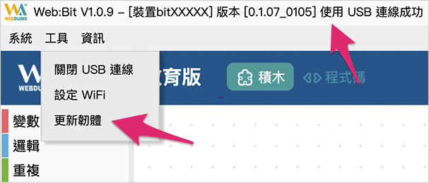
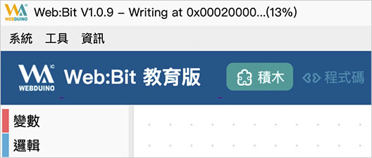
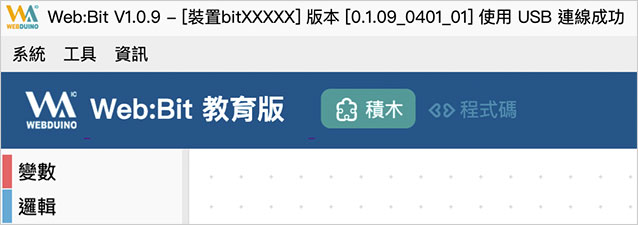
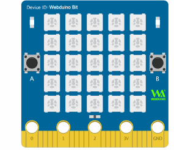
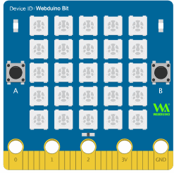

# 硬體開發板 ( 更新韌體 )

如果已經完成了 開發板的初始化設定且也順利連接上所在場所的 Wi-Fi，接著就可以準備更新 開發板的韌體程序了，又或者如果是使用編輯器安裝版，可以再不用初始化的狀態下，直接透過安裝版完成韌體更新。

## 更新韌體方法 1：使用安裝版進行更新

在電腦中打開安裝版 ( 不清楚什麼是安裝版，請參考 [編輯器](../index.html#software) )，將 開發板使用 USB 線連接電腦，確認安裝版已經正確讀取到 開發板之後 ( 上方會出現 開發板的 Device ID 以及版本號碼 )，按下 `Ctrl + W` 打開工具列，滑鼠選擇「*工具 > 更新韌體*」，就能開始更新。

> *特別提醒！如果無法出現 Device ID 以及版本號碼*，**可能需要先手動更新開發板韌體**。
> 
> 更新韌體方式請按照以下步驟進行
>
> - [初始化方法 2：連線到開發板進行初始化](#step2)
> - [更新韌體方法 2：透過 Wi-Fi 遠端更新](ota.md#step2)

如果系統有偵測到有新版本韌體，也會在連接電腦後彈出視窗提示。

如果沒有彈出視窗提示，亦會在上方的訊息文字裡，出現提示更新的訊息。

點選更新後，會再度提示請勿關閉程序或移除 USB 線，按下確認後就開始更新。

更新時最上方的訊息文字，會同步顯示更新的進度。

更新直到 100% 之後會顯示目前的版本號碼，表示 開發板韌體已經更新完成。( 下圖範例已經從 0.1.07_0105 更新為 0.1.09_0401_01 )

## 更新韌體方法 2：透過 Wi-Fi 遠端更新

遠端更新 ( OTA ) 可以在 開發板連上網路後，連線遠端伺服器更新取得最新版本韌體，更新步驟如下：

- 步驟 1、確認開發板已經可以正常連上 WiFi，若不行，請檢查 WiFi 連線或重新進行初始化設定。
- 步驟 2、移除開發板電源。
- 步驟 3、接上開發板電源，**在白色跑馬燈燈顯示文字的時候，按住按鈕 A，持續按住按鈕 A，直到開發板閃完紅燈、綠燈熄滅上線後，此時會再聽到蜂鳴器發出輕微的一個聲響，再放開按鈕 A**。

  

- 步驟 4、完成後會看到開發板的點矩陣，由第一顆燈開始亮藍燈，表示開始進行更新，*當藍燈全部亮起接著熄滅後，表示更新完成*。

  

- 步驟 6、更新完成後開發板會閃紅燈自動進行連線，連線成功會亮綠燈後綠燈熄滅，表示遠端更新完成，此時也可以透過 WiFi 連線開發板，由 192.168.4.1 進入設定畫面，在設定畫面最下方會看到開發板的版本號變成新的版本。

## 還原初始設定值

如果我們想要還原硬體出廠時的設定值，可以透過類似 Wi-Fi 遠端更新的方式來實現，步驟如下：

- 步驟 1、移除開發板電源。
- 步驟 2、**同時按住按鈕 A 和 B。**
- 步驟 3、接上開發板電源，**聽到蜂鳴器發出聲響後放開按鈕 A 與 B**，此時開發板已經恢復出廠設定值。( **恢復設定值會將自訂的 Wi-Fi 帳號、密碼、自訂的 device SSID 和密碼清除，這個步驟會造成開發板無法連接所在場所的 Wi-Fi** )
- 步驟 4、重新執行初始化設定，參考：[硬體 ( 初始化設定 )](setup.html)

