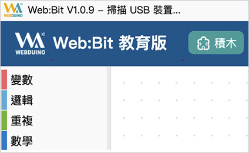
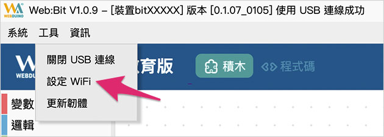
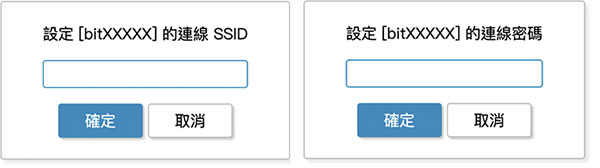
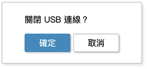
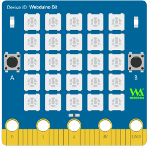
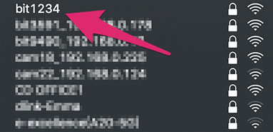
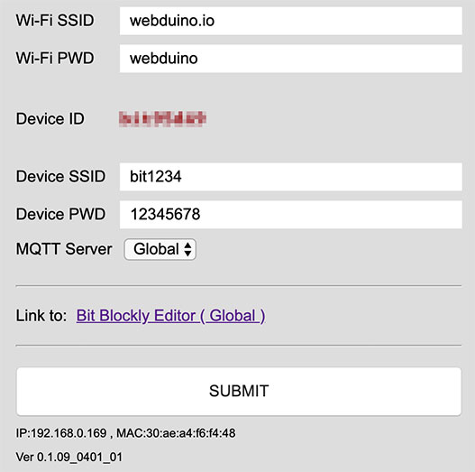
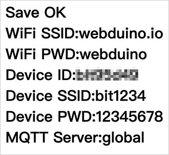

# 硬体开发板 ( 初始化设定 )

使用之前，最重要的就是进行初始化设定，初始化设定的目的在于让开发板可以自动上网( Internet )，有了初始化设定，我们也能够自订开发板的显示名称和密码，更可以连上internet 进行远端更新。

> 初始化设定**仅针对透过「Wi-Fi」连线控制**，如果单纯使用「USB 操控」，则可以不需要初始化设定。

## 初始化方法 1：使用安装版进行初始化

如果是使用安装版 ( 不清楚什么是安装版，请参考 [编辑器](../index.html#software) )，可以直接透过安装版的工具，按照下列步骤进行初始化设定。

### 步骤 1、开启工具列

打开安装版后，最上方会出现安装版的「版本号码」以及「扫描 USB 装置」的提示讯息，此时可以将 硬体开发板使用 USB 线连接电脑，让软件进行扫描。

扫描到开发板后，*上方会出现开发板的Device ID 以及版本号码*，接着按下电脑键盘的*`Ctrl + W`* 开启工具列，用滑鼠选择「*工具> 设定WiFi*」，开始进行初始化更新。

> *特别提醒！如果无法出现 Device ID 以及版本号码*，**可能需要先手动更新开发板韧体**。
>
> 更新韧体方式请按照以下步骤进行
>
> - [初始化方法 2：连线到开发板进行初始化](#step2)
> - [更新韧体方法 2：透过 Wi-Fi 远端更新](ota.html#step2)

### 步骤 2、设定 Wi-Fi SSID 与密码

点选设定 WiFi 后，会弹出一个对话视窗，询问欲连线的 WiFi 基地台 SSID 名称和连线密码。 ( 这里就填入所在场所例如：公司、学校或家里的 Wi-Fi 基地台的帐号和密码 )

设定完成后，会弹出一个对话视窗，询问是否关闭USB 连线，如果选择「确定」，开发板就会透过刚刚设定的Wi-Fi SSID 与密码，连线到指定的Wi-Fi 基地台，如果选择「取消」，就会关闭Wi-Fi 连线功能，仅能使用USB 连线操作。

若选择关闭 USB 连线功能，开发板会进入重启并闪烁红灯，当红灯熄灭且绿灯亮起一次之后，表示 Bit 开发板已经成功连结上家里或环境内的 WiFi 基地台*。 ( 若红灯持续闪烁或恒亮，请重新进行步骤2，若红灯闪完后亮起「蓝灯」而不是绿灯，表示已有新版本可以进行下载更新，请参考[硬体( 更新韧体)](ota.html) 一文。 )

> 简单来说，*在Wi-Fi 连线操控的状态下，可以使用远端操控* ( 例如将开发板接行动电源远离电脑、在公司或学校控制家里的开发板)，而*透过USB 操控必须将开发板连接控制的电脑*，虽然说无法远距操控，但可以在没有Wi-Fi 的情形下进行操作体验。

## 初始化方法 2：连线到开发板进行初始化

如果无法使用安装版初始化，也可以透过有 Wi-Fi 连线功能的电脑或行动装置，连接到开发板进行初始化设定，相关步骤如下所示：

### 步骤 1、接上电源，输入 WiFi 帐号密码连线

把接上电源，一开始在开发板正面的全彩LED 点矩阵，会透过跑马灯显示一串文字( *预设是bit 三个英文字加上四个数字* )，这串文字对应到电脑或行动装置WiFi 搜寻里的SSID 名称，例如显示bit1234，在WiFi 搜寻中就会看到bit1234 的名称，**注意，这串文字「不是」操控开发板的Device ID，是识别用的SSID** ！

由于开发板尚未初始化设定完成，也就无法连线至区域网路，所以一开始*会闪红灯，或者红灯恒亮*。这时请准备一台具备WiFi 功能的电脑、笔电或行动装置，使用这台装置进行Wi-Fi 搜寻刚刚看到为「bitXXXX」的装置( 以上述的例子就是搜寻bit1234 )，找到该装置后，输入预设密码*12345678*，进行连线。

### 步骤 2、设定 WiFi 帐号密码与显示名称

*确认连线成功*后，打开浏览器 ( 建议使用 Chrome )，网址列输入 192.168.4.1 连线到 Bit 开发板的设定画面，画面中包含以下几种设定：

- **WiFi SSID、PWD**：必填，表示开发板要连接哪个 Wi-Fi 基地台。
- **Device ID**：每块开发板的唯一识别代码，目前版本预设都是短 ID。 ( *如果看到ID 为18 码的长ID，可以点击Shorten the ID 的按钮更换为短ID，或进行远端更新自动更换为「短ID」*，参考[硬体( 更新韧体)]( ota.md) )
- **Device SSID、PWD**：装置*在 WiFi 搜寻中所显示的名称和密码*，若不填写会自动产生 SSID 以及预设密码 12345678。
- **MQTT Server**：开发板要连接的伺服器，预设 Global，中国地区请选择 China。

设定完成后按下SUBMIT 储存，出现SAVE OK 的字样表示储存成功，此时开发板会重启并闪烁红灯，当红灯熄灭且绿灯亮起一次之后，表示Bit 开发板已经成功连结上家里或环境内的WiFi 基地台。 ( 若红灯持续闪烁或恒亮，请移除电源，重新操作步骤1 与步骤2，若红灯闪完后亮起「蓝灯」而不是绿灯，表示已有新版本可以进行下载更新，请参考[更新韧体](ota.html) 一文。 )

