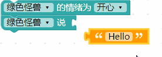
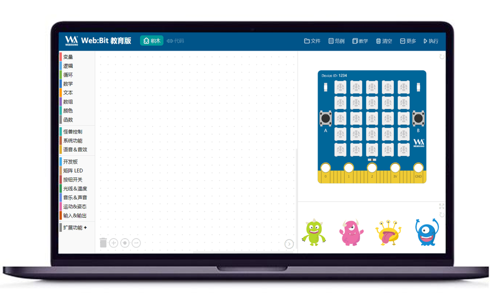
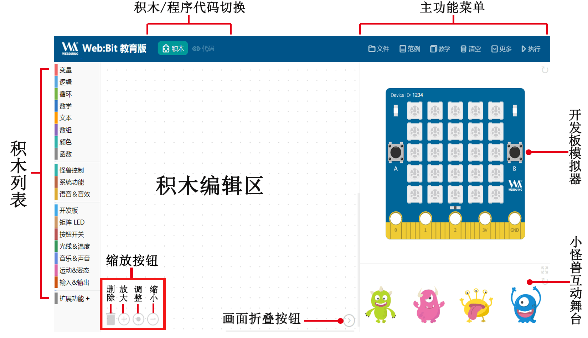
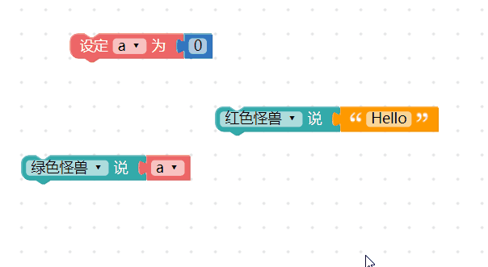
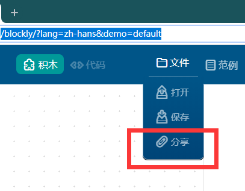
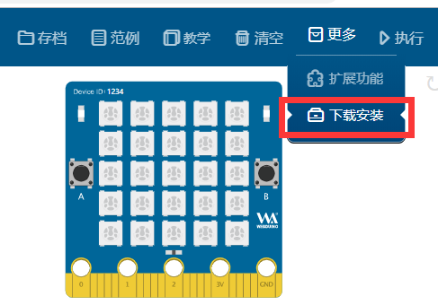
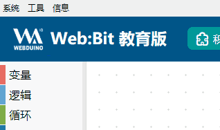
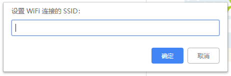

## 编辑器介绍

Web:Bit 编辑器是 Webduino 的学习积木编程的软件，积木编程大幅简化了编写代码的步骤流程，并添加了**虚拟仿真开发板**、**小怪兽互动舞台**、**外接拓展硬件**等许多积木供你玩耍。不论是大朋友小朋友，都可以轻松的入门 Web:Bit 。

### 什么是积木编程？

对于第一次接触的人来说，可能不太清楚「积木编程」的由来，「积木」是翻译自「block」这个英文单词，其操作方式类似「组装积木」或「拼图」的概念，通过互相堆叠和搭配组合，就能判断不同的逻辑或依据指定的排列顺序，实现对应的程序动作。

### 编辑器类型

编辑器分为 **网页版** 和 **安装版**，功能与界面几乎完全相同，可以依据不同的教学场景需求采用不同的版本。

#### 网页版

使用基于 Google Chrome 内核的浏览器即可体验积木编程，注意网页版暂不支持「USB 连接」开发板。

> 网页版链接：[webbit.webduino.io](https://webbit.webduino.io/blockly/?lang=zh-hans)

#### 安装版

> 安装版下载：[WebBitSetup_x.x.x.exe](https://banana-pi.dev/Image/BPI-BIT/)

**安裝版**目前只提供 Windows 7 以上的系统版本，界面与网页版保持一致，还能够更方便的初始化设置和使用「USB 连接」开发板。

### 操作界面说明

编辑器的操作界面分成下列几类区域：

- **主功能菜单**：包含文件的打开与保存、范例和教学、清空、更多功能和执行。
- **积木/程序代码切换**：将拼接好的积木转换为标准 Javascript 代码。
- **积木列表**：包含基本功能、小怪兽控制、开发板控制和物联网拓展...等积木。
- **积木编辑区**：进行积木的逻辑组合，产生各种不同的场景应用。
- **开发板模拟器**：包含一块虚拟的开发板，可以模拟开发板的实际状况和应用。
- **小怪兽互动舞台**：包含四种不同造型和颜色的小怪兽，可以通过积木设定相关动作和互动。
- **缩放按钮**：能够快速缩放画面积木或删除积木。
- **画面折叠按钮**：可以折叠开发板模拟器和小怪兽互动区，让积木编辑区域放大或缩小。

### 如何使用编辑器？

编辑器是基于 Google 所开发出的 Blockly 图形化编程工具，下面我们演示一下使用进行编程的效果。

每块积木都有它对应的功能和用途，如果想了解该积木的使用方式，可以「**使用鼠标在指定的积木上单击右键**」，就能打开积木的功能列表，点击「**教学**」可以阅读该积木的教学文件，如果该积木有「**小工具**」，则可以点击小工具使用更多进阶功能。

### 积木使用小技巧

#### 小技巧 1、多行与单行输入

如果积木程序太长，可以用鼠标在积木上点击右键，且该积木支持多行输入，可以选择「**多行输入**」将积木由单行变成多行，也更方便阅读和编辑。

#### 小技巧 2、整理积木

在使用积木编程的时候，往往会遇到积木四面八方散落在积木编辑区上的状况，这时可以在编辑区域上点击右键，选择「**整理积木**」将积木排列整齐。

### 网页版独有功能

右上方的主功能菜单，包含编辑器的主要功能，但「**网页版**」和「**安装版**」编辑器的菜单略有不同。

#### 分享链接

在网页版可以使用「**文件> 分享**」，分享可以帮助我们保存积木分享给他人，它会产生一段「**网址**」，下次再开启这个网址就可以载入分享的积木，但是安装版无法使用该功能。

在网页版主菜单的「**更多**」里面，包含「**下载安装**」的选项，点击后会下载安装版的压缩文件，解压缩安装就可以使用安装版。 ( 目前安装版编辑器仅支持 Windows )

### 安装版菜单说明

打开安装版之后工具列里分别有「*系统*」、「*工具*」和「*信息*」三个主要功能列表，如果你没有出现下图的工具列，可以按下电脑键盘的 *`Ctrl + W`* 打开工具列，。

#### 系统 > 通过浏览器打开

点选「通过浏览器打开」，会自动打开电脑的 Chrome 浏览器并连接至编辑器（网页版），如果没有该选项，请下载安装 [Chrome 浏览器](https://www.google.cn/intl/zh-CN/chrome/) 到系统里。

#### 工具 > 关闭 USB 连接

如果开发板使用 USB 线 连接到电脑，安装版可以在没有 Wi-Fi 的状态下控制开发板，但此时开发板也将「关闭 Wi-Fi 连接功能」，如果要开启开发板的 Wi-Fi 连接功能，则需关闭安装版程序，或是点击「关闭 USB 连接」功能。

> *如果关闭 USB 连接，开发板就会采用 Wi-Fi 连接模式，反之开启 USB 连接就会关闭 Wi-Fi 连接功能*。
> 详细操作方式会在[「开发板功能」](../board/board.md) 介绍使用方法。
>

#### 工具 > 恢复出厂固件

可以解决开发板大部分疑难杂症，并回到初始状态。

> 恢复出厂固件可以参考 [更新固件方法 1：使用安装版进行更新 > 恢复出厂固件](update.html#id3)

#### 工具 > 设置 Web:Bit WiFi

该功能帮助开发板连接网络，如果没有 Wi-Fi 控制开发板的需求，可以不需要使用该功能，点击该选项之后，会要求我们输入 Wi-Fi 的 SSID 和 密码，这功能可以帮助我们将「WIFI 路由器」的 Wi-Fi 名称（SSID） 和 密码 设置到开发板中。

> *特别提醒！如果无法使用该功能*，**需要恢复出厂固件**。
> 详细设定步骤可以参考 [「开发板设置」](setup.md)
> 恢复出厂固件可以参考 [更新固件方法 1：使用安装版进行更新 > 恢复出厂固件](update.html#id3)
>

#### 工具 > 设置 Web:bit MQTT 服务器

在这之前请先配置开发板的 WIFI 连接到路由器，这将为开发板配置 Web:bit 无线控制的外网服务器，外网就是指互联网（广域网）。

如果想要在外网的环境（如咖啡厅的 WIFI 网络）下 控制 连接到家里 WIFI 的开发板（家里的 WIFI 必须能够上网浏览网页）。

这就需要设置 MQTT 服务器的地区，如中国或全球（不同地区的服务器不能互联），此时使用开发板 WIFI 连接即可在外网控制。

#### 工具 > 更新固件

如果软件提示开发板有新版本的固件，可以点击该选项进行固件更新。

> *特别提醒！如果无法使用该功能*，**需要恢复出厂固件**，可以参考 [更新固件方法 1：使用安装版进行更新 > 恢复出厂固件](update.html#id3)。

#### 信息 > 版本、复制设备 ID、帮助

版本功能会显示目前的固件版本，复制设备 ID 可以将开发板的 Device ID 复制出来，而帮助会显示安装版支持的各种快捷键。

