# 小怪兽基本操作

编辑器设计了四只可爱的小怪兽，透过程序积木编排逻辑顺序，就能控制每只小怪兽的说话、声音、互动与行为...等动作，甚至能进一步与实际开发板互动，做出更多好玩的有趣应用。

## 小怪兽积木清单 ( 基本操作 )

基本操作小怪兽的积木分别有讲话、展示图片、情绪、改变位置、改变角度、改变大小、显示隐藏和阶层...等，可以透过这些积木控制小怪兽的外在表现。

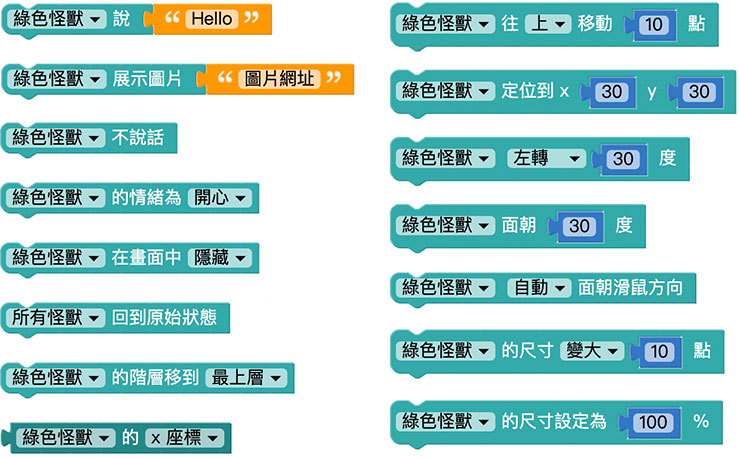

## 讲话＆不讲话

「讲话」和「不讲话」积木可以让小怪兽讲出指定的文字，或不要讲出文字，透过下拉选单也可以选择哪一只小怪兽讲话，或所有小怪兽一起讲话。

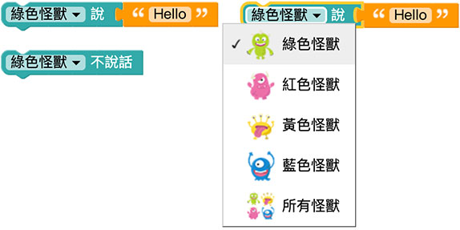

只要在讲话的积木后方，连接指定的文字，网页执行后小怪兽就会说出指定的文字。

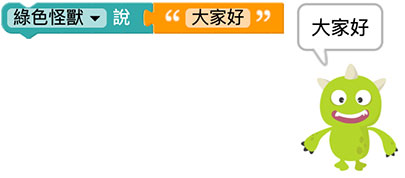

只要把文字留空，或者使用不说话的积木，就能够让小怪兽不说话。

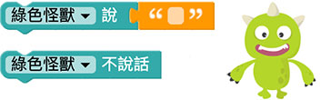

## 展示图片

「展示图片」积木可以让小怪后展示一张「网路图片」。

举例来说，从维基百科上搜寻[蒙娜丽莎](https://zh.wikipedia.org/wiki/%E8%92%99%E5%A8%9C%E4%B8%BD%E8%8E %8E#_blank)，可以得到这张图片的「[网址](https://upload.wikimedia.org/wikipedia/commons/thumb/e/ec/Mona_Lisa%2C_by_Leonardo_da_Vinci%2C_from_C2RMF_retouched.jpg/460px-Mona_Lisa%2C_by_Leonardo_da_Vinci %2C_from_C2RMF_retouched.jpg#_blank)」，复制图片网址，贴到小怪兽展示图片的文字空格内，网页执行后，就会看见小怪兽展示这张图片。

> 目前图片格式仅支援 jpg、jpeg、png、gif

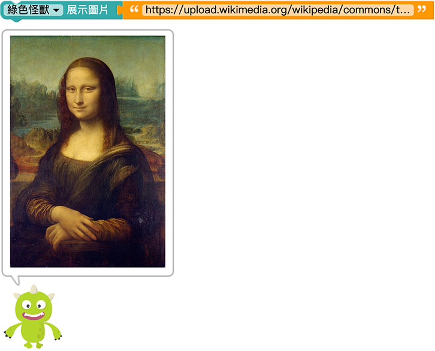

## 情绪

「情绪」积木可以改变小怪兽的情绪，包含开心、惊讶、生气、难过和随机。

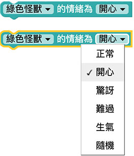

选择对应的小怪兽 ( 也可以四只同时 )，选择对应的情绪，网页执行后就会看见小怪兽的情绪变化。

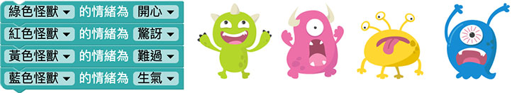

## 改变位置

「改变位置」积木可以指定小怪兽改变*目前的位置*，选项有往上、往下、往左、往右、随机或朝向滑鼠方向。

搭配重复十次和等待 0.1 秒的积木，就能够让小怪兽往右上方移动。

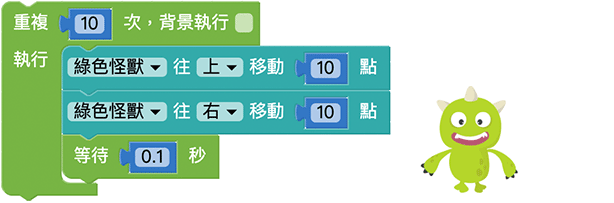

如果使用无线重复的积木，搭配「朝着滑鼠位置」的设定，就能够让小怪兽追着滑鼠移动。

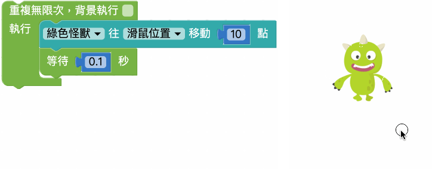

## 定位

「定位」积木能够把小怪兽摆放到指定的坐标位置。

怪兽的座标系统采用*笛卡儿座标系统* ( 直角座标系统)，往上y 为正，往右x 为正，而(0,0) *原点位在怪兽互动舞台的左下角*，指定小怪兽xy 坐标，网页执行后小怪兽就会出现在指定的位置。

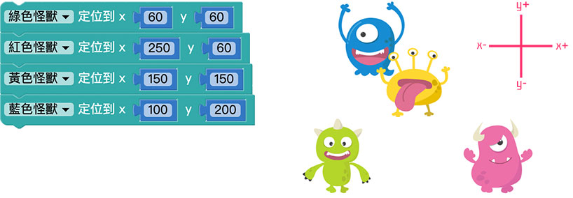

## 旋转角度

「旋转角度」可以指定小怪兽改变*目前的角度*，选项有往左或往右。

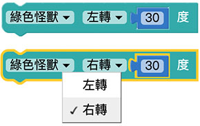

搭配重复无限次的积木，就能让小怪兽不断的每隔 0.1 秒旋转 10 度。

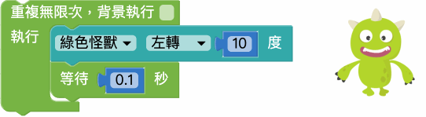

## 面朝方向

「面朝方向」角度可以指定小怪兽旋转的角度，顺时针为正，逆时针为负。

因为「面朝方向」是指定一个角度，如果要做到和前一个积木「旋转角度」一样的效果，可以使用变量搭配无限重复的积木，在每一次执行时修改变量数值即可。

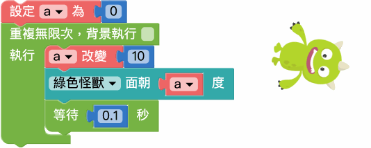

## 自动面朝滑鼠方向

「自动面朝滑鼠方向」积木能让小怪兽转到滑鼠所在的方向，有自动和停止两个选项，预设并不会面朝滑鼠。

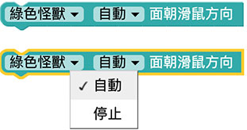

因为「自动面朝滑鼠方向」只会执行一次，所以如果要让小怪兽不断的面向滑鼠，就必须搭配无限重复的积木，如下图，网页执行后小怪兽就会自动面向滑鼠旋转。

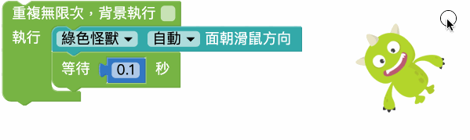

## 取得座标和角度

「取得座标和角度」积木能够读取小怪兽当前的 X 座标、Y 座标和旋转角度。

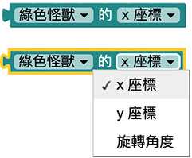

下图的例子，就能让小怪兽自己讲出自己的 X 座标、Y 座标和旋转角度。

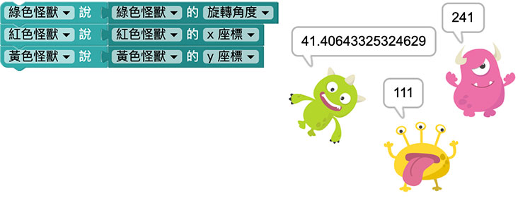

## 尺寸放大缩小

「尺寸放大缩小」积木可以指定小怪兽改变*目前的大小*，选项有放大或缩小。

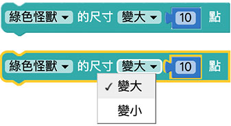

搭配重复十次和等待 0.1 秒的积木，网页执行后，就能够让小怪兽逐渐变大。

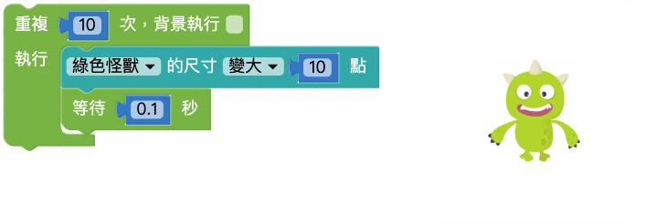

## 尺寸百分比

「尺寸百分比」积木可以指定小怪兽放大缩小的百分比。

由于 100% 表示原本怪兽大小，所以 200% 就会是一倍大，50% 则是会缩成 1/2 大小，下图透过尺寸百分比，分别让四只小怪兽呈现不同尺寸大小。

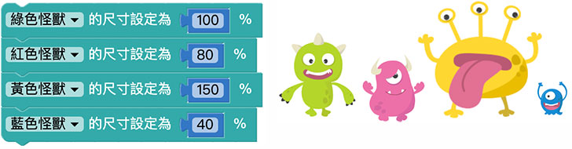

## 显示/不显示

「显示/不显示」积木可以指定小怪兽是否显示在互动舞台区。

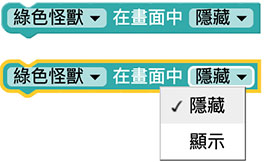

## 阶层

「阶层」积木可以指定小怪兽排列的阶层，最上层在最前面，最下层在最后面。

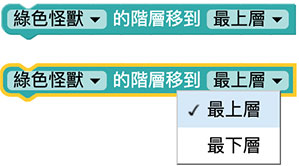

透过重复回圈以及等待的积木，能够让小怪兽的阶层依序显示在最前面。

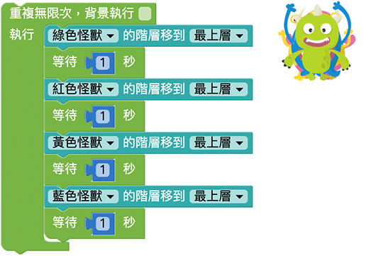

## 回到原始状态

「回到原始状态」积木可以让小怪兽回到初始状态，初始状态包含不说话、预设座标、预设旋转角度和预设尺寸大小。

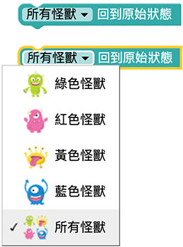