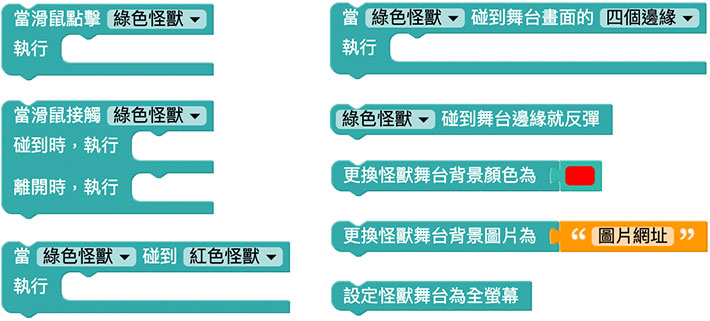
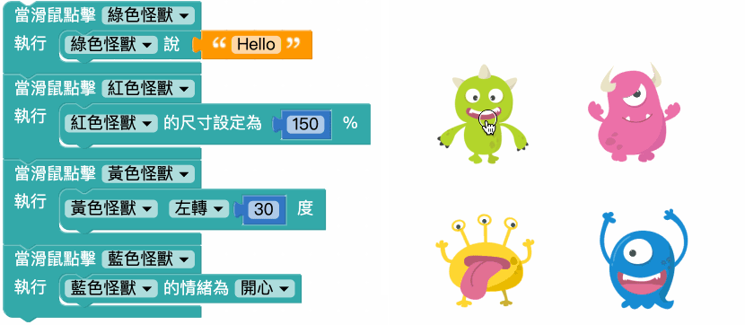
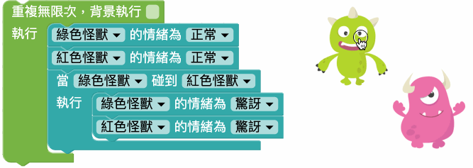
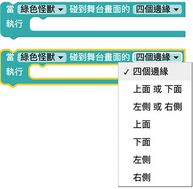
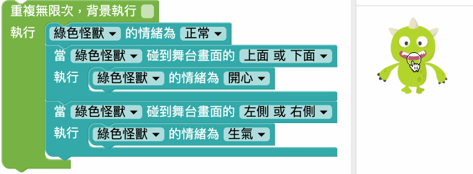
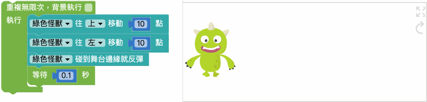
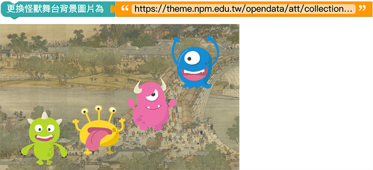
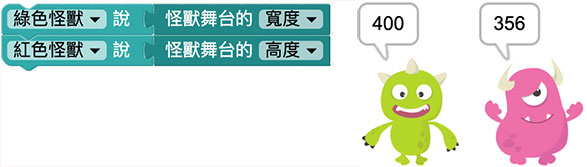

# 小怪兽互动＆舞台

除了可以设定小怪兽的位置或大小，编辑器更能让我们与小怪兽互动，例如用滑鼠点击小怪兽、小怪兽互相碰撞、碰撞舞台画面边缘...等，透过这些互动行为，就能实现更多想法和创意。

## 小怪兽积木清单 ( 互动＆舞台 )

互动＆舞台的积木分别有滑鼠点击小怪兽、滑鼠接触小怪兽、小怪兽互相碰撞、小怪兽碰撞画面、碰到画面边缘就反弹、更换舞台背景和设定全萤幕。

## 滑鼠点击

「滑鼠点击」积木可以让指定滑鼠点击小怪兽时，要做些什么事情。

> 滑鼠点击积木「*不需要放在重复回圈内*」就可重复侦测。

下图的例子，点击绿色小怪兽时会说话，点击红色小怪兽会放大，点击黄色小怪兽会旋转，点击蓝色小怪兽会改变情绪。

## 滑鼠碰触

「滑鼠碰触」积木包含两个行为动作，分别是滑鼠碰触到小怪兽要做什么事，以及滑鼠离开小怪兽要做什么事。

> 注意，离开的行为一定会接续在碰触之后，滑鼠碰触积木「*不需要放在重复回圈内*」就可重复侦测。

下图的例子，在滑鼠碰触到绿色小怪兽时，小怪兽的情绪会开心，滑鼠离开后小怪兽又恢复正常的情绪。

## 互相碰触

「互相碰触」积木可以侦测小怪兽彼此之间是否有互相碰触。

> 互相碰触积木「*只会侦测一次*」，必须*搭配重复回圈*，才能重复侦测。

以下图为例，搭配重复回圈，就能不断侦测小怪兽是否互相碰触，用滑鼠拉动小怪兽，当俩俩互相碰到时，小怪兽就变成惊讶的情绪，分开后又恢复正常。

## 碰触舞台画面

「碰撞舞台画面」积木可以侦测小怪兽是否碰触到互动舞台的四个边，或个别侦测碰到上、下、左、右四个边的行为。

> 碰撞舞台画面积木「*只会侦测一次*」，必须*搭配重复回圈*，才能重复侦测。

以下图为例，搭配重复回圈，就能让小怪兽碰到舞台画面上缘或下缘时，变成开心的情绪，碰到左边或右边则呈现生气的情绪，没有碰到时则是正常情绪。

## 碰触舞台画面就反弹

「碰触舞台画面就反弹」积木是「碰触舞台画面」积木的简化版，将碰触后的行为单一化为「反弹」，反弹表示位置的相反，*如果碰到舞台左右两侧，则小怪兽移动的X 方向会相反，如果碰到舞台上下两侧，则小怪兽移动的Y 方向会相反*。

> 碰触舞台画面就反弹积木「*只会侦测一次*」，必须*搭配重复回圈*，才能重复侦测。

以下图为例，搭配重复回圈，就能让小怪兽碰到舞台画面移动，碰到舞台边缘时就会反弹。

## 更换舞台背景颜色或图片

「更换舞台背景颜色」和「更换舞台背景图片」，可以改变怪兽舞台背景为指定的颜色或图片，图片只要填入图片网址，执行后就会更换。 ( 图片支援 jpg、jpeg、png 和 gif )

举例来说，找一张[清明上河图](https://theme.npm.edu.tw/opendata/att/collectionPic/04015934/17024347.jpg#_blank)的图片网址，将网址贴上在背景图片的文字积木内，网页执行后就会看见舞台背景变成清明上壳图了

## 设定舞台为全萤幕

「设定舞台为全萤幕」积木不影响任何操作，只会在「网页执行时」把怪兽互动舞台变成全萤幕大小。

如果不想使用该功能，也可以手动操作，点选怪兽互动舞台右上方的小按钮，也可以进行全萤幕的切换。

## 取得舞台尺寸

「取得舞台尺寸」积木可以取得当下怪兽互动舞台的宽度或高度。

下图的例子会在网页执行的时候，绿色小怪兽讲出舞台宽度，红色小怪兽讲出舞台高度。

