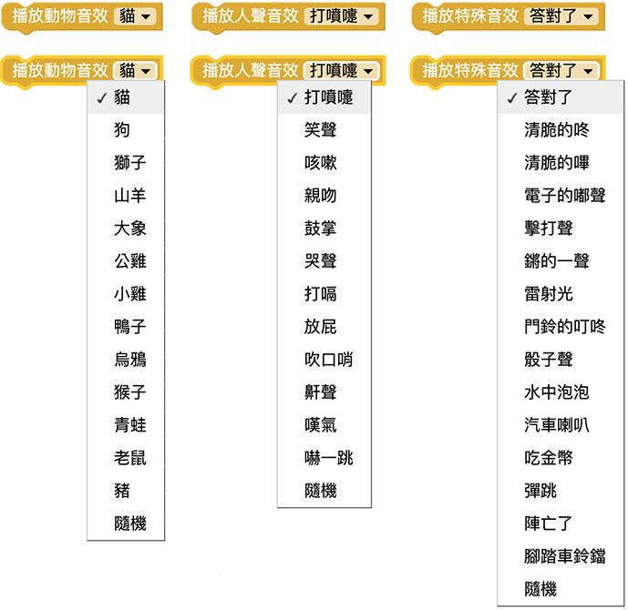
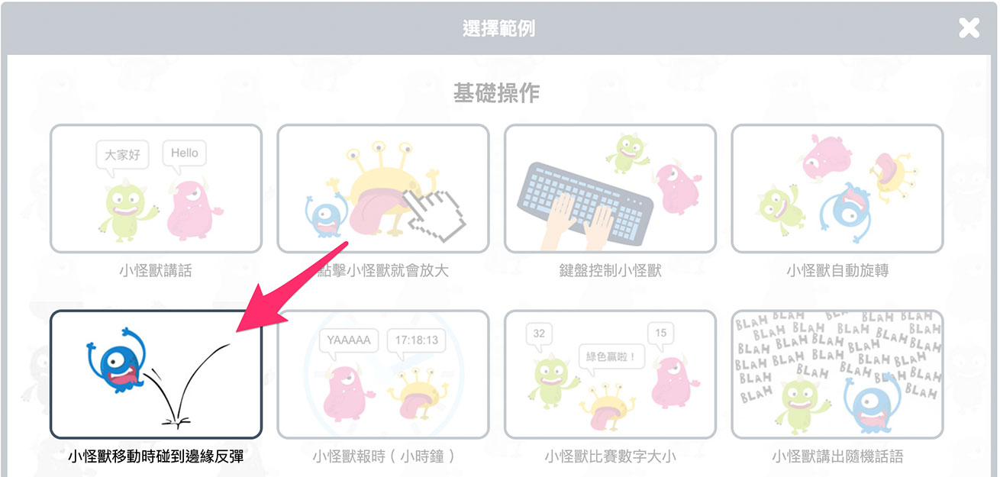
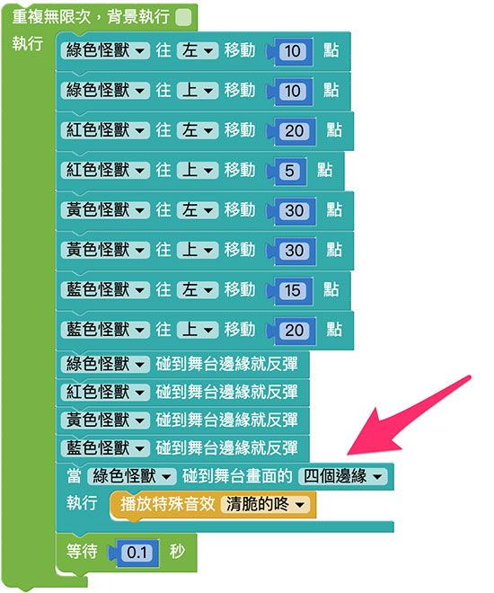

# 特殊音效

教育版预设三十几种特殊音效，里头包含了动物音效、环境音效、人类生活音效...等，藉由不同音效和小怪兽、开发板的互相搭配，就能实现许多丰富的生活情境。

## 积木清单

特殊音效分成三个项目，分别是动物、人声和特殊音效。

## 点击小怪兽发出音效

搭配点击小怪兽的积木，网页执行后，用滑鼠点击小怪兽就会发出对应的特殊音效。

## 替小怪兽的反弹加入音效

教育版内建许多有趣的范例，点选右上方选单「范例」，打开范例清单。

打开范例清单后，开启基础操作里的「小怪兽移动时碰到边缘反弹」。

开启范例后，在积木中加入「当绿色怪兽碰到舞台画面的四边缘」，并在执行的区域内加入特殊音效，网页执行后，当绿色怪兽碰到画面边缘，就会发出特殊音效。

