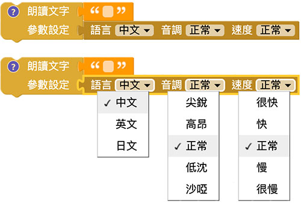
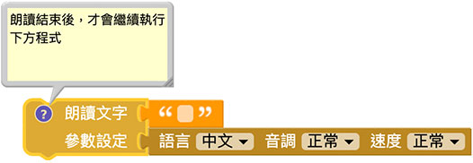
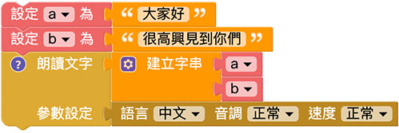

# 语音朗读

语音朗读是透过电脑的语音合成器，念出我们指定的语言，教育版的语音朗读可以轻松做出语音报时器、语音通知、语音对话...等创意应用，更可以调整语音的速度和音调，变化出许多有趣的花样。

## 积木说明

语音朗读积木包含三种语 ( 中文、英文或日文 )，五种音调和五种速度。

> 注意，*在「安装版」编辑器中，可能无法正常朗读中文和日文*，若遇到无法发音的状况，请使用「网页版」版本的编辑器。 ( 参考 [编辑器](../index.html#software) )

语音朗读积木属于「*执行完成才会继续执行后方程序*」的类型( 点击前方问号小图示会提示)，当程序中使用了语音朗读积木，*朗读结束后才会接着执行其他程序*，使用上要特别注意。

## 朗读文字

若要朗读文字，只需要在后方文字积木输入对应的文字，网页执行后就能从电脑喇叭听到语音。

## 朗读不同段落的文字

如果要朗读不同段落的文字，第一种方法可使用建立字串积木，配合变量积木，在网页执行后就会从电脑喇叭听到语音。

第二种方法可以透过语音朗读积木的特性，将不同段落的文字依序接在后方，网页执行后再朗读完第一段，就会接着朗读第二段。

## 朗读输入的文字

由于「在对话框中输入文字」和语音朗读积木特性相同，搭配重复回圈，就能做到透过语音朗读，念出输入的文字。

