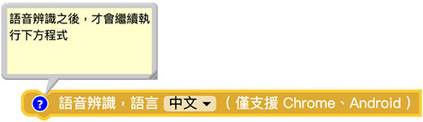
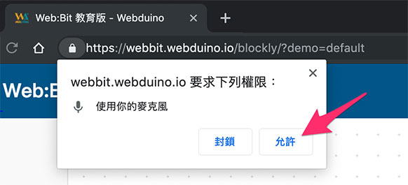
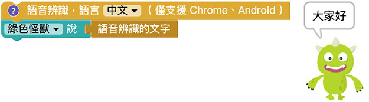
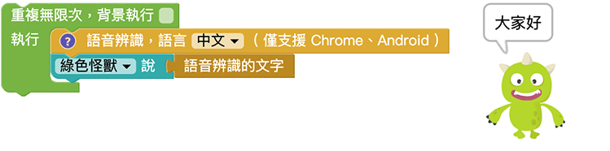
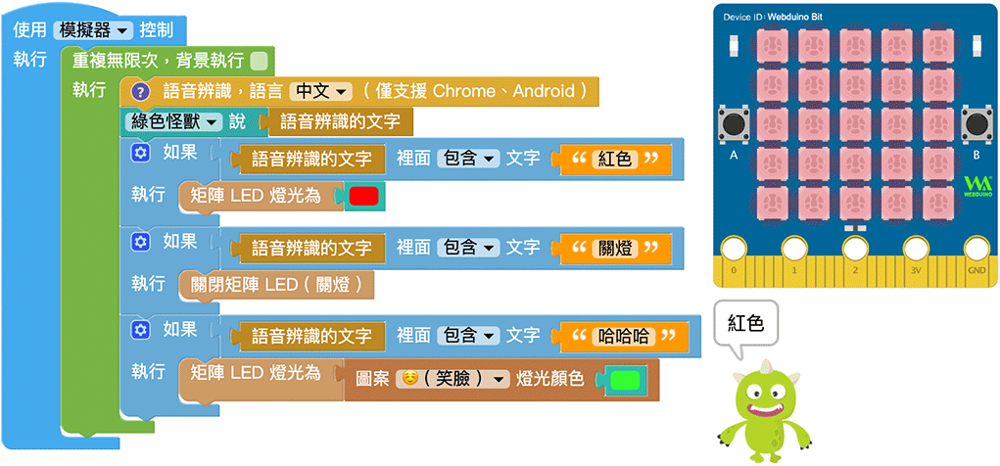

# 语音辨识

随着科技的技术日新月异，过去在行动装置才能使用的语音辨识功能，如今编辑器也能完整实现，结合Google 语音辨识的技术，如果电脑有麦克风，就能轻松做出「Hey Siri」或「OK Google」的有趣声控效果。

## 语音辨识积木说明

语音辨识积木可以分别识别中文和英文的语言，无法进行中英文夹杂的混合辨识。

语音辨识积木属于「*执行完成才会继续执行后方程序*」的类型 ( 点击前方问号小图示会提示 )，每段语音辨识时间为两秒，*辨识后才会继续执行后方的程序*。

## 透过小怪兽显示语音辨识文字

进行语音辨识之后，就能使用「辨识的文字」积木，下图的范例会在语音辨识后，让小怪兽讲出辨识的文字。

使用语音辨识积木时，如果是「网页版」的编辑器，在网页执行后会询问「是否允许使用麦克风」，勾选允许。

网页允许麦克风后，在浏览器页签上会出现一个小圆点，提示麦克风正在运作。

此时可以对着麦克风讲话，语毕就能看见小怪兽讲出辨识的文字。

## 连续语音辨识

藉由语音辨识积木的特性，搭配重复回圈，就能不断进行语音辨识来更新小怪兽讲出的文字。

## 语音辨识控制 开发板

如果将语音辨识结合 开发板，搭配逻辑判断判断文字内包含的字词，就能实现物联网声控的应用，下图的例子便可以很简单的透过声控开关灯，或透过声控改变颜色。

